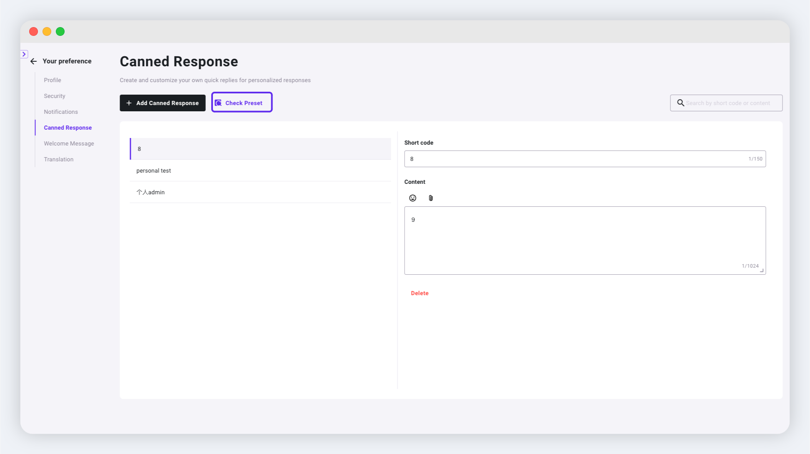
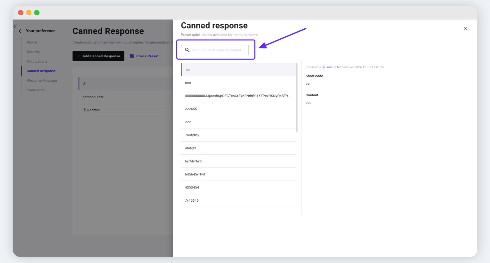
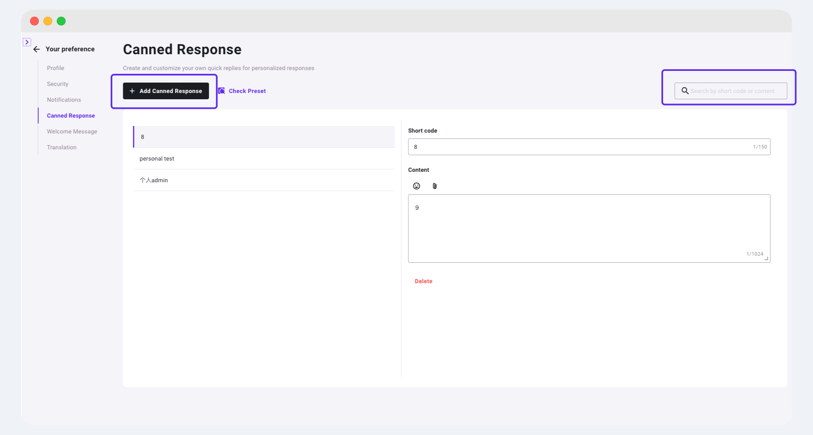
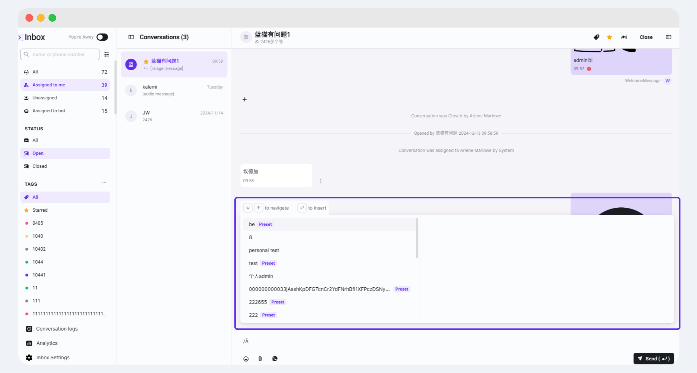
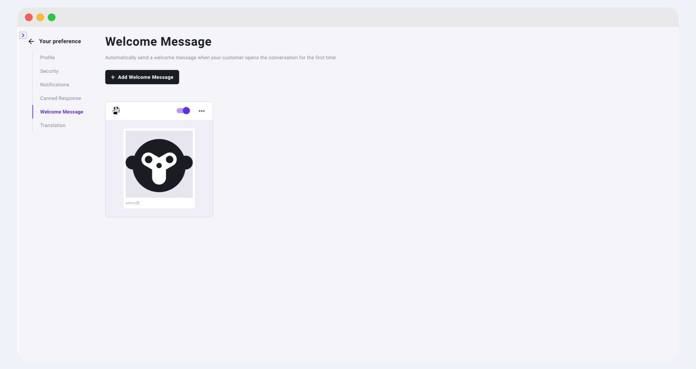
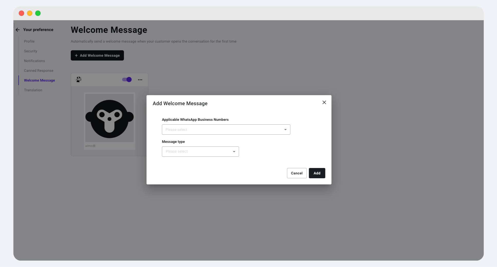
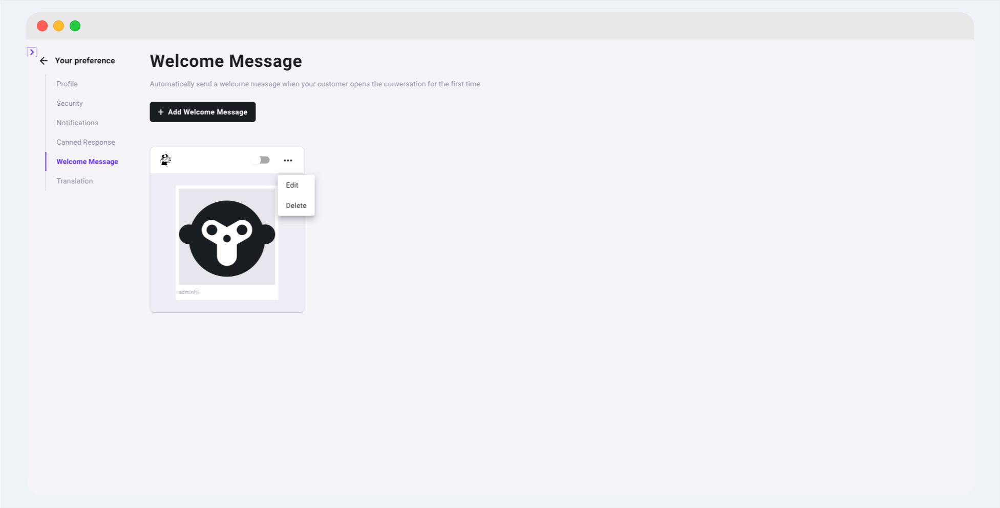

# Personal Preferences Settings

Personal preference settings cover aspects such as personal profile, security, and notifications, allowing you to customize according to your needs for a more comfortable and convenient experience.

## Personal Profile

In "Your preference > [Profile](https://www.ycloud.com/console/#/app/userSettings/myProfile)", you can set your personal information, including your name, avatar, email, and phone number, with the option to change your password.

<figure><figcaption></figcaption></figure>

### Profile Image

You can choose or upload your preferred profile image in the personal preference settings, making it easier to distinguish during subsequent transfer sessions. Hovering the mouse over the image allows for a larger preview and delete operation. Recommended avatar size is 640 x 640 px, less than 5MB.


Please click the save button at the bottom of the area after completing the operation for the changes to take effect.


### Name

Set your name here to clearly and accurately identify your identity within the system.

### Email

Email modification is not supported, it is only displayed.

### Phone Number

Fill in your phone number for necessary 2FA verification to ensure account security. You can click the modify button to change your phone number.


Modifying the phone number requires verification of the previous phone number. Please click "Get Code" in the pop-up window to verify the phone number.


### Change Language

Switch to the system language of your choice.

<figure><figcaption></figcaption></figure>

### Change Password

Use this feature to update your password and enhance account security.

## Security

Enable two-factor authentication to protect your account. We will send a one-time password (OTP) via SMS or email to your registered contact method.

Setting path: Click the avatar in the lower left corner > Edit > Your preference > [Security](https://www.ycloud.com/console/#/app/userSettings/security)

* Switching modifications requires SMS or email authentication.
* If 2FA is enabled, email or SMS verification is required when logging into the account.

<figure><figcaption></figcaption></figure>

## Notifications

Set the scenarios for inbox notification triggers: Account > [Notifications](https://www.ycloud.com/console/#/app/userSettings/notification)

* Set the timing for sound alerts
* Set the timing for browser pop-up alerts (browser alert permissions need to be enabled)

<figure><figcaption></figcaption></figure>

## Personal Canned Response

users can view the company's preset canned response for reference, and set up personal canned response according to their own needs.

#### Check the company’s canned response

Click the \[Check Preset] button to view the canned response preset by the administrator in the right drawer. It supports searching for specific canned response through short codes or content.

<figure><figcaption></figcaption></figure>

<figure><figcaption></figcaption></figure>

#### Set personal canned response

You can add a personal canned response by clicking the \[Add Canned Response] button, enter the short code and content according to your needs, and it supports adding emoticons, attachments and other content. It also supports search, filtering, editing, and deletion of existing personal canned responses.

<figure><figcaption></figcaption></figure>

#### Use company/personal canned response

<figure><figcaption></figcaption></figure>

You can enter "/" in the Inbox dialog box to bring up the canned response window, and search for the canned response you need by entering the short code corresponding to it. Preview the canned response in the column window on the right to confirm that it is what you need. After selecting the canned response, press the Enter key to enter the selected it. Canned response preset by companies in the list will be labeled to make it easy for you to distinguish them.

## Welcome message

Set up your unique welcome message as a welcome statement to give your customers a great first impression. Your welcome message will be triggered when the following conditions are met:

* Conversations are open
* Conversations are initialed by customers
* Conversations are assigned to you

Follow these steps to set up a welcome message:

1. Select Welcome Message on the left side of the personal preferences settings menu. After entering the page, you can click the \[Add Welcome Message] button to create your own welcome messages

<figure><figcaption></figcaption></figure>

2. Select the WhatsApp Business Numbers which will send the welcome message


Note: Each WhatsApp Business Number can only be attached to one welcome message.


3. Select the message type you need


Note: For interactive messages, if you want to use list buttons, the Header must be set to None or plain text Header.


<figure><figcaption></figcaption></figure>

4. After completing the setting, you can turn the switch on to make the welcome message in effect
5. When the switch is off, you can edit or delete the corresponding welcome message

<figure><figcaption></figcaption></figure>

