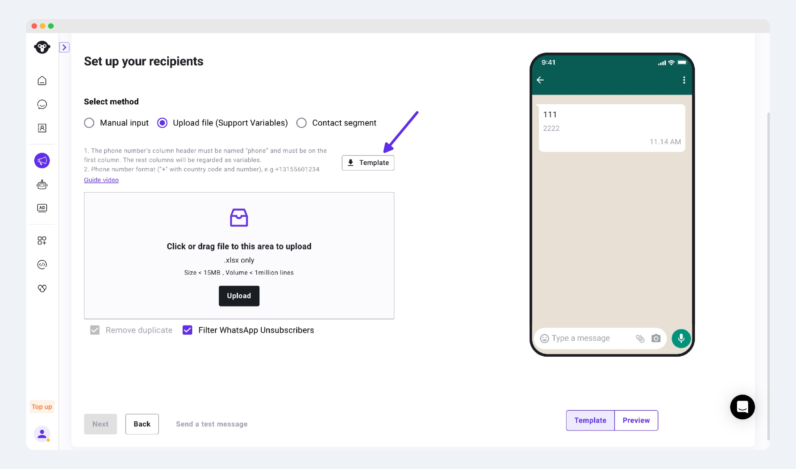
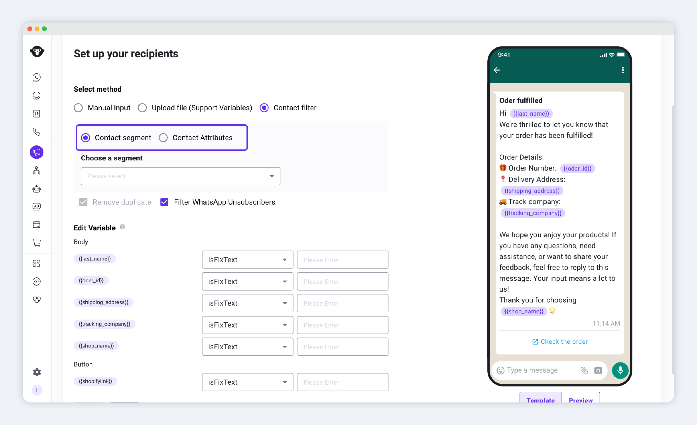
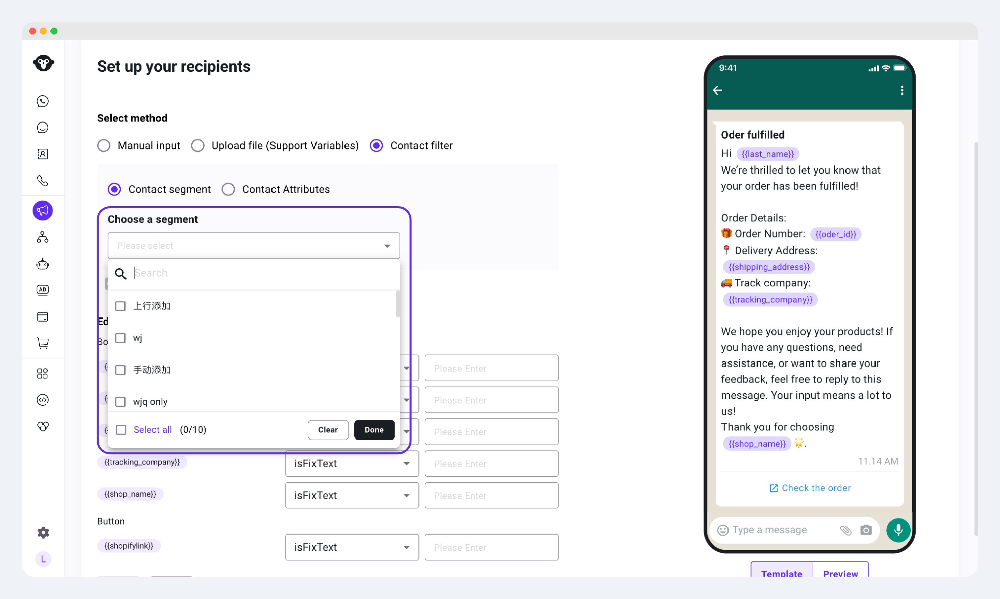
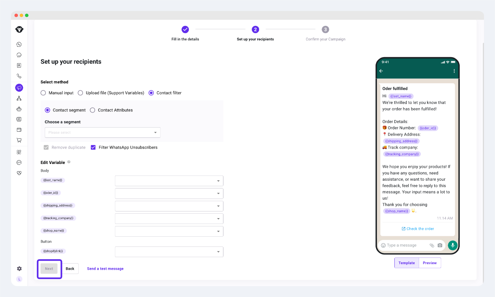
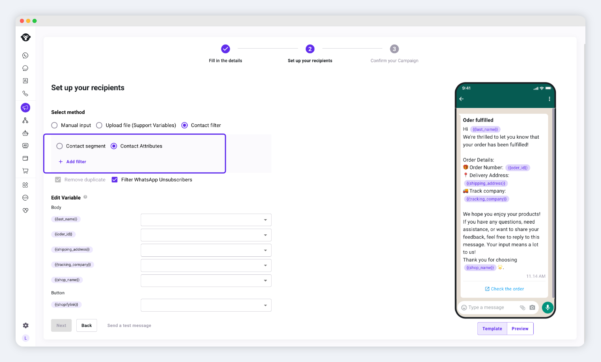
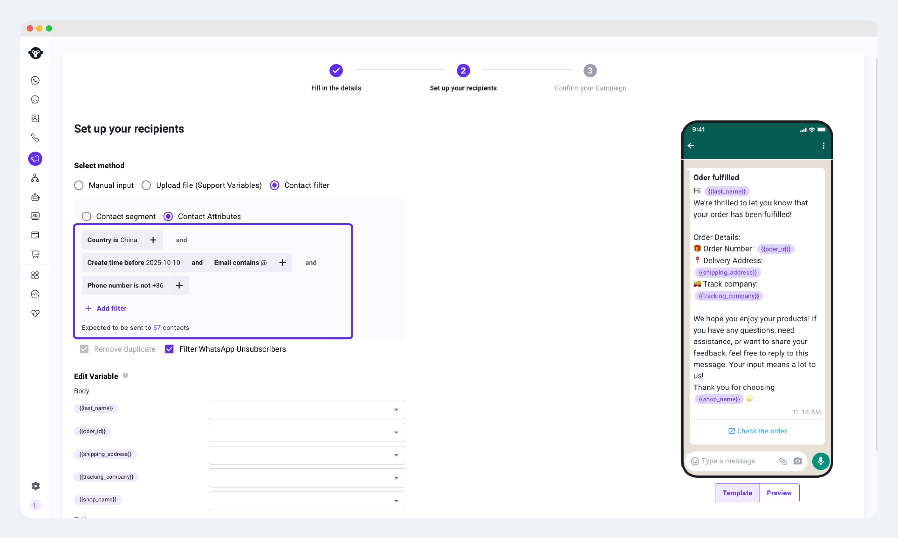

# Create a WhatsApp Marketing Campaign


**What are marketing type conversations/messages** In WhatsApp, you only need to have the user's phone number (and obtain their consent) to send them messages. You can also add call-to-action buttons and quick reply buttons to make your marketing messages more actionable, promoting business conversion. Although the WhatsApp API seems very suitable for marketing purposes, it was designed not just for bulk marketing campaigns. If you blindly send promotional messages to potential users, you will soon face account suspension. In fact, there are many scenarios and uses to be explored within the WhatsApp ecosystem, which can be fully referenced from the successful experience of WeChat public accounts in China. WhatsApp also has a rich set of tool-like features that, if used well, can be very effective.


## Step 1: Create a Marketing Template

* Log in to your [YCloud account](https://www.ycloud.com/console/#/entry/login), navigate to Home > Templates > + Add Template

<figure><figcaption></figcaption></figure>

* Select Category as Marketing, and name the template and choose the template language

Please note: **The template name must be unique**. Names only support lowercase letters a-z, 0-9, and underscores (\_). Once submitted, the template cannot be changed.

<figure><figcaption></figcaption></figure>

* Enter the content to be sent Marketing messages are used to send promotional offers, product announcements, and other marketing-related messages to enhance awareness and engagement. This includes but is not limited to:
  * Promotional or discount messages
  * Welcome/closing remarks: i.e.: Thank you for shopping at XXX, wish you have a good day
  * Updates, invitations, suggestions: i.e: Hey members, join us tonight for this event

<figure><figcaption></figcaption></figure>

* Click Submit and wait for approval

<figure><figcaption></figcaption></figure>

## Step 2: Send Marketing Messages


There are two ways to send marketing messages: via Campaign or by calling the API; you can choose either.


### Sending via Campaign

#### 1. Choose to send bulk messages via the WhatsApp channel

Log in to your [YCloud account](https://www.ycloud.com/console/#/entry/login), navigate to Campaign > + Add Campaign > WhatsApp

<figure><figcaption></figcaption></figure>

#### 2. Fill in the Campaign details

2.1 Name the Campaign: You can also choose the default name

2.2 Select Sender: The phone number connected through the embedded sign-up process

2.3 Select the template approved by Meta and the language

2.4 Send time: Send immediately or schedule a send time

<figure><figcaption></figcaption></figure>

2.5 Click Next to configure recipients

#### 3. Choose recipients


YCloud offers several ways for selecting recipients for a campaign:

1. Enter manually
2. Upload a CSV file
3. contacts filters&#x20;


**3.1 Manual input**


**Please note,** if there are variables in the template, we recommend using a file upload to set recipients. Manual input only supports setting these variables as fixed values. For example, if the template is "Hi, \{{name\}}", and you choose to manually input recipients, you can only set \{{name\}} as a fixed value, such as "there". The final message sent to all recipients will be "Hi, there".


Enter phone numbers in the box, one number per line. Ensure the numbers are in international format, starting with the country code. For example, a UK number is 44, and the phone number is 7759398257, you should enter +447759398257. If you already have an excel file, you can copy the phone number column and paste it into the box.

<figure><figcaption></figcaption></figure>

**3.2 Upload CSV**

The file upload method supports setting variables in the message.

* Download the template and fill in the phone numbers.

<figure><figcaption></figcaption></figure>

* Open the template file and fill in the phone numbers
  * The phone number must be in the first column and named "phone".
  * If there are no variables in the message, you can delete the other columns in the template.
  * If there are variables in the message, you can start entering variable names from the second column, first row. For example, if the message is "Hi, \{{name\}} the panda socks have arrived! There are several colors". Then you can set a variable named "name".

<figure><figcaption></figcaption></figure>

**3.3 Contact filter**


Filtering” means: selecting recipients based on specific conditions from your contacts,&#x20;

YCloud provides **2 options**:

* Select: **contact segment**
* Select: **contact attribute**


<figure><figcaption></figcaption></figure>

3.3.1 Contact Segment

Click **Contact Segment**,\
and choose one or more groups.

<figure><figcaption></figcaption></figure>

> If you haven’t created any segments yet, you can go to [Contact](https://www.ycloud.com/console/#/app/contact/contactList)  to add segments.
>
> You can select up to **10 segments** simultaneously.

If you find the **Next** button is disabled, it means the campaign information is incomplete.

Please check that&#x20;

1. &#x20;**one segment** has been selected.

<figure><figcaption></figcaption></figure>

After filling out the information, click **Next** to proceed to Step 3.

3.3.2 Contact Attributes

Click **Contact Attributes**, which lets you filter based on the attributes/traits of contacts.

<figure><figcaption></figcaption></figure>

Click **Add Filter**, choose appropriate filter criteria, and apply the filter.

Contacts that meet the criteria will be the recipients of the campaign.

<figure><figcaption></figcaption></figure>

## Step 3: Set Variables

If there are media headers or variables in the template, you can set these values in this step. If there are no variables in the template, this part will not display, and you can proceed to the next step.

### Headers

YCloud provides a default example media profile, it is recommended to change this media to make it easier to pass the review.

### Variables

If there are variables in the template, upload your file with variables, then manually match the variables in the template with the variable values in the file.

<figure><figcaption></figcaption></figure>

Set the variable to a fixed value. Select Set a fixed text and assign it a value.

<figure><figcaption></figcaption></figure>

Click Next to review the campaign details.

## Step 4: Check Details

Confirm the details and preview the message. Ensure you have clicked the Submit button to complete the submission.

<figure><figcaption></figcaption></figure>

<figure><figcaption></figcaption></figure>
