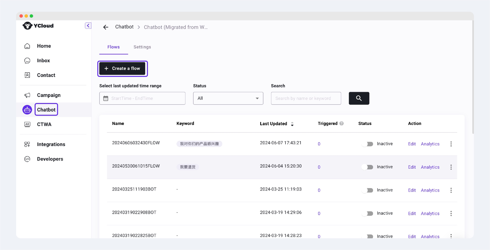
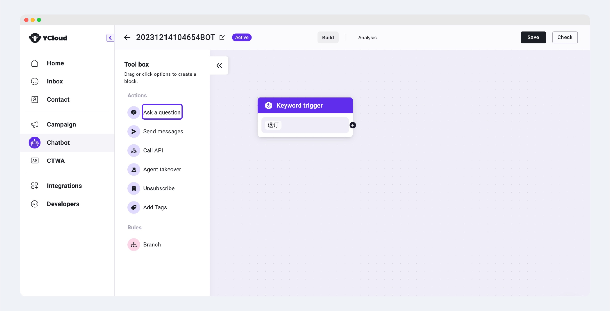
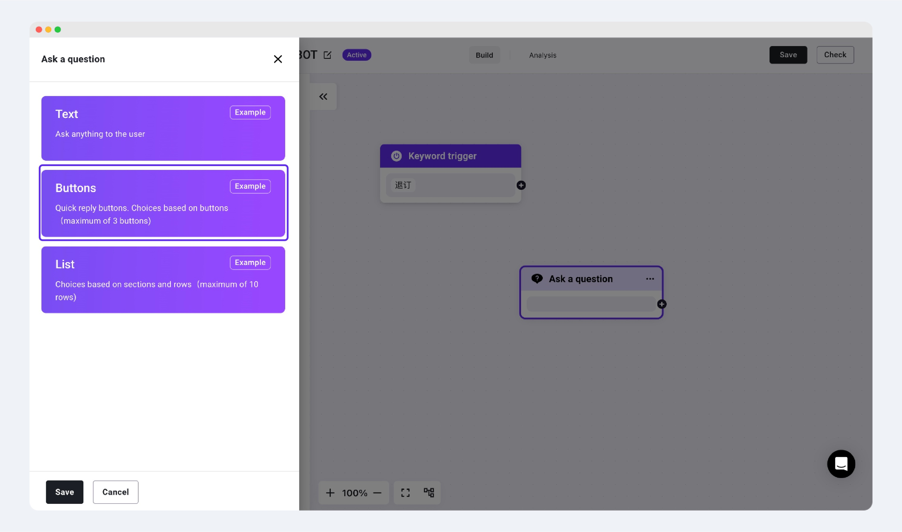

# Automatically Add Customers to Unsubscribe List

Automatically identify customer unsubscribe intentions through YCloud Chatbot, allowing customers to unsubscribe and automatically add them to the unsubscribe list, avoiding direct complaints to WhatsApp. This will effectively prevent your WhatsApp account from being banned.

Example:

When a customer's message to unsubscribe is received, the Chatbot automatically asks the customer if they confirm they want to unsubscribe, and for those who confirm a second time, adds them to the unsubscribe list.

<figure><figcaption></figcaption></figure>

## Step 1: Log in to your YCloud account and create a Chatbot Flow

<figure><figcaption></figcaption></figure>

## Step 2: Add unsubscribe trigger keywords


Recommendation: Set multiple unsubscribe keywords and choose "Containing" rather than "Exact matching". This way, any keyword in the list will trigger the Chatbot. After setting up, click the save button.


<figure><figcaption></figcaption></figure>

## Step 3: Confirm customer's unsubscribe intention (optional)


Strongly recommend adding this step to avoid customers mistakenly entering the unsubscribe list. You can choose to use the "Ask a question" component to ask the customer: "Please confirm if you want to unsubscribe from messages?"


Detailed steps:

1. Select the "Ask a question" component

<figure><figcaption></figcaption></figure>

2. Choose the Buttons message format

<figure><figcaption></figcaption></figure>

3. Set the inquiry content: "Please confirm if you want to unsubscribe from WhatsApp?"

* Set two options for the Button
  * OPT-OUT
  * Hand slip
* After setting up, click Save

<figure><figcaption></figcaption></figure>

4. Connect the Keyword trigger to the Ask a question component after setting up

<figure><figcaption></figcaption></figure>

## Step 4: Add to Unsubscribe List

1. Add the Unsubscribe component

<figure><figcaption></figcaption></figure>

2. You can choose whether to automatically reply with a successful unsubscribe message. If needed, click the Auto-reply switch on the right and enter the auto-reply content below, then select Save to save.

<figure><figcaption></figcaption></figure>

3. Connect the "OPT-OUT" button from the Ask a question component to the Unsubscribe component

<figure><figcaption></figcaption></figure>

## Step 5: Add a Send messages text (optional)

Add a Send messages text component and connect it to the "No, I clicked by mistake" button

<figure><figcaption></figcaption></figure>

## Step 6: Save and activate the Chatbot

After editing the Chatbot flow, click Save in the upper right corner, and in the pop-up window, click Active > Save to instantly activate the unsubscribe Chatbot. When a customer triggers the unsubscribe keyword, the Chatbot will automatically add this phone to the unsubscribe list and display it in the Contact > Unsubscribe list.

<figure><figcaption></figcaption></figure>
