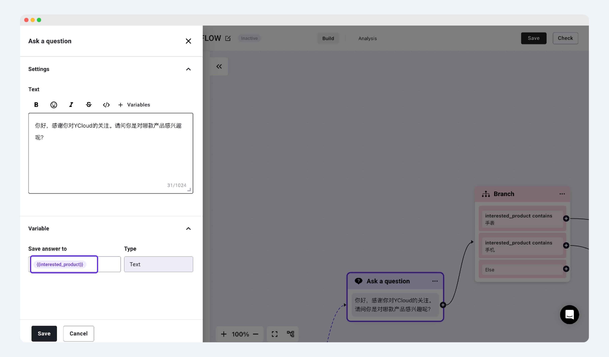
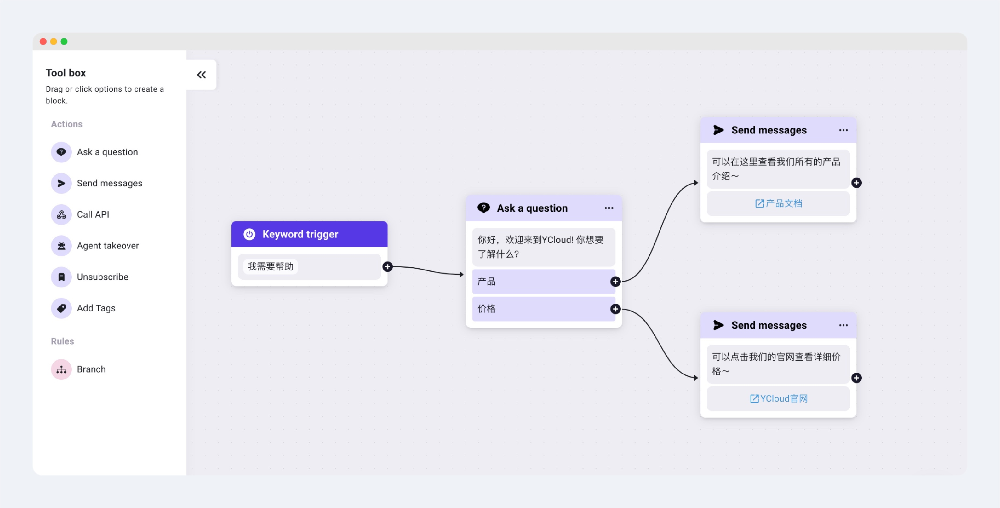
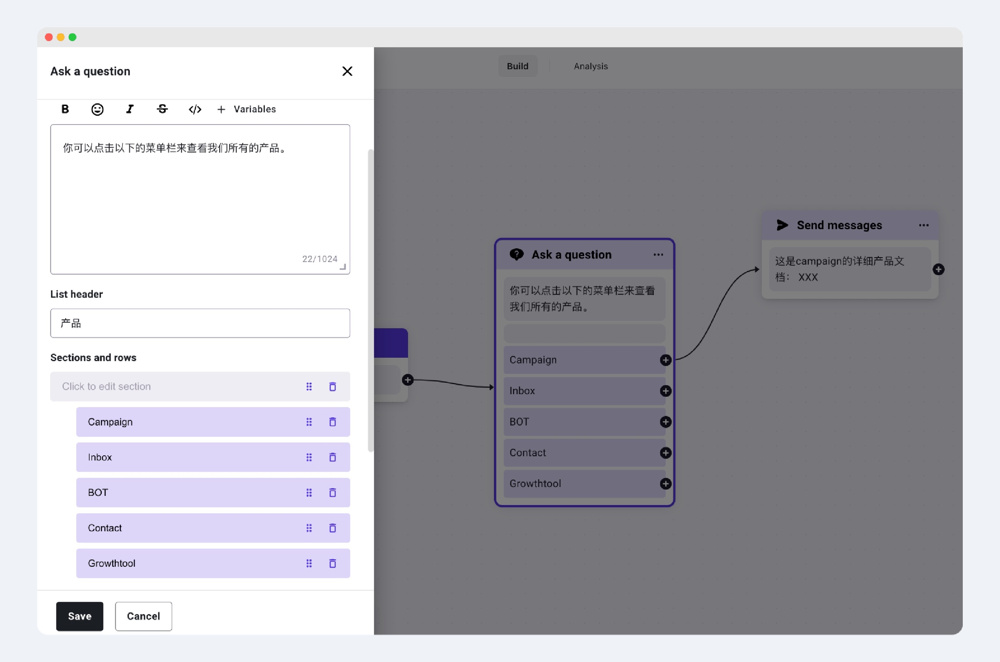

# Ask a Question

## What is Ask a Question?

Ask a Question represents an initiative by the business to pose a query, and this component waits for the user's response before proceeding with further actions based on the response.

## Types of Ask a Question

* #### Text (Textual Form)
  * A question presented in text form. After the user responds, the information they provide can be stored as a variable for subsequent customer replies.
  * _Example: You can ask for the customer's name and then save the name they provide into their profile. Later, when chatting with the customer, you can insert this name into the conversation._

<figure><figcaption></figcaption></figure>

* #### Button: Quick Reply Buttons (Up to three can be set)
  * You can prompt the customer with several options to choose from in your inquiry. Once the customer clicks an option, it automatically replies with that choice, allowing for different routing based on the customer's selection.
  * _Example: You can ask if the customer wants to inquire about pricing or products. If the customer replies with pricing, automatically send them a price list document. If they click on products, send them an automatic product introduction._

<figure><figcaption></figcaption></figure>

* #### List: Menu Bar
  * Up to 10 options for replies can be set. Suitable for businesses that want to provide quick replies but are limited by the number of quick reply buttons. It also allows for further segmentation and replies to the user's questions and needs.

<figure><figcaption></figcaption></figure>

## Other Related Settings

### **Set to Collect Only One User Response**

Guide:\
Log in to your YCloud account > Chatbot > Flow > Ask a question (select List/button format) > Turn on the "Limit user to answer once only" button.

When enabled, the Chatbot will only collect one response from the user for the current question. The user cannot choose two different options for the same question. The flow will proceed based on the user's first selected option.

<figure><figcaption></figcaption></figure>

### **Add a Description to the List Message**

Guide:\
Log in to the YCloud Dashboard > Chatbot > Flow > Ask a question > Select the List format > Click "Add description" to add a description.


Please note: The description is limited to 72 characters.


<figure><figcaption></figcaption></figure>

<figure><figcaption>
<strong>Add a Description Under the List Button</strong>
</figcaption></figure>

<figure><figcaption>
Final display effect
</figcaption></figure>
