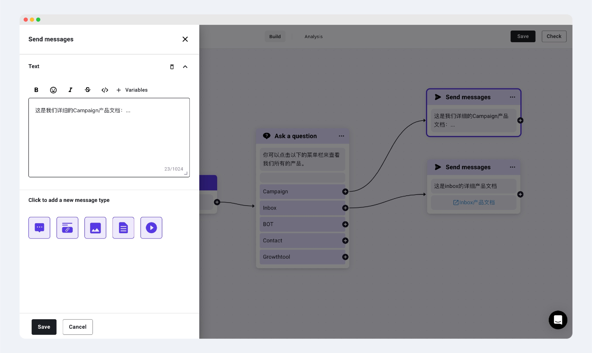
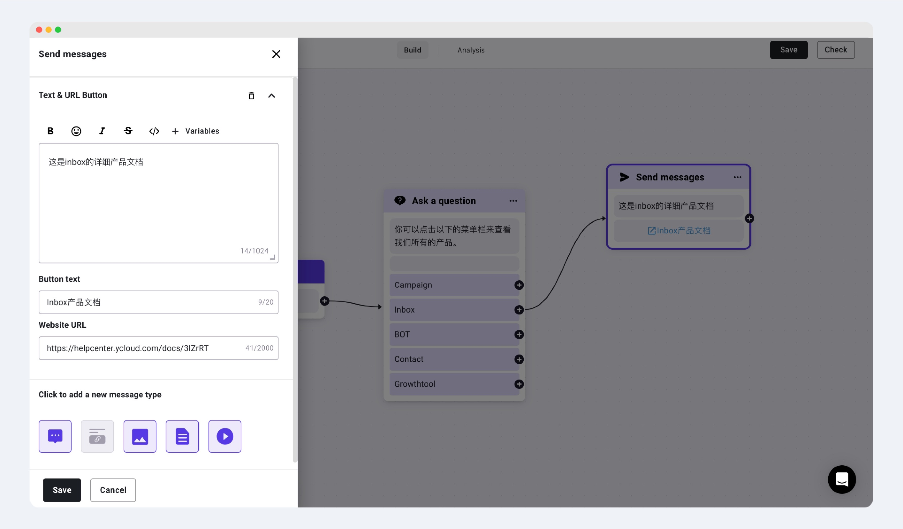

# Send Messages

## What is Send Messages?

"Send messages" refers to sending information. Unlike Ask a question, Send messages simply sends a message without waiting for a user's reply or executing subsequent replies based on the user's response.

## Types of Send Messages

* #### Text
  * Messages in text format. Up to five can be sent consecutively at a time.

<figure><figcaption></figcaption></figure>

* #### Text & URL Button
  * A combination of text and link in message format. The link can be placed in a button. Only one Text & URL Button message is supported per send.

<figure><figcaption></figcaption></figure>

* #### Picture

Messages presented in picture format.

Limitations: .jpg, .jpeg, or .png. 5MB.

Recommended dimensions: Landscape 1125px \* 600px, Portrait 2:3

* #### Video

Messages presented in video format.

Limitations: .mp4, no more than 16MB

* #### File

Messages presented in file format.

Limitations: no more than 100MB
