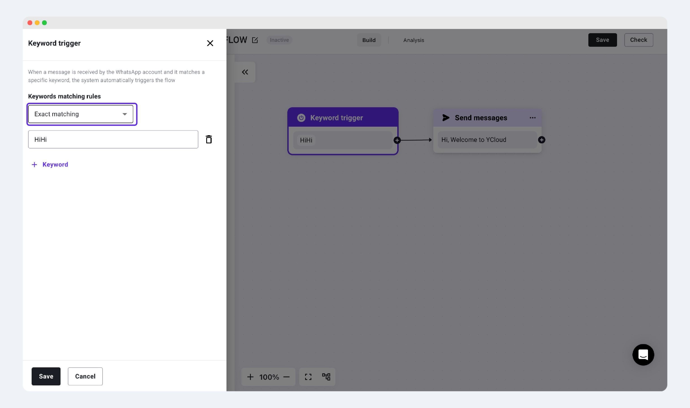

# Trigger

## What is Trigger?

When a user wants to create a new Chatbot, the page will first prompt "Add a trigger," which indicates the need to add a trigger keyword for the Chatbot.

<figure><figcaption></figcaption></figure>

## Trigger:

### Exact Matching

* A trigger occurs only when the user's reply exactly matches any of the set keywords.
* Suitable for scenarios involving specific coupon codes or invitation codes.

<figure><figcaption></figcaption></figure>

### Containing

* A trigger occurs if the user's reply contains any of the set trigger keywords.

<figure><figcaption></figcaption></figure>

## Natural language trigger


Choosing natural language trigger and specific keyword triggers are not mutually exclusive. After setting natural language triggers, you can still add specific trigger keywords to activate the corresponding chatbot.


Use AI large language models to understand user-triggered chatbot keywords without needing to input specific trigger keywords.

You can select default trigger topics in the YCloud system under "Conversation topic," such as greeting, checking order status, transferring to an agent, etc.; or you can choose to customize specific topics. Additionally, you can add other keywords below that you think are necessary to better recognize the customer's intent and trigger the corresponding chatbot flow.

<figure><figcaption></figcaption></figure>

## Click button trigger

To trigger the chatbot, it is essential to use template messages with quick reply buttons.

This is applicable when a business sends marketing/utility type messages with quick reply buttons to users. When the user clicks the corresponding button, it will redirect them to the corresponding chatbot flow, where interactions with the user will take place.

<figure><figcaption></figcaption></figure>

<figure><figcaption></figcaption></figure>
