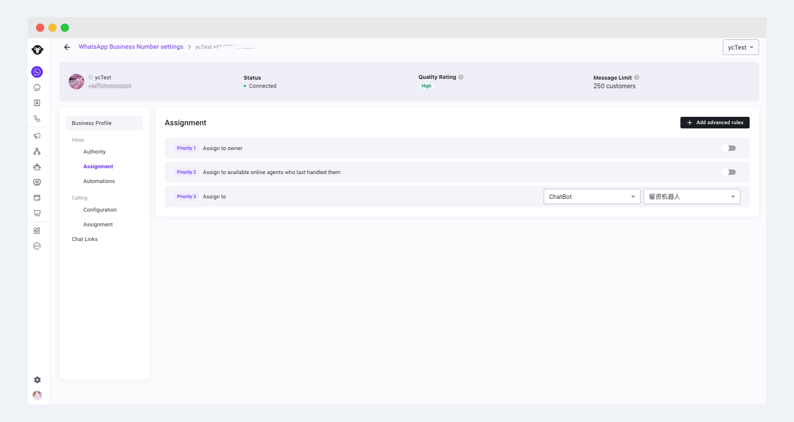
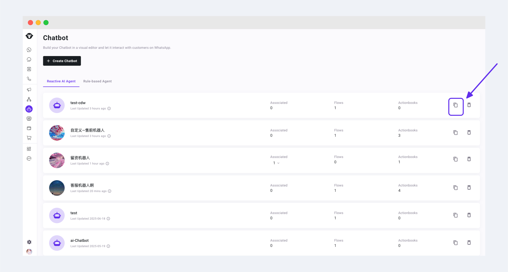
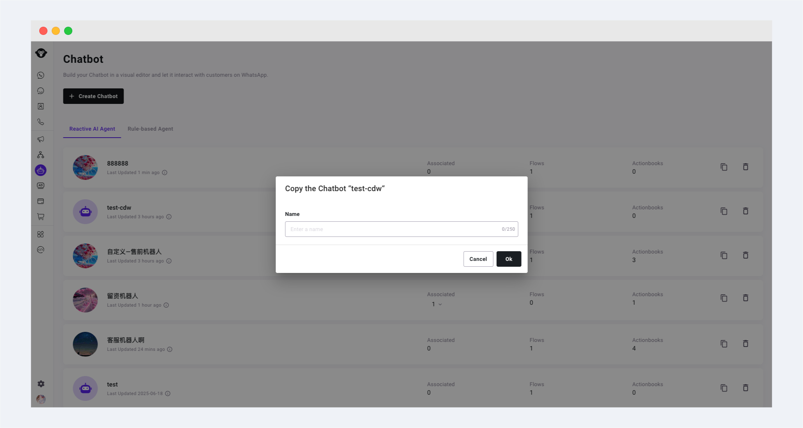

# Create a Chatbot

## Step 1: Create a Chatbot

Go to [YCloud ](https://www.ycloud.com/console/#/entry/login)> ChatBot, Click "Create Chatbot" and select the type of chatbot you want to  create. Then set up the basic configuration for the ChatBot:

The configuration may vary depending on the type of chatbot you choose. Please refer to specific help doc for different types of agents.

[AI Agent](reactive-ai-agent.md)

[Rule-based Agent](rule-based-agent.md)

## Step 2: Configure the Chatbot to Take Over a WhatsApp Number


It is recommended to configure this step after completing the configuration of the Chatbot


Operation path: Enter WhatsApp accounts > Settings > Assignment

<figure><figcaption></figcaption></figure>

In priority 3 assign to, choose Chatbot and then in the second blank choose the Chatbot you want to assign to.

<figure><figcaption></figcaption></figure>

## Copy a Chatbot

For the Chatbot copy function, click the \[Copy] button on the right side of the Chatbot you want to copy

<figure><figcaption></figcaption></figure>

Fill in the configuration such as the name for the copied Chatbot in the pop-up window. Specific configuration may vary depending on the type of Chatbot you are copying.

<figure><figcaption></figcaption></figure>
