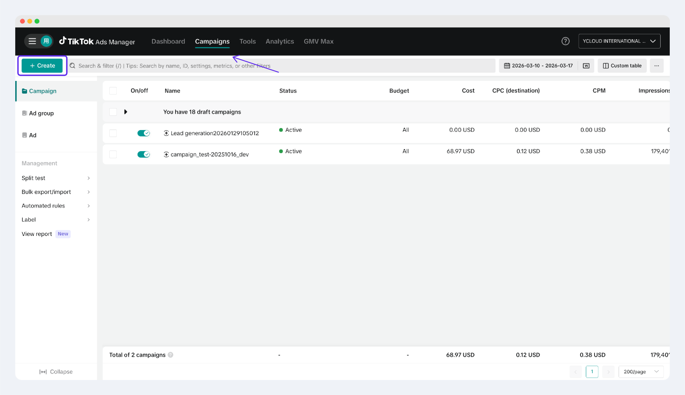
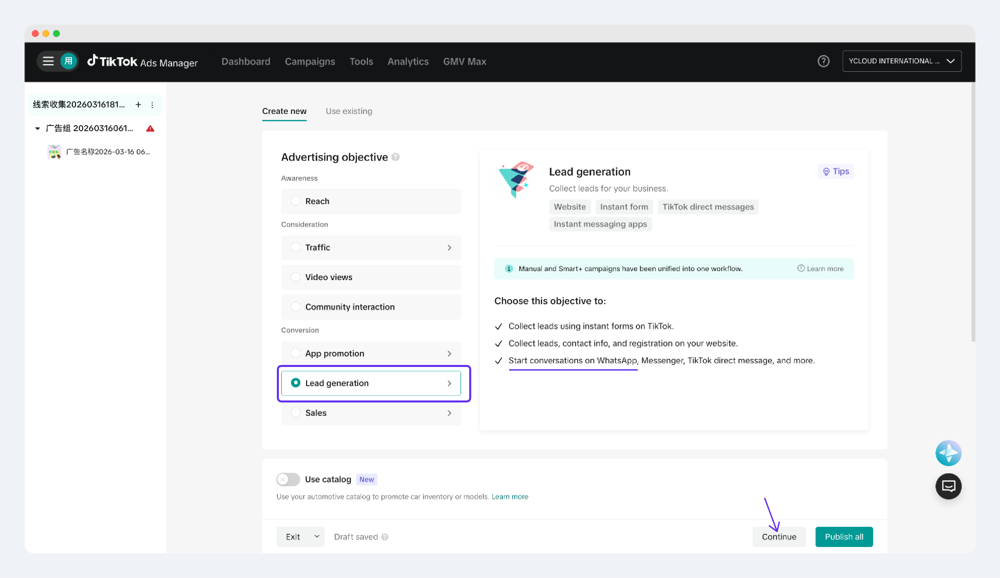
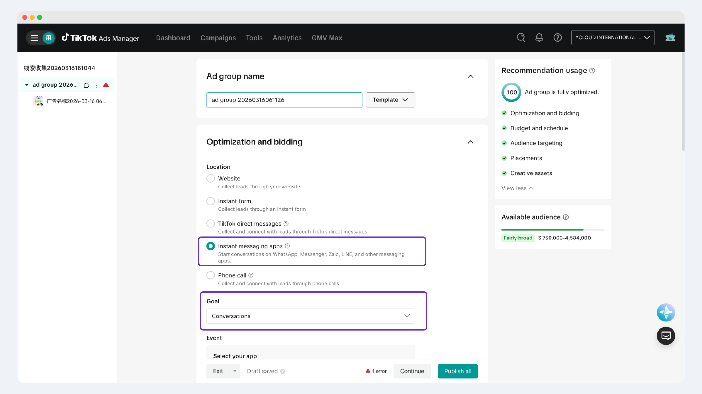
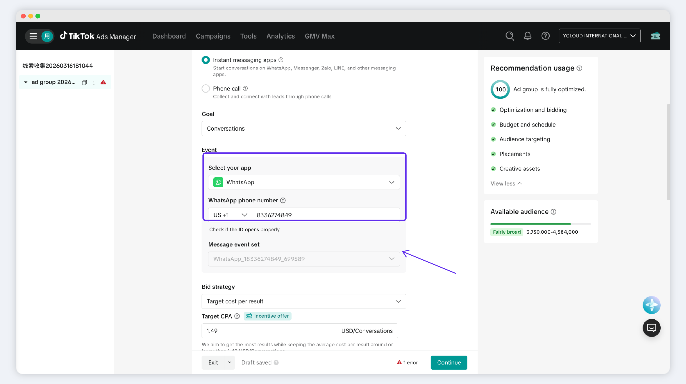
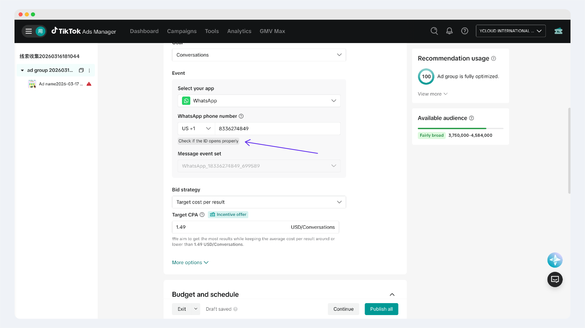
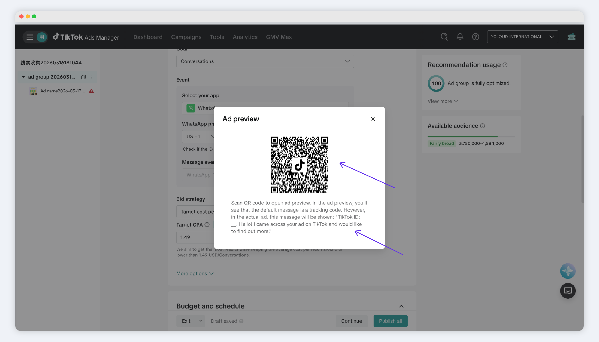

# Create TikTok Instant Messaging Ad


1. Before you begin, read this : [TikTok Messaging Ads](./)
2. Steps 1 & 2: [Authorize TikTok Ad Account](connect-tiktok-ad-account.md)


### Step 3: Create a Campaign in TikTok Ads Manager

Go to TikTok Ads Manager to create an ad campaign.&#x20;

#### **Steps**

1. Log in to [TikTok Ads Manager](https://getstarted.tiktok.com/ttvalue?irgwc=1\&afsrc=1\&irclickid=XK7TIP2wAxyZRu6W4BzY6TnuUkuzaH1RwyBsSU0\&lang=en-US\&gad_source=1\&gad_campaignid=23462953610\&gbraid=0AAAABClJOcVVlo2p9Uozdy1ANAF_0bVRL\&gclid=CjwKCAjw1N7NBhAoEiwAcPchpxlUEiX0xNtEGzufuRo7Dte9ubCkvY0l-I0DfJ2nmK2LyYNsdT_SShoCIqUQAvD_BwE), and click **Create an Ad**.&#x20;

<figure><figcaption></figcaption></figure>

2. Under **Campaign objective**, select **Lead Generation**.

<figure><figcaption></figcaption></figure>

3. Continue to the ad group settings.

### Step 4: Configure the Ad Group and Set Up WhatsApp Business Number

At the Ad Group level, you need to configure the messaging location , WhatsApp Business number, and messaging event set.&#x20;

#### **Steps**

<figure><figcaption></figcaption></figure>

&#x20;

1. Under **Location**, select **Instant Messaging Apps**.
2. Under **Goal**, select **Conversations**.
3. Under **Event - Select App**, select **WhatsApp**.
4. Enter the **WhatsApp Business Number** for ad delivery.&#x20;

<figure><figcaption></figcaption></figure>

When entering the number, please note: the country code must be selected separately. For example, if your number is +1234567, you need to fill in two fields: select **+1**, then enter **234567**.

* After the number is entered, TikTok will automatically match the messaging event set (YCloud has already created the one for your WhatsApp Business Number in **Step 2**).

> ℹ️ If you have questions about the messaging event-set (also called event set) during the TikTok messaging ad creation process, [click here to learn more.](connect-tiktok-ad-account.md)

6. After entering the number, you can click **Check ID** to verify it opens correctly. Use the TikTok app to scan the QR code and experience the WhatsApp redirect interaction.&#x20;

<figure><figcaption></figcaption></figure>

<figure><figcaption></figcaption></figure>

> ℹ️ For TikTok messaging ads, **the welcome message** in WhatsApp is **fixed text** and **cannot be customized by the advertiser**.&#x20;
>
> This text will automatically switch to other languages based on the TikTok user's language settings.

7. Continue to complete the remaining settings, including budget, delivery schedule, audience targeting, and placements.
8. After completing the Ad Group configuration, proceed to the ad creative settings.&#x20;

**Notes**

* The WhatsApp Business number entered must match the number already linked in YCloud.
* The country code and the number body must be entered separately.

### Step 5: Complete the Ad Creative Configuration

Follow the TikTok ad workflow interaction and guidelines to complete the information entry.&#x20;

#### **Steps**

1. Upload ad images or video assets.
2. Enter the ad copy in the **Text** field.
3. Clearly state in the copy that users will start a conversation with the business via WhatsApp after clicking.
4. Preview the ad display and confirm whether the redirect link is correct.
5. Once confirmed, click **Publish** to submit the ad.
6. After the ad passes review, you can turn on the toggle to start delivery.&#x20;

**Important Notes**

* Before publishing, it is recommended to fully preview the redirect link once to confirm that it leads to the correct WhatsApp conversation.
