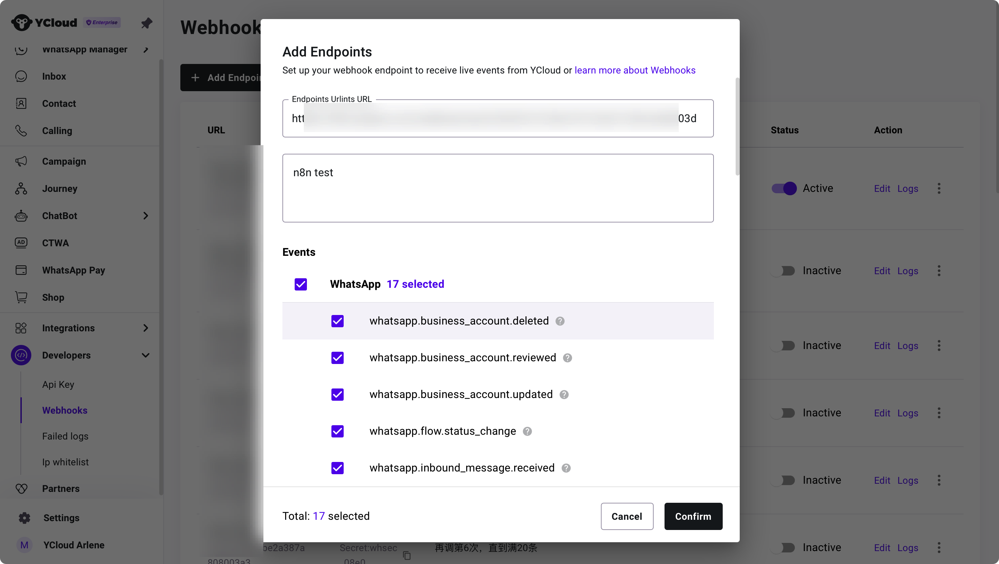
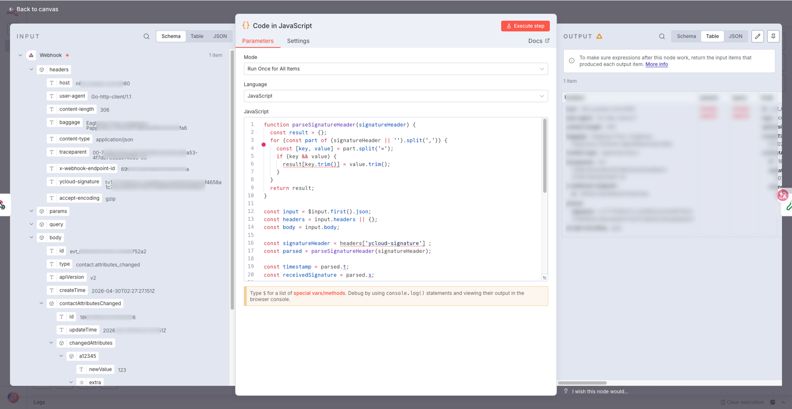
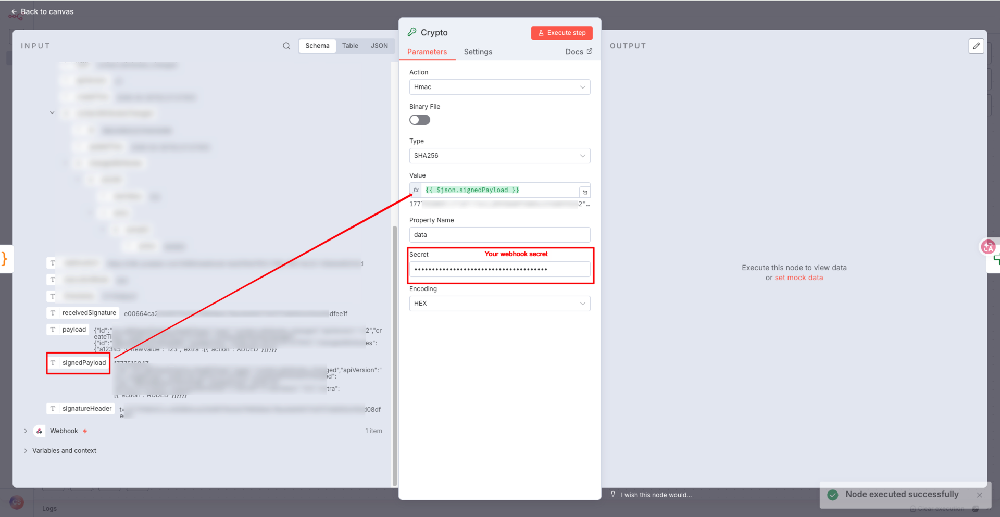
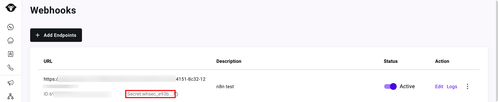
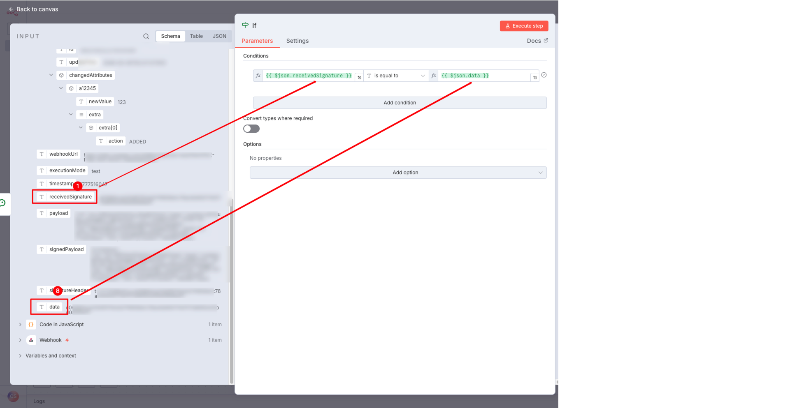
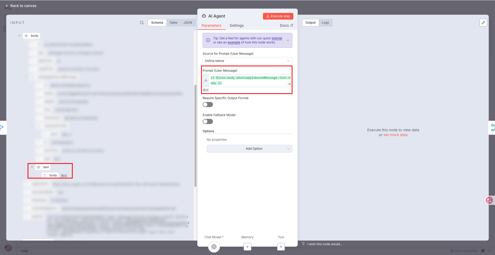
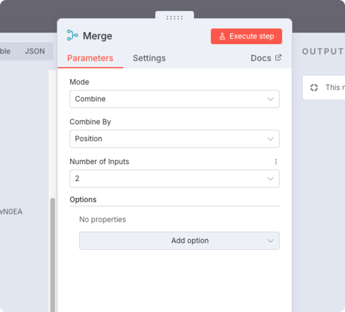

# Example 1: AI auto-reply

This example demonstrates how to implement a basic automated reply workflow using n8n, a large language model and a YCloud node:\
When the YCloud platform receives an inbound message, it triggers an n8n workflow via a webhook. The workflow calls upon the large language model to generate a reply, and then sends the message back to the user via the YCloud node.

> YCloud Chatbot has built a comprehensive AI workflow for you, offering an end-to-end, easy-to-understand AI knowledge base, corpora and automated processes. Click here for more details.

### Overall Process

<figure><figcaption></figcaption></figure>

### Webhook Event

1. Create a Webhook endpoint
   1. Use the n8n Webhook Node to create a new listener
   2. Select POST as the HTTP method
   3. In the Options, set the Response Code to 200 and ensure that ‘Immediately’ is selected

<figure><figcaption></figcaption></figure>

Add your endpoint details to the YCloud platform and select the Webhook events you wish to monitor

<figure><figcaption></figcaption></figure>

### Parse the return value and verify the signature

#### Parse the return value

Parsing the headers in the webhook response using N8N’s built-in ‘code’ node

<figure><figcaption></figcaption></figure>

Select JavaScript for parsing

```javascript
function parseSignatureHeader(signatureHeader) {
  const result = {};
  for (const part of (signatureHeader || '').split(',')) {
    const [key, value] = part.split('=');
    if (key && value) {
      result[key.trim()] = value.trim();
    }
  }
  return result;
}

const input = $input.first().json;
const headers = input.headers || {};
const body = input.body;

const signatureHeader = headers['ycloud-signature'] ;
const parsed = parseSignatureHeader(signatureHeader);

const timestamp = parsed.t;
const receivedSignature = parsed.s;

const payload =
  body === undefined || body === null
    ? ''
    : typeof body === 'string'
      ? body
      : JSON.stringify(body);

const signedPayload = `${timestamp}.${payload}`;

return [
  {
    json: {
      ...input,
      timestamp,
      receivedSignature,
      payload,
      signedPayload,
      signatureHeader,
      
    }
  }
];
```

The return values of this node are:

* The original value,
* The timestamp,
* The received signature, the payload, the signed payload, and the signature information in the request header

#### Encrypted data

In the previous step, the data was fully partitioned. In this node, we will use SignedPayload and Secret. We will use the Crypto node to encrypt the data.

<figure><figcaption></figcaption></figure>

Ge Secret from YCloud platform.

<figure><figcaption></figcaption></figure>

#### Compare signatures

Use an if statement to verify the signature information; if it matches, the verification is considered successful.

<figure><figcaption></figcaption></figure>

#### Reply to messages using AI

Once you have subscribed to the `whatsapp_inbound_message` and `whatsapp_messages_updated` events, you will receive a push notification when a message is received, or a follow-up status update after a message has been sent.&#x20;

1. Use the `switch` node to configure multiple webhook notification types.

<figure><figcaption></figcaption></figure>

2. When an `inbound_message_received` event is received, a reply can be generated by calling the AI API

<figure><figcaption></figcaption></figure>

3. Use the merge node to retain the collection of webhook push data from the preceding section

<figure><figcaption></figcaption></figure>

4. Sending messages using YCloud nodes

<figure><figcaption></figcaption></figure>

Fill in the relevant details, place the AI-generated text in the Body field, and send.


Please note that the sender and recipient are **reversed** here; this is a reply message.


With that, the complete n8n workflow—Webhook → Large Language Model → Automated Reply—is now configured.

### Save to a data table (optional)

<figure><figcaption></figcaption></figure>

### Monitor subsequent updates to the message sent (optional)

Once step 5 is complete, the data will be pushed via the `whatsapp.message.update` event.&#x20;

Upon receiving this push, you can use the `datatable - update rows` node to update the data table, thereby tracking the entire message delivery process.

<figure><figcaption></figcaption></figure>

<figure><figcaption></figcaption></figure>

