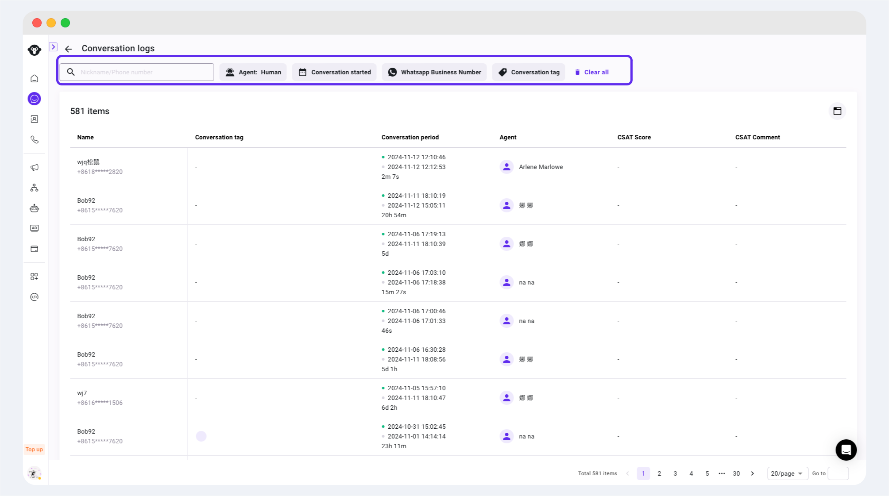

# Conversation Logs

## What are conversation logs

When the team leader needs to conduct regular inspections or spot checks on team members' conversations, the conversation logs are often very useful. The conversation logs are the management background of the conversation record, and all the conversations that have occurred will be recorded in it. In addition, the page of conversation logs also provides a convenient search function, which makes it easy for managers to quickly locate specific conversations and view the specific details of the conversation through the conversation details page.

## How to view conversation logs

### Acess to view

Users with the Inbox manager or Admin role can access the conversation logs.

### Entrance to conversation logs

<figure><figcaption></figcaption></figure>

### View the conversation logs

Enter the conversation logs page, the administrator can view the conversation logs related information in the list, search for contacts through the filter items above, or locate specific conversations by matching other conditions.

<figure><figcaption></figcaption></figure>

Hover the first column and click the arrow icon that appears to jump to the contact list or the contact's Inbox for further viewing.

<figure><figcaption></figcaption></figure>

Click on a blank area of ​​a specific row of the conversation log to expand the details drawer page of the conversation. Click to view the previous or next conversation of the conversation.

<figure><figcaption></figcaption></figure>

In the conversation log details, you can add and delete conversation tags for historical conversation records. For details, please see: [Conversation Tags](conversation-tags.md).
