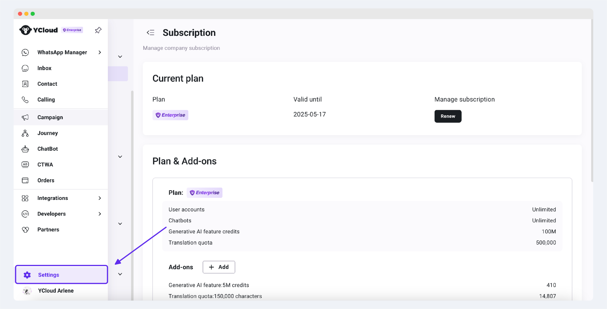

# Conversation Tags

## what are conversation tags

Conversation tags are a convenient tagging tool that we provide for you. When you need to quickly tag a conversation (whether it is open or closed) for classification, you can use conversation tags to quickly implement the tagging operation. Conversation tags support custom text and color, which allows you to manage the session freely.

## How to use conversation tags

### For open conversations

You can add conversation tags to a conversation by clicking the Add Conversation Tag button above the conversation display area.

We support selecting and adding from the existing tag list, or adding tags with custom text.

<figure><figcaption></figcaption></figure>

If you want to delete a specific conversation tag, just place your mouse over the tag and click the delete symbol that appears to the right of the tag to delete the corresponding tag.

<figure><figcaption></figcaption></figure>

### For closed conversations

You can see an Add Conversation Tag button below the ended conversation. Click it to apply the conversation tag to the conversation.

<figure><figcaption></figcaption></figure>

## How to manage the conversation tags

### The acess to manage

Users with the Admin and Inbox manager roles can access the conversation tags management page.

### The entrance to manage

When you add conversation tags in the conversation display area, click the Manage Tags button at the bottom of the list to enter the conversation tag management page.

<figure><figcaption></figcaption></figure>

Or, enter the Inbox Settings page through the Settings button at the bottom left of the page, and select Conversation Tags menu in the left menu.

<figure><figcaption></figcaption></figure>

<figure><figcaption></figcaption></figure>

### Manage conversation tags

1. Click the Add Conversation Tag button to add a custom tag, which supports custom tag text and color.
2. The search bar allows you to filter tags by tag name and tag creation time.
3. Click the Edit button to edit the corresponding tag.
4. Click the Delete button to delete the corresponding tag. Please note that the tags already marked in conversations will also be deleted after deletion. Please operate with caution.

<figure><figcaption></figcaption></figure>

<figure><figcaption></figcaption></figure>
