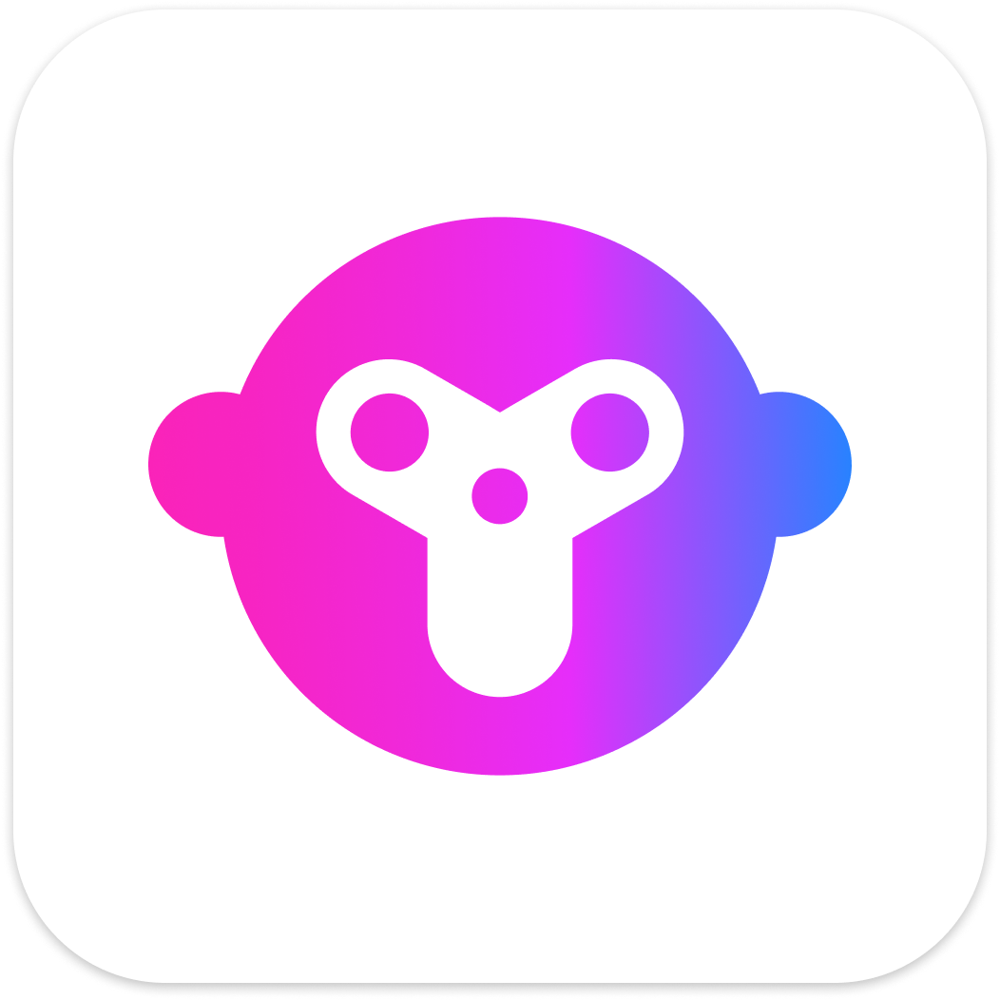
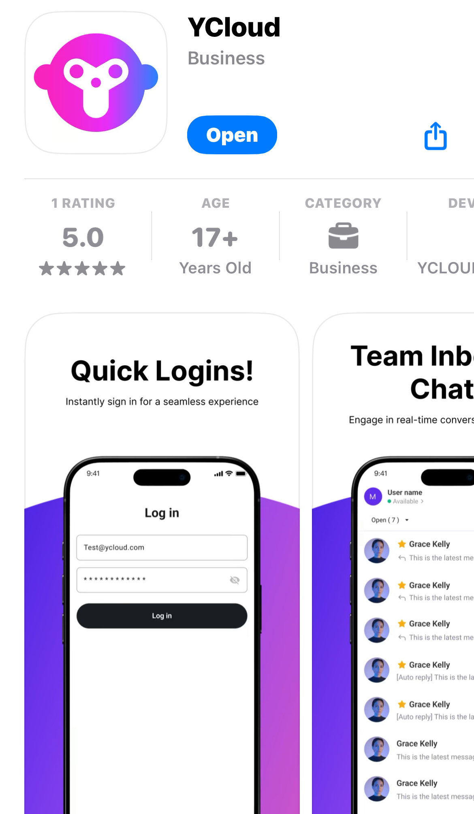

# Inbox Mobile Client

## Download the Mobile Client-Android

<figure><figcaption></figcaption></figure>

&#x20;     [**Click to Download**](https://oss-ycloud-publicread.oss-ap-southeast-1.aliyuncs.com/tmp/inbox.apk)

## Download the Mobile Client-IOS

<figure><figcaption></figcaption></figure>

&#x20;[    **Click to Download**](https://apps.apple.com/us/app/ycloud/id6745244974)

## Download the Mobile Client-Google Play

<figure><figcaption></figcaption></figure>

&#x20;[  **Click to Download**](https://play.google.com/store/apps/details?id=com.ycloud.inbox)


If there are any subsequent version updates, you need to follow the pop-up guide in the app to update the app before you can continue to use it.


## Inbox Mobile Features

### Login, log in with your account password

<figure><figcaption></figcaption></figure>

### Conversation list

1. Filter conversation status, supporting the filtering of conversations that are open, closed, or in all states
2. Support conversation sorting, which can prioritize the latest incoming conversations, unread conversations, and starred conversations
3. Support clicking the funnel button to expand advanced filtering, including filtering by conversation assignment, filtering by contact tags, and selecting specific custom filters
4. Switch the agent's current online or offline status by clicking the button below the avatar
5. Search for conversations. Click the magnifying glass button to search for conversations by customer number or name
6. Add a new conversation, click the plus button, and send a message to the specified number
7. View the conversation, click on the specific conversation in the list to see the chat details

<figure><figcaption></figcaption></figure>

<figure><figcaption></figcaption></figure>

### Conversation details

1. You can close the current conversation by clicking the "close" button in the upper right corner
2. You can access the conversation that is being handled by other agents by clicking the "assign to me" button
3. When sending free-form conversations is no longer supported, you can send a template message by clicking the "template message" button below

<figure><figcaption></figcaption></figure>

<figure><figcaption></figcaption></figure>

4. Click the settings button in the upper right corner to add conversation tags to the current conversation
5. Support transferring the current conversation to another agent
6. Support adding the current contact to the blocklist
7. Support adding the current contact to the \[Unsubscribe] list

<figure><figcaption></figcaption></figure>

<figure><figcaption></figcaption></figure>

8. Click the plus button on the left side of the input box to select and send pictures, videos, and other attachments
9. Support sending canned response
10. Support sending template messages
11. Support the translation function of input box content

<figure><figcaption></figcaption></figure>

### Contact details

1. Click on the contact's avatar to enter their contact details
2. Support changing the contact's nickname
3. Support editing contact tags
4. Support to modify other contact attributes 

<figure><figcaption></figcaption></figure>

<figure><figcaption></figcaption></figure>

### Settings

1. Enter the translation settings, you can turn on the automatic translation switch, and select the target language for translation
2. Support choosing the workbench language
3. Support switching companies
4. Support logging out

<figure><figcaption></figcaption></figure>

<figure><figcaption></figcaption></figure>

