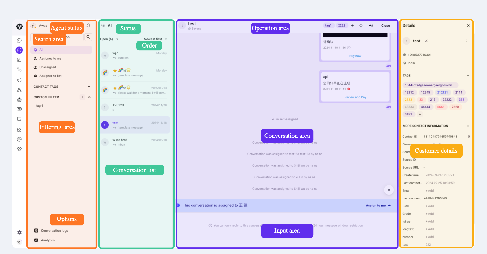
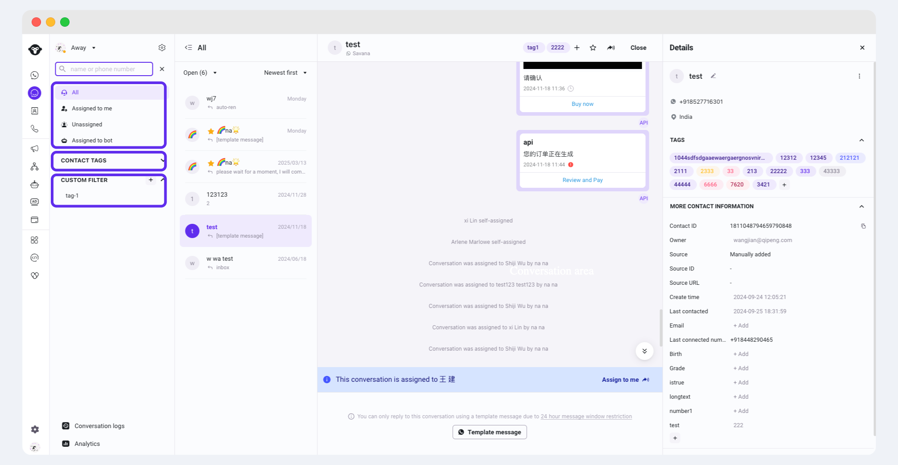
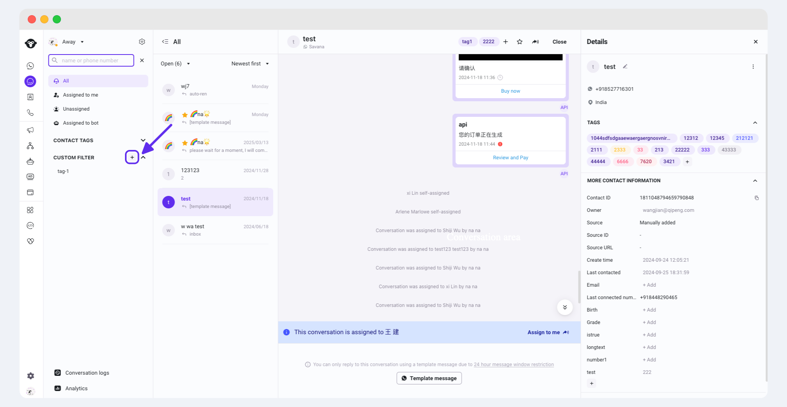
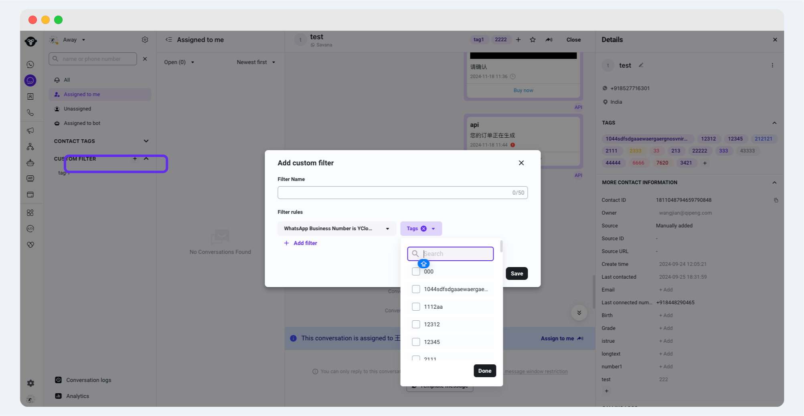
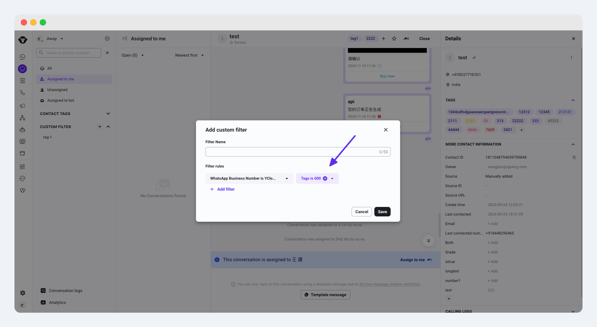

# Quick start with Inbox

Inbox Interface

Quickly understand the Inbox operation interface by area division.

<figure><figcaption></figcaption></figure>

**Orange Area: Inbox Search and Filtering Area** - By entering keywords or setting specific conditions, helps users quickly find conversations or messages, including:

* Agent status: Set the current status as "Away" or "Available". When set to "Away", conversations are not automatically assigned (unless special settings in the assignment rules apply).
* Search area: Basic search to help quickly find target customer sessions.
* Filter area: Quickly filter Inbox conversations by allocation status, contact tags and custom filters.
* Options: Data analysis, Inbox settings.

**Green Area: Conversation List** - Lists all conversations, allowing users to quickly switch and select which conversation to view or continue.

**Purple Area: Chat Area** - This is the main area where users communicate in real-time and send messages, displaying both parties' messages, including:

* Conversation area: Displays the conversation content.
* Message input area: Users input text, emojis, files, templates, etc., to be sent.
* Operation area: Provides a series of agent-executable actions, such as marking as favorite, transferring conversations, etc.

**Yellow Area: Customer Details** - Displays detailed information about the user related to the current conversation, such as name, profile image, contact details, and allows adding tags and modifying contact attributes.

## Inbox Search and Filtering Area

Helps users quickly find the desired conversations or messages.

### Basic Search

Inbox supports searching historical chat records by **phone number and name**. Note that text-based search for conversations is currently not supported.

Operation guidance: Log in to YCloud Inbox > Click the search box at the top left > Enter name/number to search.

<figure><figcaption></figcaption></figure>

### Quick Filter

Quickly filter Inbox conversations by allocation status, contact tags and custom filters. Each category supports single selection only.

<figure><figcaption></figcaption></figure>

### Advanced Filter

Inbox supports advanced filtering of conversations by combining single or multiple conditions, with multiple selections within conditions.

Click the add button at the left to custom filter. Advanced filtering  will automatically pop up.

<figure><figcaption></figcaption></figure>

**Adding Conditions**

Select the conditions to filter by and set the filtering rules. After adding, you can continue to click "Add filter" to add more conditions.


The relationship between conditions is "and".


<figure><figcaption></figcaption></figure>

**Deleting Conditions**

**Hover the mouse over the corresponding condition and click the cross to delete the added filtering condition.**

<figure><figcaption></figcaption></figure>

**Viewing Filter Results**

View the filtered results in the conversation list.

<figure><figcaption></figcaption></figure>

**Closing Advanced Filter**

Click the advanced filter button again to close it.

<figure><figcaption></figcaption></figure>

### Bulk transfer and close for conversations

Inbox provides functions for bulk transferring and closing conversations.Hover your mouse over the conversations you want to operate in batches, and a check box will appear on the left side of the conversation. Check the conversations you need to process in batches. On the right side of the page, you can see the number of conversations currently selected. Press the ESC key on your keyboard to cancel the current selection.

If you need to transfer conversations in batches, click the transfer button in the upper right corner of the conversation list and select the specific customer service you want to transfer these conversations to or transfer them to the "unassigned" group. The system will pop up a secondary confirmation window. After confirmation, the system will complete the transfer operation for you.

If you need to close conversations in batches, click the close button in the upper right corner. The system will pop up a confirmation window. After confirmation, the system will close the selected conversations in batches for you.

<figure><figcaption></figcaption></figure>

## Inbox Chat Area

### Conversation Display Area

In Inbox, a "conversation" is the entire exchange process between you and a specific contact, including all content exchanged. A "message" is a specific piece of content sent or received during this exchange.


Since Inbox is linked to all WhatsApp numbers under the YCloud account, there may be multiple conversation windows for the same customer. Please distinguish the corresponding WhatsApp number for the conversation by the Inbox name next to the user name at the top of the chat area.


#### **Conversation Status**

* Open
* Close

**Conversation Status Explanation**

Conversation opened by \{{1\}}: The conversation was opened by the client/agent.

Conversation was assigned to Agent B by Agent A: The current conversation was transferred from Agent A to Agent B.

The ”\{{1\}}“ tag was added by Agent A: Agent A added a “XXX” tag to the current customer.

Conversation was starred by Agent A: Agent A starred the current conversation.

Conversation was unstarred by Agent A: Agent A unstarred the current conversation.

Conversation status was changed to "Closed" by Agent A: The current conversation was closed by Agent A.

Conversation status was changed to "Closed" automatically: The current conversation was automatically closed after 24 hours without a reply from the customer.

#### **Message Status**

 Sent: The message has been successfully sent.

 Delivered: The message has been successfully delivered to the recipient's phone or any connected device.

 Read: The message has been read.

 Send Error: Hover the mouse to display the error reason.

#### **Message Actions**

Hover the mouse over the message to reveal the "three-dot operation button", click the button to perform related actions.

<figure><figcaption></figcaption></figure>

* **Message Quote (Reply)**: When you quote a message on WhatsApp, it attaches the original message to your new message, making it clear which message you are replying to, avoiding confusion.

<figure><figcaption></figcaption></figure>

* **Message Reaction (React)**: The message reaction feature on WhatsApp is similar to Facebook's Reaction emojis. Users can like, express love, surprise, sadness, etc., to a message. This feature allows you to express your feelings about a message more quickly and intuitively without typing a text reply.

<figure><figcaption></figcaption></figure>

#### **Sender**

Distinguish the sender by avatar.

<table><thead><tr><th width="247">Sender</th><th>Avatar</th></tr></thead><tbody><tr><td>Agent</td><td></td></tr><tr><td>Chatbot</td><td></td></tr><tr><td>API</td><td></td></tr><tr><td>Inbox Auto-Reply</td><td></td></tr></tbody></table>

### Message Input Area

**Conversation Assigned to Me**

<figure><figcaption></figcaption></figure>

**Add messages through the chat area icons, supporting the following functions:**

1. Add emoji
2. Add attachment
3. Send template

<figure><figcaption></figcaption></figure>

**Add Quick Reply**

Enter "/" to select a quick reply to add into the chat box. For details, see: [Quick Reply](company-canned-response.md)

**Send Message**

Send the message by pressing Enter on the keyboard or clicking the "Send" button.

## User Information and Operation Area

### Basic Operations Supported

**Conversation Tags**

You can tag the current conversation or historical conversations. For details, see: [Conversation Tags](conversation-tags.md)

**Star User**

For high-value customers, you can also click the star to favorite this customer. This customer will then be listed under the Starred label on the left.

<figure><figcaption></figcaption></figure>

**Transfer Conversation**

Click the "Transfer" button next to the user name at the top of the conversation area, and select the person to transfer to from the dropdown list. You can enter a name for quick search.

<figure><figcaption></figcaption></figure>

**Close Conversation**

Click the "Close" button next to the user name at the top of the conversation area to end the conversation. The conversation status changes to "Closed".

<figure><figcaption></figcaption></figure>

## Customer Details

Click the "Expand" button or the customer's avatar to expand the customer details, and edit and modify customer attributes through the customer details.

* Modify customer nickname: Click the edit icon next to the customer's name.
* Modify customer assignment: Click the assignment dropdown box, select a customer service person or team.
* Add tags: Find the Tags category, click the "➕" button to select existing tags.
* Modify attributes: Click the text behind the attributes to modify the relevant attributes. Clicking on a blank area will save the changes (you can also press Enter on the keyboard to save).

<figure><figcaption></figcaption></figure>

<figure><figcaption></figcaption></figure>
