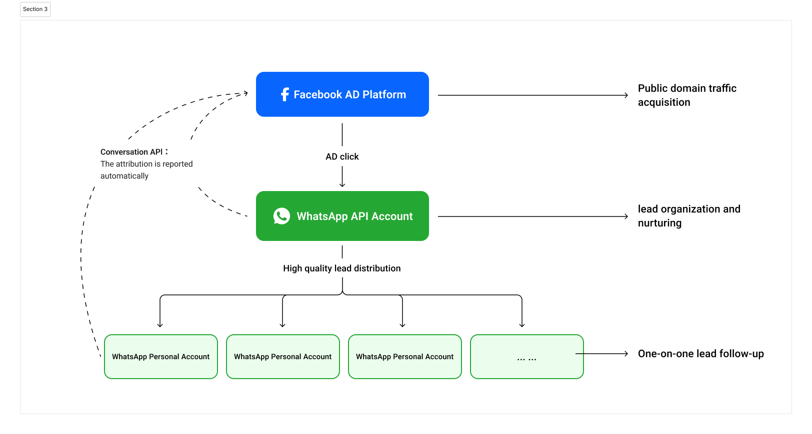

# Acquire More Customers (CTWA)

CTWA (Click-to-WhatsApp Ads), as an innovative form of advertising, is a great tool to acquire new customers and help you make the most of your AD spend on Facebook and Instagram!

<figure><figcaption></figcaption></figure>

## What is Click on WhatsApp Ads (CTWA)?


CTWA is a form of Facebook and Instagram advertising. It allows viewers to initiate WhatsApp conversations with brands directly from ads they see on platforms like Facebook or Instagram. Conversations can be completely human-led or automated using the YCloud WhatsApp Bot, with the option to hand over to a human agent using YCloud's human takeover module.Marketers have struggled to create landing pages with high conversion rates and generate leads, but now we can eliminate landing pages to shorten user journeys and replace them with real-time, personalized conversation experiences that make marketing easier.


<figure><figcaption></figcaption></figure>

## Why Use Click on WhatsApp Ads (CTWA)?


* Attract new customers: Attract more customers and let them know about your product or service through the platforms they use in their leisure time (Facebook and Instagram). In countries like Indonesia and Malaysia, people use Facebook and Instagram to get news and celebrity updates, and WhatsApp to interact with friends and family.
* Increase conversions and drive sales: CTWA can capture users' attention better than traditional advertising because users can interact directly with businesses through WhatsApp, and this personalized, instant communication can increase user engagement and drive sales.
* Improve ROI: Integrate with Meta's conversion API to feed events back to the AD platform, allowing the AD system to optimize AD targeting to achieve conversion and reduce the cost per operation.
* Window of opportunity for remarketing: This form of advertising eliminates the landing page and establishes a WhatsApp based connection with the customer. Even if the customer fails to complete the transformation this time, it can also establish long-term contact with the customer through WhatsApp and promote long-term transformation in the way of private messages.


## Suitable business type&#x20;

In general, CTWA is suitable for industries that need to generate transactions through chat interactions. For example: finance, insurance, healthcare, B2B trade, real estate, short plays, novels, automobiles and DTC e-commerce.

> Here's how to get started using CTWA for customer acquisition

## Pre-preparation

Before you can start acquiring customers through CTWA, you need to complete the following steps:

### Step 1: YCloud account creation

[Click to register](https://www.ycloud.com/console/#/entry/login?lastPath=https%3A%2F%2Fwww.ycloud.com%2Fconsole%2F%23%2Fapp%2Fdashboard%2FgetStarted) your YCloud account.

### Step 2: Create a WABA accountDocuments to be prepared:

* A Facebook account
* Phone number.

The phone number must be able to receive voice calls or text messages.This number has no previous WhatsApp App or business account.

<figure><figcaption></figcaption></figure>

Click to view [Create a WhatsApp Business API Account](https://helpdocs.ycloud.com/help-center/kuai-su-ru-men/chuang-jian-whatsapp-business-api-zhang-hu)

### Step 3: Invite sales and customer service teams

The leads will interact with your WhatsApp enterprise account, and you will need to arrange in advance for your sales/customer service team to access the YCloud platform and configure the corresponding permissions for them.

Invitation procedure:

* Account in the lower left corner > Company settings > Users and teams > Invite user

Click to view [Users and Teams](https://helpdocs.ycloud.com/help-center/zhang-hu-guan-li/yong-hu-he-tuan-dui)

### Step 4: Set the customer assignment rule

Then configure the sales/customer service invited in Step 3 into the WhatsApp business number assignment rules to ensure that they can receive inquiries from prospective customers in a timely manner.

<figure><figcaption></figcaption></figure>

Click to view [Conversation Assignment Rules](https://helpdocs.ycloud.com/help-center/whatsapp-accounts-zhang-hao-guan-li/shou-ji-hao-ma-guan-li/dui-hua-fen-pei-gui-ze)

## CTWA advertising

Once the pre-setup is complete, you can start advertising:

### Step 1: Check the AD account link status or connect to the Facebook AD account if not connected

* [Log in to your YCloud account](https://www.ycloud.com/console/#/app/getStarted) > [CTWA](https://www.ycloud.com/console/#/app/ctwa/noAccount)

YCloud automatically associates all advertising accounts under your WhatsApp business account BM.

You can view it in Ad acount

<figure><figcaption></figcaption></figure>

_In the future, YCloud will support you to bind different BM Facebook advertising accounts, please look forward to it._

### Step 2: Connect the WhatsApp Business API number to your Facebook pageMake sure you have administrator rights for your Facebook Page

* Navigate Facebook Page > Click Settings (top right) > Select WhatsApp
* Enter your WhatsApp Business phone number and click "Continue"

If your WhatsApp account and advertising account belong to the same BM, you can complete the binding directly.

If your WhatsApp account and the AD account do not belong to the same BM, log in to your WhatsApp BM account again, visit the Request page, and approve the binding request.

<figure><figcaption></figcaption></figure>

If you want to run an advertising campaign on Instagram, you should also associate your Instagram account with your Facebook page.&#x20;

Once you've completed the above steps, you're ready to set up your first Click-to-WhatsApp AD.

### Step 3: Set up Click-to-WhatsApp ads on Facebook AD Manager

1. Open Facebook AD Manager

Visit your Facebook AD Manager and click "Create" to get started.

2. Select the target of your marketing campaign

To use with WhatsApp, select "**Engagment**"

<figure><figcaption></figcaption></figure>

3. Select the Manual sales campaign

<figure><figcaption></figcaption></figure>

4. Fill in the relevant basic information to create your campaign. This includes:

* Name your campaign
* State whether you have a special advertising category, such as recruitment
* Define whether you want to A/B test your ads
* Note: The Advantage+ catalog ads need to be turned off in this step

<figure><figcaption></figcaption></figure>

5. Configure AD group details

* Conversion location: Select "Messaging apps"
* Ad type: Select "Click to message"
* Facebook Page: Select the Facebook Page
* Messaging Apps: Select WhatsApp. Be careful not to select another message app such as Messager
* Performance goal: Select Maximize number of purchases through messaging

You will not see the WhatsApp number until you have completed step 2 above: Connecting your WhatsApp Business API account to your Facebook page.

Ads are automatically optimized based on Converted data sent back by YCloud only when the Performance goal is selected to Maximize number of purchases through messaging. [Click to learn about CTWA's conversion tracking](https://helpdocs.ycloud.com/help-center/ctwa-dian-ji-whatsapp-guang-gao/ctwa-fen-xi)

<figure><figcaption>
Select a WhatsApp number
</figcaption></figure>

<figure><figcaption>
Select performance goal
</figcaption></figure>

6. Choose your audience, location, budget, and schedule

Please refer to the Facebook advertising documentation for a full understanding of the bidding strategy.Now that you have successfully selected the campaign's goals and budget, click "Next" and define the campaign's AD group.

7. Create your AD ideas

Here's a 5-point list of ways to optimize your creative and media placement for the best results:

* Edit specific AD placement on Facebook and Instagram to resize images. You can also convert a set of images into a video slideshow to increase click-through rates.
* Add the main text and title To your Click To WhatsApp AD. You can add up to five main text options and headings.
* Add a note to your AD for more details and context.
* Select the CTA button for your WhatsApp ads. You can choose from a number of available CTAs.
* Preview the ads in the display location in Advanced Preview. This is how each media display location looks on Facebook and Instagram feeds.

8. Create and preview message templates

Click "New" and create a welcome message template for a quick chat after people click on your AD.

<figure><figcaption></figcaption></figure>

9. Publish your AD

Facebook will now review your ads. Once approved, it will go live based on your location.Click to view [Set Up a Click-to-WhatsApp Ad in Facebook Ad Manager](https://helpdocs.ycloud.com/help-center/ctwa-dian-ji-whatsapp-guang-gao/chuang-jian-dian-ji-whatsapp-guang-gao-ctwa#step-3-set-up-a-click-to-whatsapp-a-d-in-facebook-ad-managerSet)

## AD tracking and attribution

### Step 1: Add tracking metricsWe set up basic tracking metrics based on the user's AD journey, including:

* Conversations started: The number of conversations initiated by people who saw the AD.
* Participation: After the prospect sends the second message

We also support you in defining new conversion tracking metrics by collecting conversation data:

Select the campaign you want to manage > Track Events > Click + Track New Events.

Here you can choose tracking methods, including tagging leads or triggering keywords in the chat.

<figure><figcaption></figcaption></figure>

### Step 2: Review the tracking data

* View the Leads brought by the AD

Click on "Track events" to the right of the campaign.

<figure><figcaption></figcaption></figure>

Select the Track events you want to View and click "View Leads".

<figure><figcaption></figcaption></figure>

View the Leads that triggered the trace event.

<figure><figcaption></figcaption></figure>

### Step 3: Set the conversion attribution

You can choose the most important events in the list to define as converted.

When a customer triggers this event, it is passed on to the Facebook AD platform via CAPI to optimize AD targeting. [Learn about CAPI](https://helpdocs.ycloud.com/help-center/ctwa-dian-ji-whatsapp-guang-gao/zhuan-hua-api-capiLearn)

You can click the "Set as Conversion" button on the interface to define the event as a "conversion" of the campaign.

<figure><figcaption></figcaption></figure>

## Converted customer&#x20;

### Receive visiting customer leads in your Inbox&#x20;

Lead inquiries are assigned to the appropriate sales or customer service staff based on pre-set customer allocation rules.

Sales/customer service needs to log in to the YCloud Inbox workbench to reply to customer messages.&#x20;

Where to go: [Log in to your YCloud account](https://www.ycloud.com/console/#/app/getStarted) > [Inbox](https://www.ycloud.com/console/#/app/inbox/chat)

<figure><figcaption></figcaption></figure>

Click to view [Quick start with Inbox](https://helpdocs.ycloud.com/help-center/inbox/chu-shi-inbox-jie-mian?fallback=true)

## Best practice

### Convert customers in 24 hours using chatbot&#x20;

Chatbot can provide round-the-clock customer service, reduce costs, and standardize service processes.&#x20;

During non-working hours, Chatbot can collect information and needs from potential customers, providing valuable data for the sales team to follow up during business hours. Not only does this increase customer satisfaction, but it can also capture potential customers for new business opportunities during non-working hours.

<figure><figcaption></figcaption></figure>

Click to view [Quick start with Chatbot](https://helpdocs.ycloud.com/help-center/chatbot/chuang-jian-yi-ge-chatbot)

### Customer remarketing

Remarketing is an effective strategy to convert potential customers into actual purchasers, through which a business can re-engage customers who have shown interest but have not yet made a purchase.

#### Bulk remarketing:

* Circle re-marketing targets

1. Select target customers by Contact attribute filtering, including source, label, etc
2. Download leads from CTWA AD Tracking event

<figure><figcaption></figcaption></figure>

* Using WhatsApp's Campaign feature, businesses can send customized messages to customers who have already indicated their intention to buy. These can be promotions, special offers, or new product information designed to motivate customers to buy.

<figure><figcaption></figcaption></figure>

Click to view [Quick start with Campaign](https://helpdocs.ycloud.com/help-center/campaign/chuang-jian-whatsapp-ying-xiao-huo-dong)

#### Automated incubation clues

Compared to a one-time group email, Journey can help you free up your hands and improve your efficiency.

Using Journey tools, you can automatically follow up with potential customers and guide them toward purchasing decisions through a series of interactions and messaging. This approach can help businesses better understand their customers' needs and deliver the right information at the right time.

<figure><figcaption></figcaption></figure>

Click to view [Quick start with Journey](https://helpdocs.ycloud.com/help-center/journey/chuang-jian-yi-ge-journey)

### Connect and transform deeply with WhatsApp Personals&#x20;

For many business models with high customer rates, it is impossible to close a transaction through a simple conversation.&#x20;

At this point, allowing sales to connect with customers through personal WhatsApp accounts is essential to maintain a deep engagement with customers for a long time.&#x20;

You can build long-term trust and complete the conversion by giving the lead of intention to the sales team for one-on-one communication, or pulling a group, or demonstrating dynamic trust enhancement.

<figure><figcaption></figcaption></figure>

Calling Online&#x20;

The Calling feature allows you to make voice calls directly to customers via WhatsApp, which can be used to resolve complex issues or engage in deeper communication to enhance customer trust. It can also be used to follow up on sales opportunities. Through direct conversations, businesses can more effectively persuade customers and facilitate the completion of sales.&#x20;

Calling is currently in Beta testing and only available to customers in <mark style="color:red;">Brazil, Mexico, India or Indonesia.</mark> If you are interested, contact YCloud Service.

<figure><figcaption></figcaption></figure>

Click to view [You can talk to the customer now! Inbound Calling is now online!](https://ycloudteam.feishu.cn/docx/LJdJdOULzogwcMxN9GfcXuMonNl?from=from_copylink)


In today's competitive digital marketing landscape, CTWA stands out in social media advertising with its immediacy, personalized communication and high conversion rates, making it a powerful tool for acquiring new customers. By simplifying the user interaction process and directly connecting potential customers with the brand, it significantly improves user engagement and response speed, and has significant advantages in improving marketing efficiency and customer engagement quality. Therefore, enterprises should adopt CTWA as soon as possible to seize the opportunity to achieve a leap in marketing efficiency, accelerate customer relationship building and business growth.

