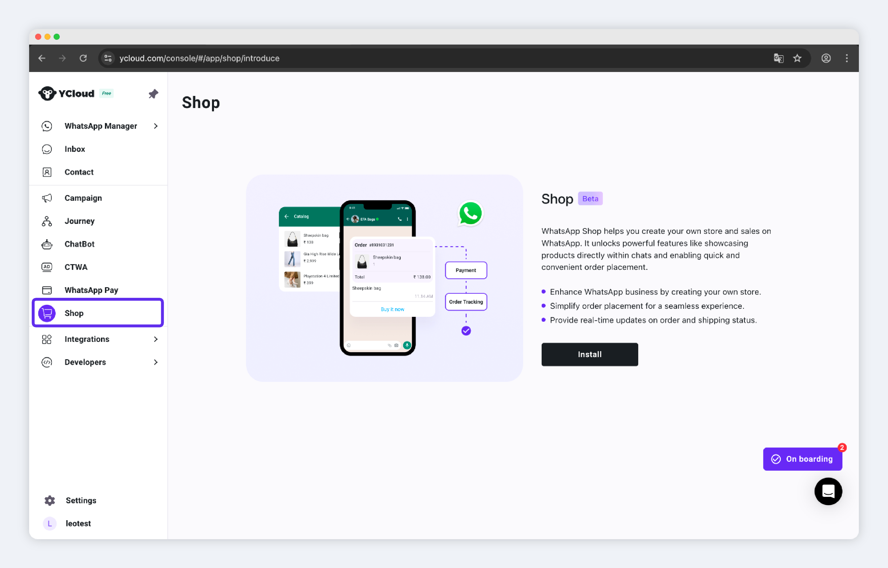

# Shop Overview

Learn how to create and customize your online Shop.

<figure><figcaption>
entrance of  Shop
</figcaption></figure>

We will introduce the SHOP   through the following modules:

* [Install Shop ](creatstore.md)
* [Shipping settings](shipping.md)
* [Payment settings](payments.md)
* [Product](products.md)
* [Order](orders/)

