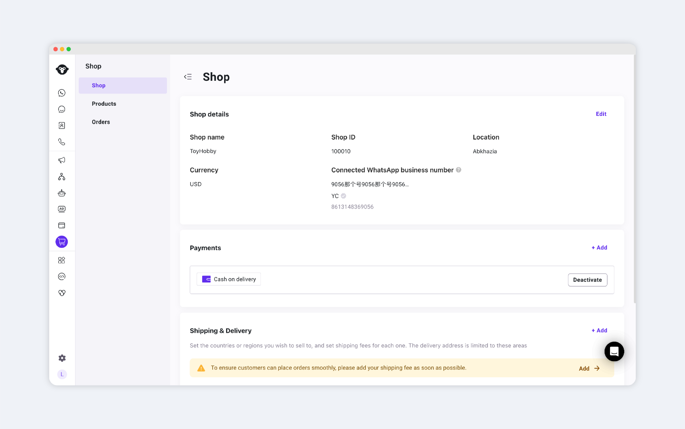
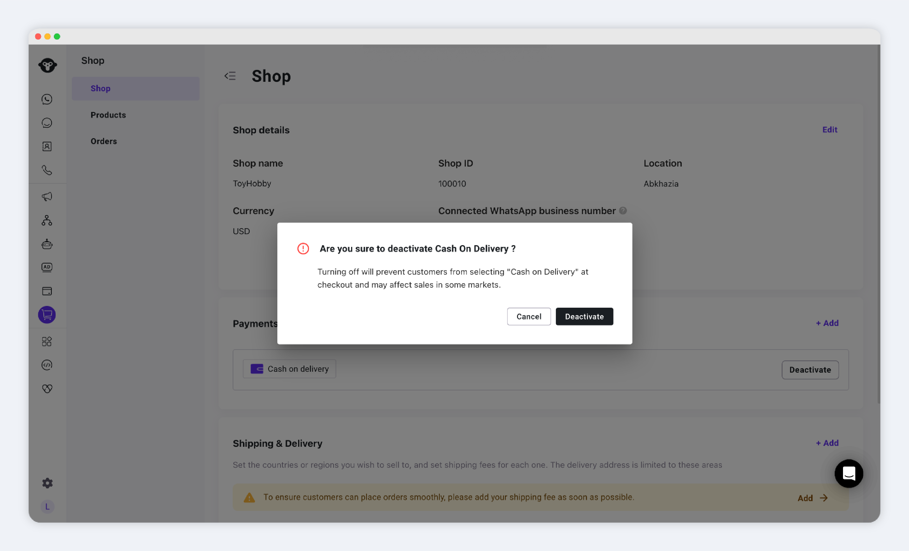
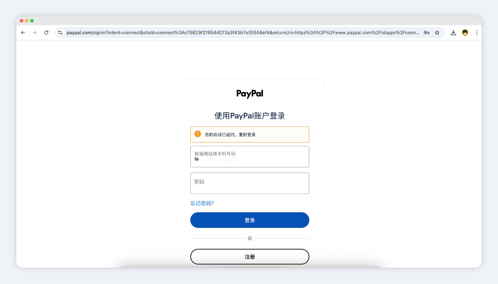
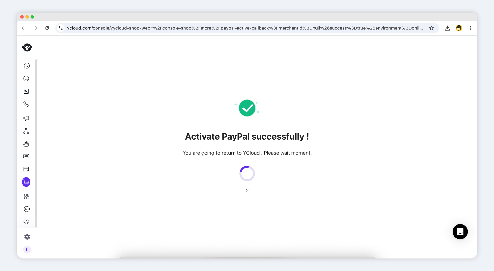

# Payment Settings


Currently, Shop supports the following payment options:

* **Cash on Delivery (COD)**
* **PayPal  wallet**


***

When your Shop is first activated, all payment options are disabled by default.&#x20;

You can enable them as needed.

#### Add a Payment Method

* Click **Add** in the payments section.
* Choose the payment method you wish to enable.

<figure><figcaption></figcaption></figure>

click add and choose payment method

<figure><figcaption></figcaption></figure>

### Cash on Delivery (COD)

**Activation Steps:**

1. Select **Cash on Delivery**.
2. In the popup, click **Activate**.

<figure><figcaption></figcaption></figure>

*   Once activated:

    * COD will appear as an available payment option during checkout.
    * Customers can place orders without paying upfront.
    * You ship the product; they pay upon receipt.

To disable, click **Deactivate**

<figure><figcaption></figcaption></figure>

The option will no longer appear.

### PayPal Wallet

**Activation Steps:**

1. Select **PayPal**.
2. Click **Activate**.
3. You will be redirected to PayPal to log in and authorize:
   * Must use a **Business** PayPal account (personal accounts cannot be connected).

<figure><figcaption></figcaption></figure>

4. After authorization, you’ll return to the Shop backend with a confirmation of successful binding.

<figure><figcaption></figcaption></figure>

5. You’ll see the PayPal business account listed in the payments section.

<figure><figcaption></figcaption></figure>

6. Once active, PayPal appears as an available payment option during checkout.

To deactivate, simply click **Deactivate**, and PayPal will be removed from the customer’s payment options.

Once you’ve completed your payment setup, you can proceed to:

* [**Manage Products**](products.md)
* [**Manage Orders**](orders/)
