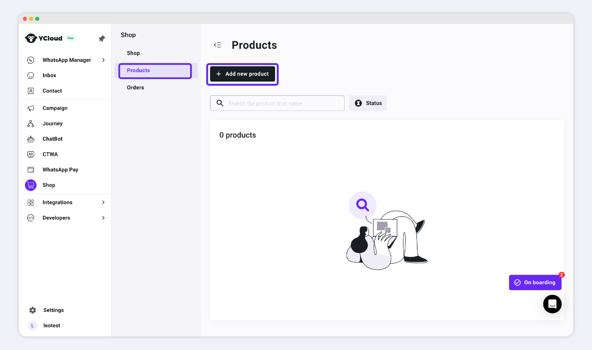
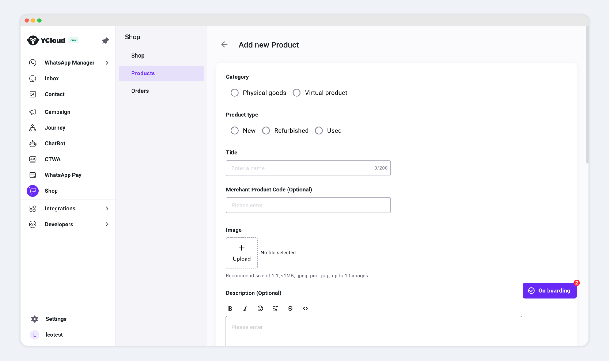
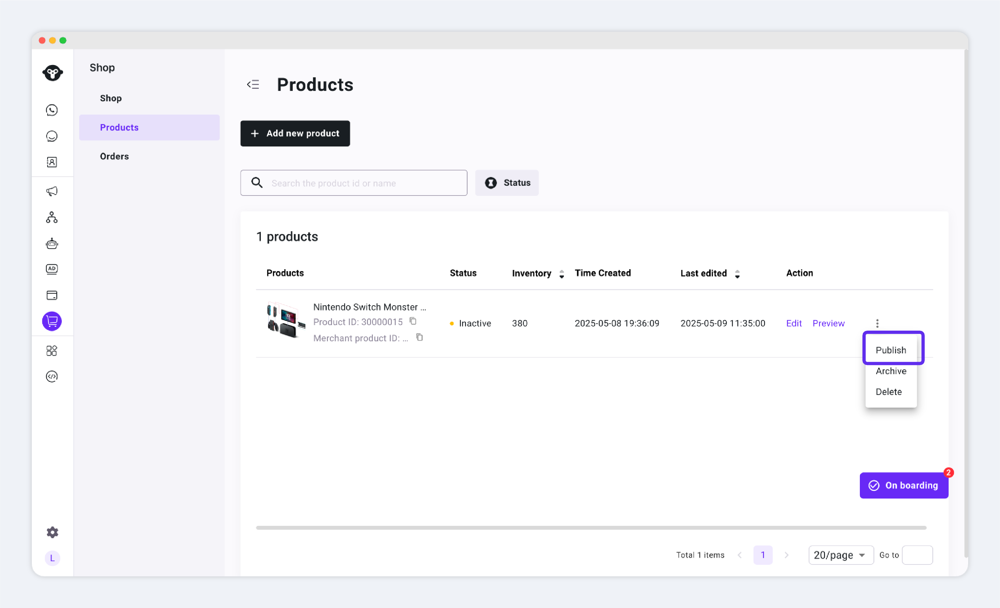
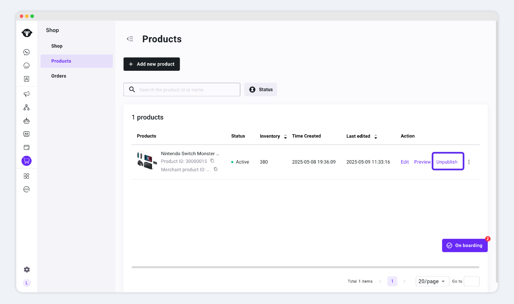
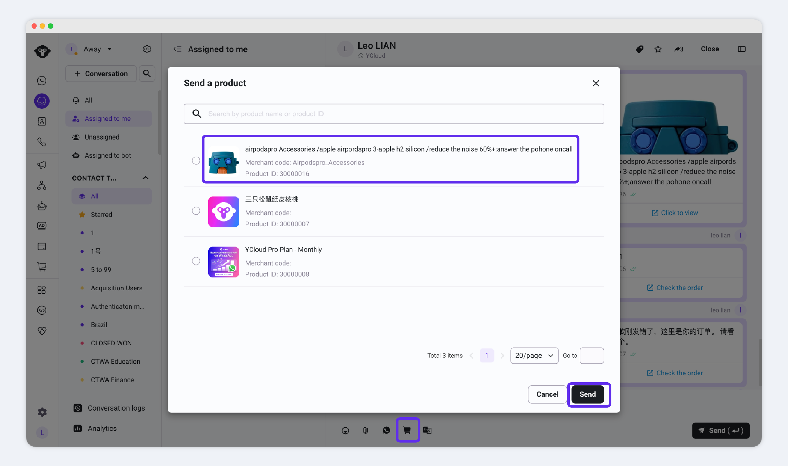
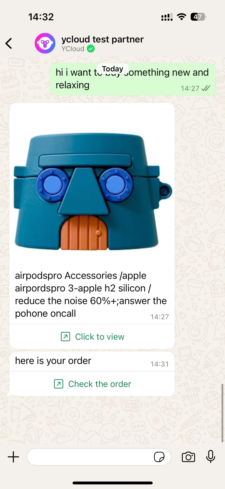
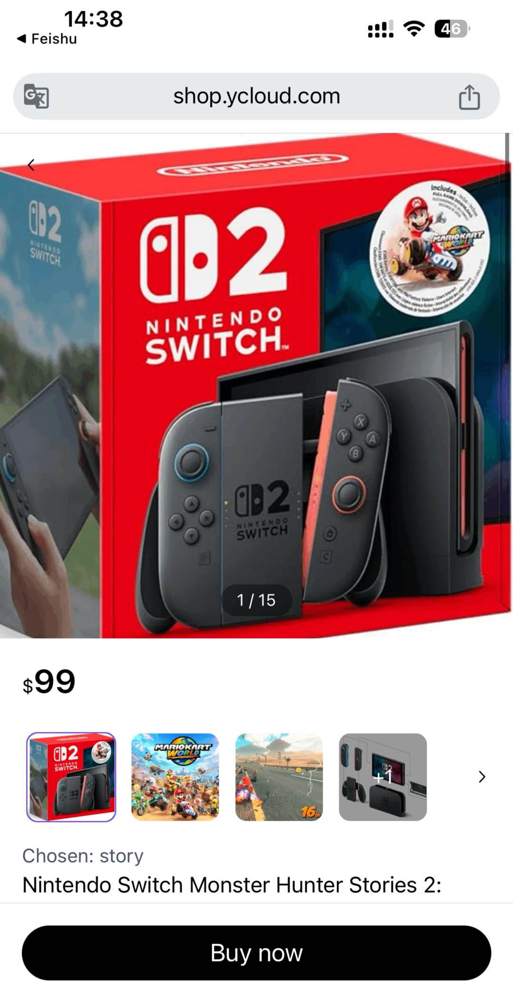
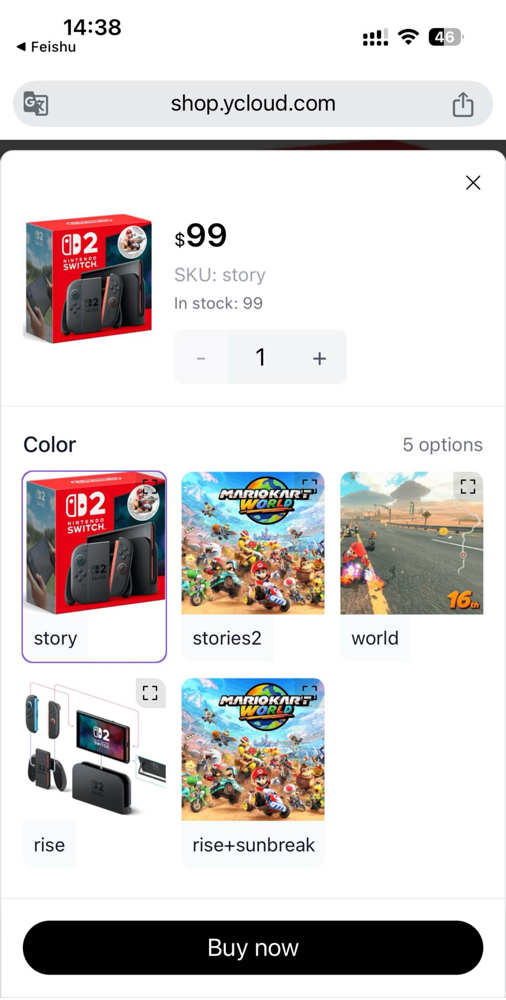
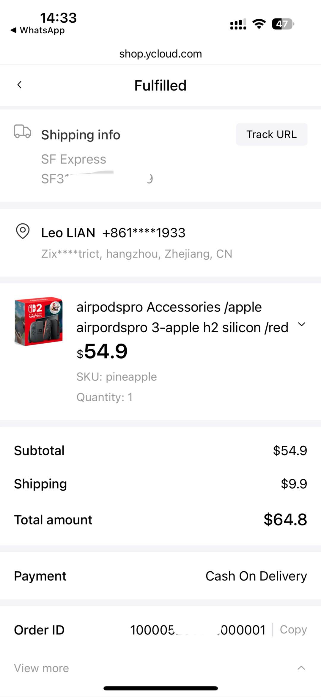

# Product


在尝试添加商品前，请先确认：您已成功创建店铺。[点此了解创建店铺](/broken/pages/ZCuMneQAG8HidHA2gLr6)

Before you begin adding products, please make sure you have already created your store. Learn [how to install a store here](creatstore.md).


Product management includes the following tasks:

* [**Add Products**](products.md#adding-a-product)
* [**Preview 、 Publish Products**](products.md#previewing-and-publishing)
* [**Archive 、 Delete Products**](products.md#archive-delete)

## Adding a Product

Create a new product in Shop：

1. Go to back‑end: **Shop → Product**
2. Click **Add New Product** to begin the creation workflow

<figure><figcaption>
店铺后台-商品列表
</figcaption></figure>

3. Fill in your product information

<figure><figcaption>
添加商品信息
</figcaption></figure>

We divide the product information into these sections:

* [**Title / Description**](products.md#biao-ti-titile-miao-shu-description-xiang-guan): Use rich‑text formatting to help _your customers_ quickly understand the product.
* [**Product Images**](products.md#shang-pin-tu-pian): Display the main visuals of your item.
* [**Pricing 、 Inventory**](products.md#jia-ge-yu-ku-cun): Set the base price, track stock levels, and manage per‑variant inventory.
* [**Category**:](products.md#shang-pin-category) Specify whether the product is virtual or physical, which affects fulfillment and settings.
* [**Product Type**](products.md#shang-pin-lei-xing): Information for catalog and advertising integrations.

### Title & Description


Your customers will see these on the product detail page, in orders, etc.


<figure><figcaption></figcaption></figure>

* **Title**: The name displayed to customers—you should include all key details (use, scenario, keywords, specs) so they can grasp it at a glance.
* **Description**: A detailed product overview. The rich‑text editor lets you format text and images to market your item effectively. If you’re a reseller, avoid copying the manufacturer’s full description—make yours unique so it stands out in search.

### Product Images


Customers will get  these  info on the detail page and in order confirmations .etc


<figure><figcaption></figcaption></figure>

* Click **Upload** to select and upload images; they will then display on the product page.
* **Requirements:**
  * File size < 1 MB
  * Square aspect ratio (e.g. 450×450 px)
  * Formats: JPG, JPEG, PNG
  * Max images per product: 10 (you must delete an old image before uploading an 11th)
* To see how images will look, use the **Preview** feature.

### Pricing & Inventory


The currency was set when you created your store. [Learn more here](creatstore.md)


price&#x20;

* **Original Price**: A reference “strikethrough” price based on market value; for display only.
* **Sale Price**: The actual selling price.

#### Single‑SKU Products

<figure><figcaption></figcaption></figure>

If your product has only one SKU, simply enter its stock level, original price, and sale price, then publish.

#### Multi‑SKU Products

<figure><figcaption></figcaption></figure>

If you have multiple SKUs, click to add variants:

* Enter each variant’s attributes—name, sale price, stock, etc.—accurately.

<figure><figcaption></figcaption></figure>


**Availability**:

* **Enabled**: SKU is visible and purchasable.
* **Disabled**: SKU is hidden and cannot be ordered.


### Category

Select **Physical** or **Virtual** based on your product:

* **Physical Product**: Requires shipping via logistics.
* **Virtual Product**: No shipping needed (e.g. memberships, digital licenses).


Tips：

This field is required for catalog integrations.


<figure><figcaption></figcaption></figure>

### Product Type

For advertising via Meta or Google Catalogs, choose one of three options:

* **New**
* **Refurbished**
* **Used**


Tips:

This field is required for catalog integrations


### Previewing & Publishing

Only published products are visible to customers.


Tips：\
please check as the following steps&#x20;

1. **Preview**: Review your product detail page to ensure all information is correct.
2. **Publish**: Make the product active and share its link with customers.


#### Product Preview

you can review all the details of the products through the preview feature.

<figure><figcaption></figcaption></figure>

#### Product Status

here are the most important status of products

* **Inactive (Draft):** Hidden from customers and can’t be purchased.
* **Active:** Available for sale; customers can access the link and place orders.

once you create a product ,the original status is inactive.

<table><thead><tr><th width="159.59765625">Product Status</th><th width="142.265625">Opration Available</th><th>The Effects</th></tr></thead><tbody><tr><td>Inactive</td><td>Publish </td><td><strong>Click "Publish"</strong>: This sets the product status to <strong>Active</strong>, making it visible to customers and available for purchase.</td></tr><tr><td>Active</td><td>Unpublish </td><td><strong>Click "Unpublish"</strong>: This changes the product status to <strong>Inactive</strong>, hiding it from customers and preventing purchases.</td></tr><tr><td>Inactive  or Active</td><td><ul><li>Edit</li><li>Delete</li><li>Archive</li></ul></td><td><ul><li>Edit：Update the product info</li><li>Delete：Detele the product and you will lost everything about the product </li><li>Archive：Mark the product with a special tag, similar to a temporarily suspended sale status, which may be restored for sale later.</li></ul></td></tr></tbody></table>

#### Publish product

click **publish** to make product available

<figure><figcaption>
Shop-products-publish
</figcaption></figure>

it means the operation is successful when the status **changes to Active.**

#### Unpublish&#x20;


After a product is published, if you no longer wish to sell it, you can take it off the shelf.\
Once taken down, your customers will not be able to view or place orders for the product.


If you find that a product's status is **"Published"**, you can take it off the shelf.

Please follow the steps shown in the image below:

<figure><figcaption></figcaption></figure>

**Share product link on WhatsApp**

After publishing a product, you can share its link on **WhatsApp** to attract customers to view and place orders.

example：

####

<table><thead><tr><th width="177.82421875">scenes</th><th>page demo-1</th><th>page demo-2</th></tr></thead><tbody><tr><td><strong>Send</strong> <strong>product in Inbox</strong></td><td></td><td>-</td></tr><tr><td><strong>Customer Browsing Products</strong></td><td></td><td></td></tr><tr><td><strong>Customer Purchase Process</strong></td><td></td><td></td></tr></tbody></table>

## Archive / Delete

If you no longer wish to sell a product, you can either **archive** or **delete** it.

* **Delete**:
  * The product will be permanently removed.
  * You **cannot recover** it afterward.
* **Archive**:
  * The product is temporarily marked with a special status.
  * You can still **manage** it and **restore** it later.

**Key Differences:**

| Feature              | Delete | Archive |
| -------------------- | ------ | ------- |
| Permanently removed  | ✅      | ❌       |
| Recoverable          | ❌      | ✅       |
| Still manageable     | ❌      | ✅       |
| Visible to customers | ❌      | ❌       |

