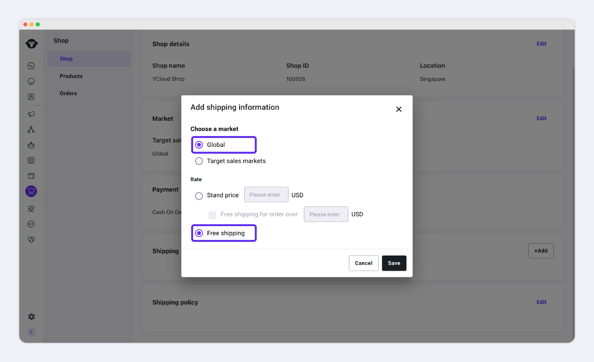
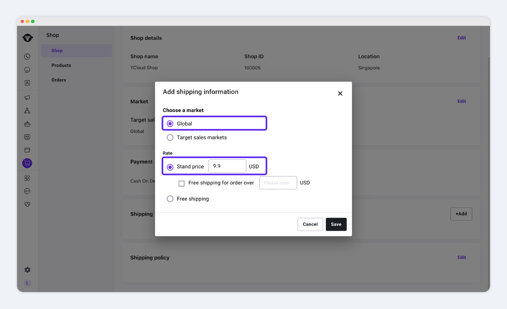
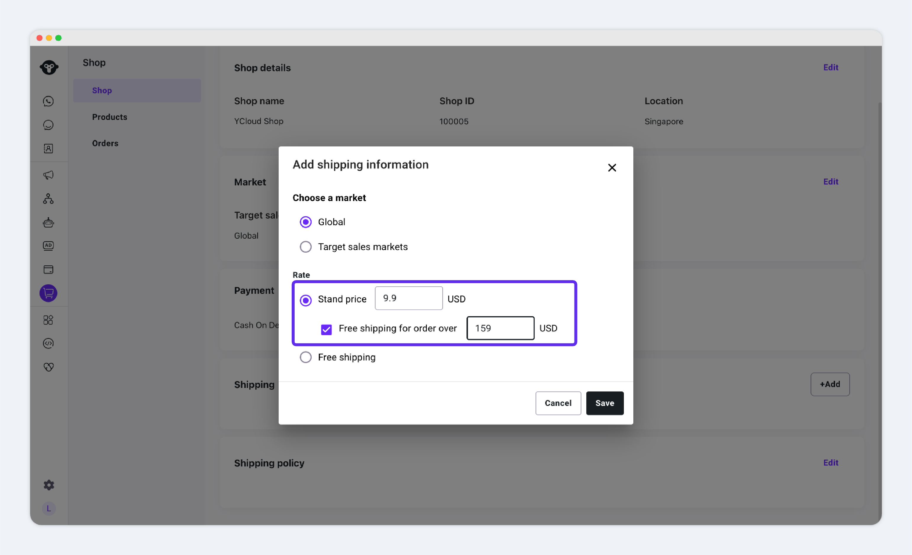
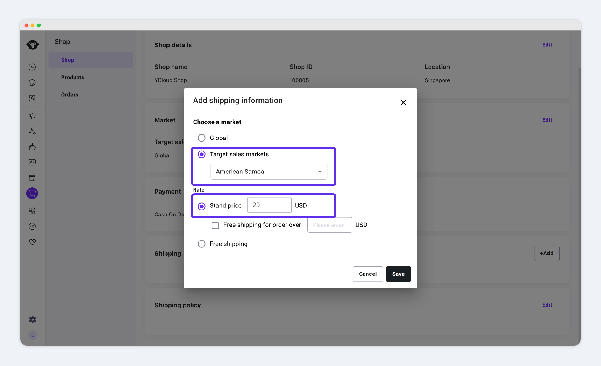
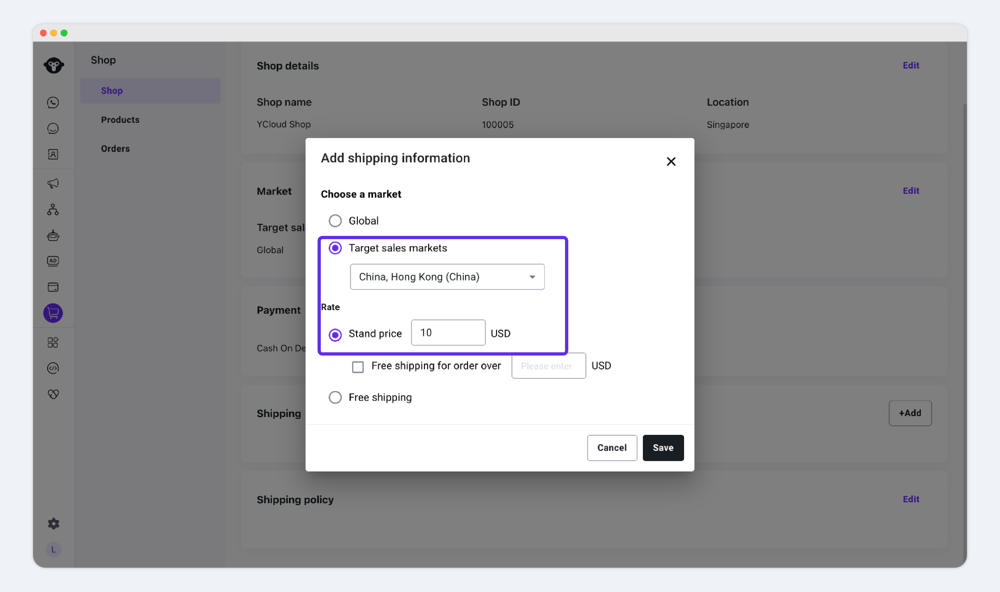
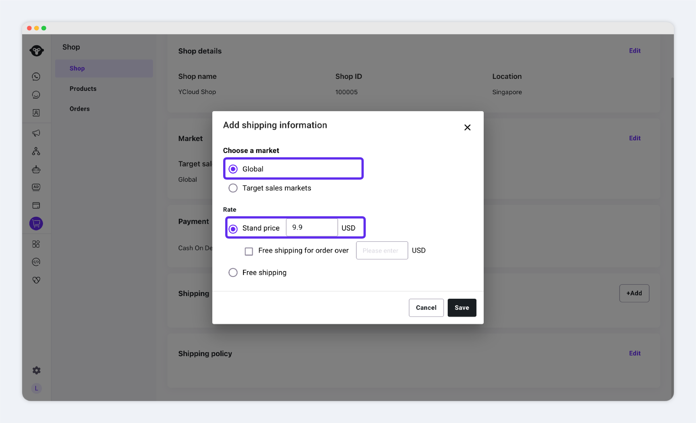

# Shipping Settings

**Shop supports three shipping modes:**

1. **Free Shipping**\
   No shipping fee is charged.
2. **Flat‑Rate Shipping**\
   You set a fixed shipping fee. Every order is charged this same amount.
3. **Free Shipping over X**\
   When an order’s paid amount is **≥ {your threshold}**, no shipping fee is charged.

### STEP 1. Create a Shipping‑Fee Template

Before you go live, you must create at least one shipping‑fee template in Shop to avoid taking losses from uncharged shipping.

**Path:** Shop → Shop → Shipping

<figure><figcaption></figcaption></figure>

Click **Add**

<figure><figcaption></figcaption></figure>

**Select Market**

* **Global:** applies the same shipping rules to all countries you sell to.
* **Specific Regions:** applies the same shipping rules only to the regions you check.

### STEP 2. Choose Your Shipping‑Fee Calculation Method

Within your selected market(s), choose one of these three options:

* **Free Shipping**\
  Customers in the selected market pay no shipping fee.
* **Flat‑Rate Shipping**\
  You enter a fixed fee. Every order placed in the selected market pays that fee.
* **Flat‑Rate + Free‑Over Threshold**
  * If **order total < {threshold}**, charge the flat rate.
  * If **order total ≥ {threshold}**, ship for free.


Make sure your template covers _all_ your target markets. If you forget a country, its shipping fee will default to 0, and you could lose revenue.


Shop displays a warning like this，when some issues show the tips below

<figure><figcaption></figcaption></figure>

> _**issue**_
>
> _“You have not configured shipping rules for these countries: {United States, South Africa, Taiwan}.”_

Follow the instructions above to **Add Shipping Rules** for each country listed in the warning.

### 3. Configuration Examples

Below are some common shipping‑fee scenarios and sample settings to help you get started:

<table><thead><tr><th width="237.78125">Scenarios</th><th>Sample Settings</th></tr></thead><tbody><tr><td>Sell to the global market, with free shipping across all regions.</td><td></td></tr><tr><td>Sell to the global market, with a flat shipping fee of $9.90.</td><td></td></tr><tr><td>Sell to the global market; - - free shipping on orders of $159 or more, otherwise $9.90.</td><td></td></tr><tr><td>

Sell to multiple countries, including the United States and China:
<ul><li>Shipping addresses in the United States: $20 shipping fee</li><li>Sales to China: $10 shipping fee</li><li>Shipping to all other countries: $9.90 shipping fee</li></ul></td><td>1、美国配置  2、中国   3、其他国家 </td></tr></tbody></table>

Once you’ve finished setting up your shipping template, you can proceed to ：

* [**Learn How to Add Products**](products.md)
