# WhatsApp Business App Coexistence

## What is WhatsApp Coexistence

**This means your WhatsApp Business API and WhatsApp Business App can now co-exist together!**

Onboarding a number already in use with the WhatsApp Business App for API access allows both the API and the app to operate on the same phone number, so businesses can take advantage of API functionalities such as large-scale messaging, Chatbot AI and workflows and Journey-based customer operations while retaining the option to send messages directly through the WhatsApp Business App.

This feature is perfect for teams looking to transition to API-based workflows while continuing to use their existing app.

## Why use WhatsApp Coexistence

**Scenario 1:** If your employees need to communicate with users using a work computer during the day and continue the conversation seamlessly via the app in the evening.

**✅ Corresponding benefits:** Messages will be mirrored between the mobile App and the API. That is:

1. Messages sent via the API will appear in the WhatsApp Business App.
2. Messages sent via the App will appear in the Cloud API conversation history, which you can check on computers.

**Scenario 2:** If you want to use features like bulk marketing messages, intelligent chatbot auto-replies, Journey-based customer engagement, and other advanced functionalities while maintaining access through the mobile app.

**✅ Corresponding benefits:** WhatsApp Coexistence allows you to use all these advanced API features while retaining one-to-one messaging in the app.

**Scenario 3:** If you already have an active number in WhatsApp Business App and want to skip the hassle of registering a new API number.

**✅ Corresponding benefits:** Seamlessly connect your WhatsApp Business App number and use API functionalities without deleting your original WhatsApp Business account.

## Noteworthy Info

#### **Limitations**

1. In order to remain compatible with the WhatsApp Business app, business phone numbers that are in use with both the WhatsApp Business app and Cloud API have a fixed throughput of 5 mps(messages per second).

#### **Requirement**

To use this feature, you must be using WhatsApp Business app version 2.24.17 or higher.

#### **Pricing**

Messages sent from the WhatsApp Business app remain free, messages sent from the API Partner Platform are charged based on the existing [API pricing model](https://www.ycloud.com/price).

#### **Function comparison after binding**

The following table describes features available to business customers who have been onboarded to Cloud API, as well as any changes to WhatsApp Business app functionality post-onboarding.Note: Media messages (such as those containing images, videos, and audio) that are more than 14 days will not be able to be synchronized.

<figure><figcaption></figcaption></figure>

## How it works?

### Onboard WhatsApp Business App

Click Create channels button to connect your number.

<figure>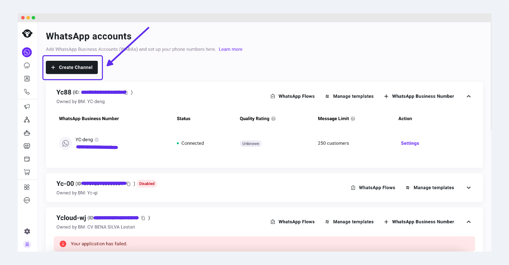<figcaption></figcaption></figure>

Choose WhatsApp Business APP Coexistence

<figure>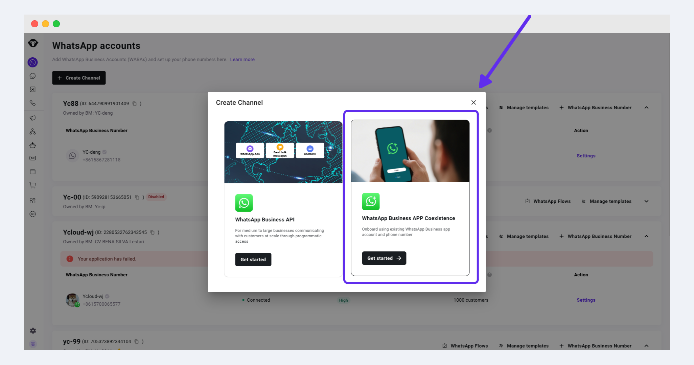<figcaption></figcaption></figure>

In this case, choose WhatsApp Business App Number, then authorize your account according to the instructions in the pop-up window.&#x20;

<figure>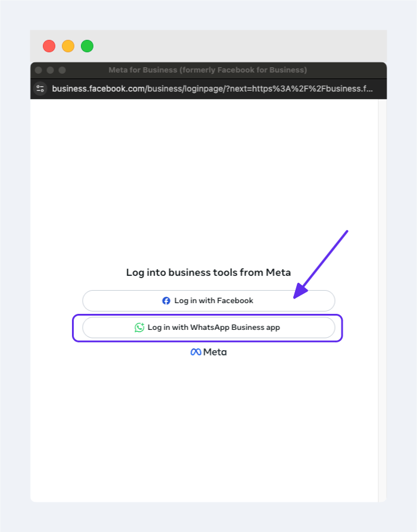<figcaption></figcaption></figure>

Enter the WhatsApp Business app number you want to bind and click Next to continue

<figure>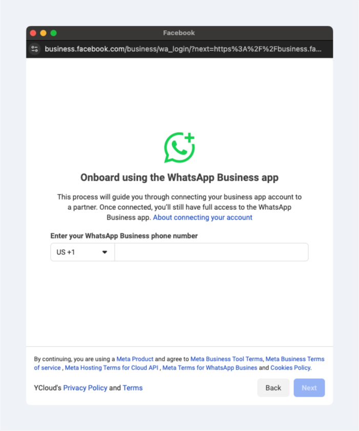<figcaption></figcaption></figure>

A QR code will appear on the screen. Scan the QR code using your mobile WhatsApp Business app to complete the binding process.

<figure>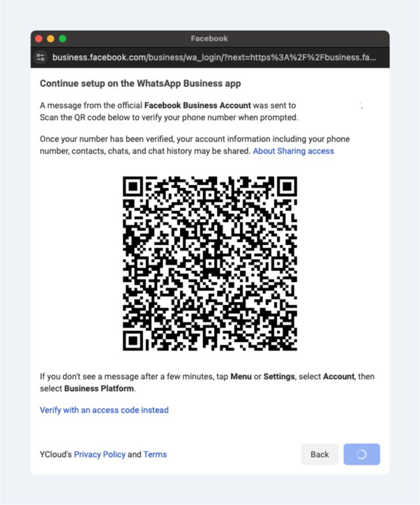<figcaption></figcaption></figure>

The WhatsApp message instructs you to use the app to scan the QR code displayed in Embedded Signup. Tapping the button and you will be given the option to share your WhatsApp Business app messaging history with us.

<figure><figcaption></figcaption></figure>

<figure><figcaption></figcaption></figure>

<figure><figcaption></figcaption></figure>

<figure><figcaption></figcaption></figure>

Enter the authorization page and click the continue button

<figure>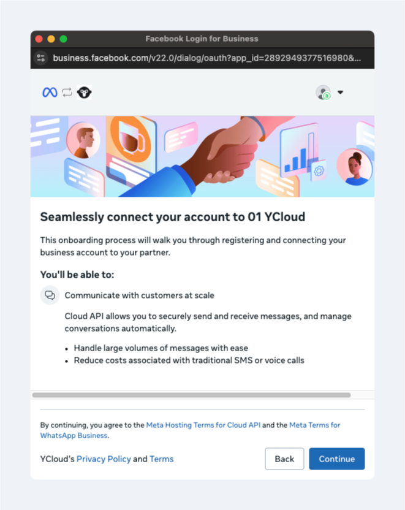<figcaption></figcaption></figure>

The business name must be filled in with <mark style="color:red;">the name on the registration document</mark>, otherwise, it will affect the business verification in future.

Please fill in the website correctly. If there is no website, check '<mark style="color:red;">My business does not have a website or profile page</mark>'.

<figure><figcaption></figcaption></figure>

Click the Confirm button to complete the authorization binding

<figure>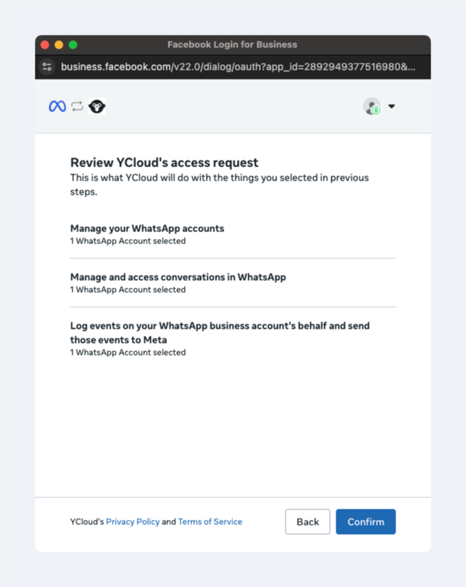<figcaption></figcaption></figure>

The page will show "connecting your account", please hold on for a momont

<figure>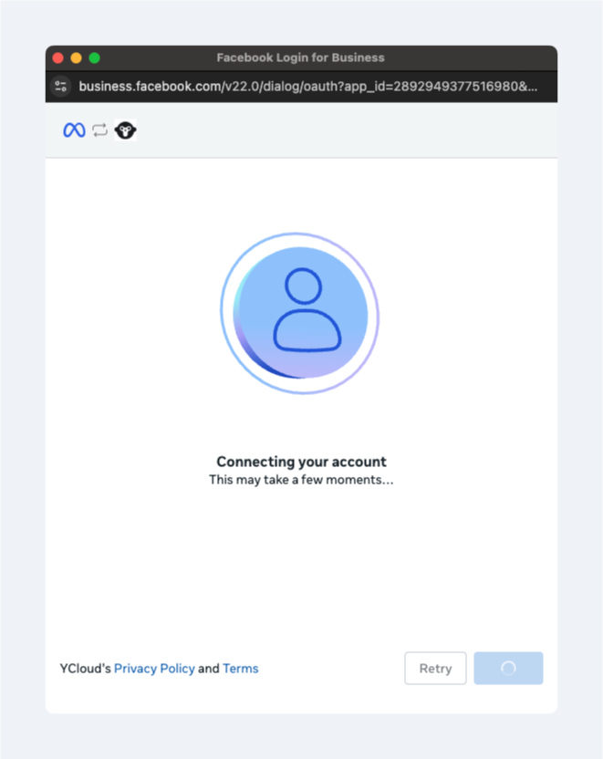<figcaption></figcaption></figure>

After completing the binding, the following page will be displayed. Click the Finish button, and the system will automatically redirect. Please wait for the system to redirect back to the account list page.

<figure>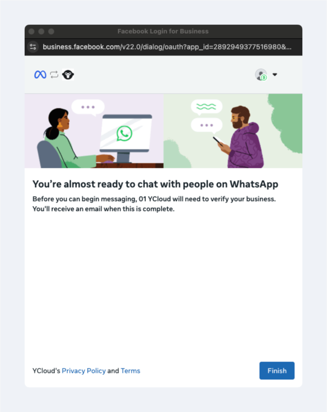<figcaption></figcaption></figure>

After completing the authorization, if you authorize the synchronization of your chat history, we will immediately start synchronizing your chats. Please keep the WhatsApp Business App open during synchronization and note that new messages will only appear in Inbox after the synchronization is done.

<figure><figcaption></figcaption></figure>

You'll see a special icon to indicate that this number is from the WhatsApp Business App. 

<figure><figcaption></figcaption></figure>

### Off-board WhatsApp Business App

You can only off-board your WhatsApp Business App from the platform on your phone. Open WhatsApp Business App and click Settings-Account-Business Platform, then tap the business platform to disconnect.

**IOS:**

<figure><figcaption></figcaption></figure>

<figure><figcaption></figcaption></figure>

<figure><figcaption></figcaption></figure>

**Android:**

<figure>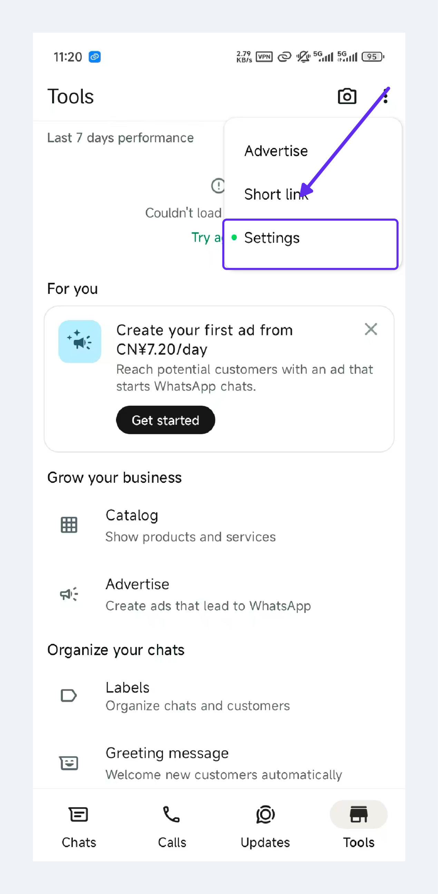<figcaption></figcaption></figure>

<figure>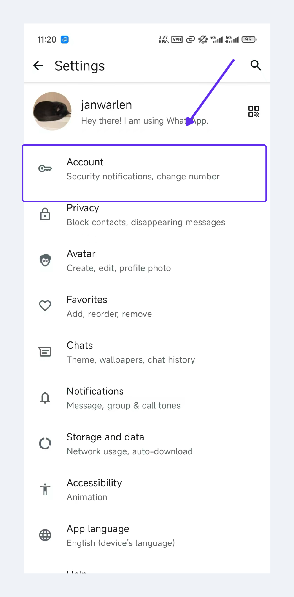<figcaption></figcaption></figure>

<figure>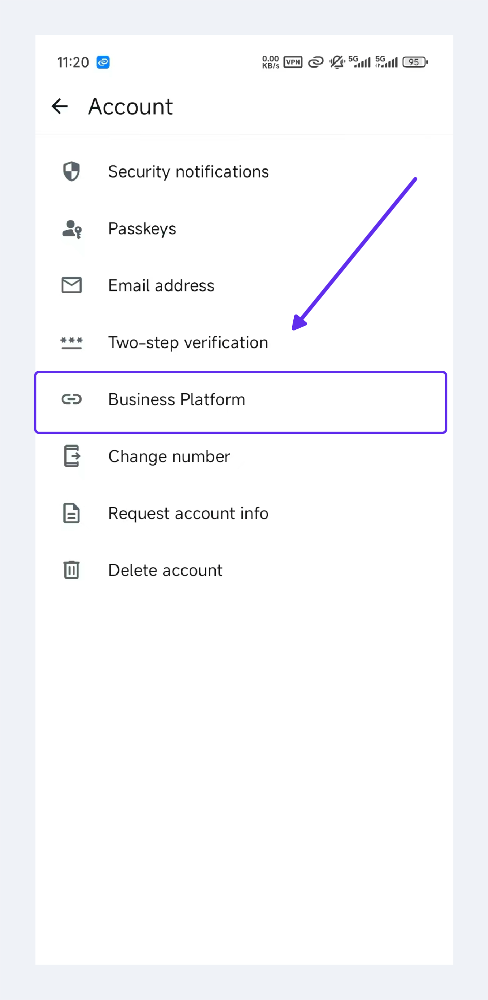<figcaption></figcaption></figure>

## Watching the tutorial video👇


