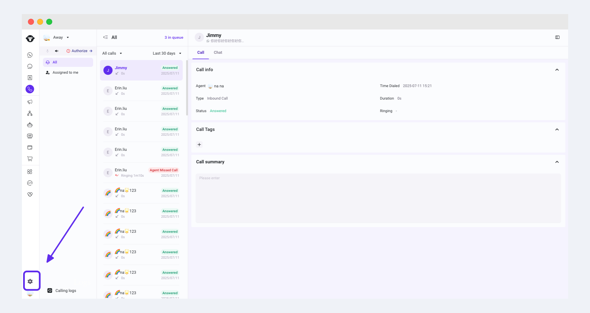
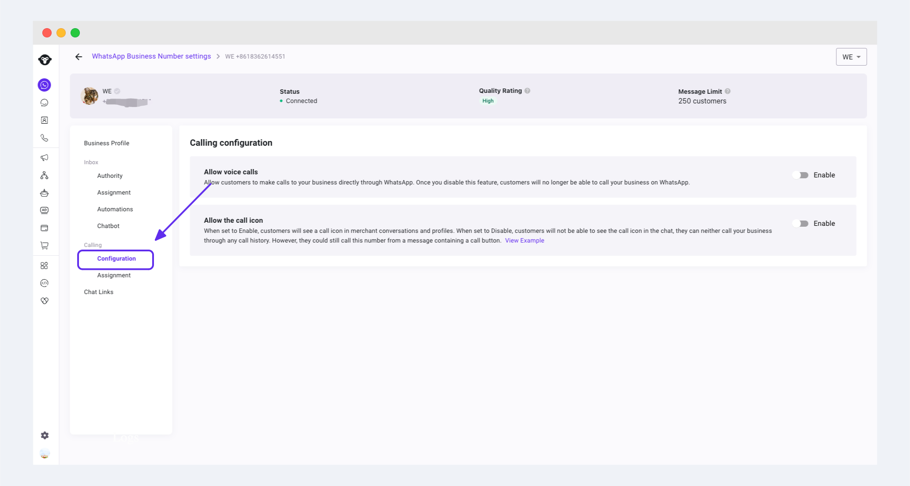
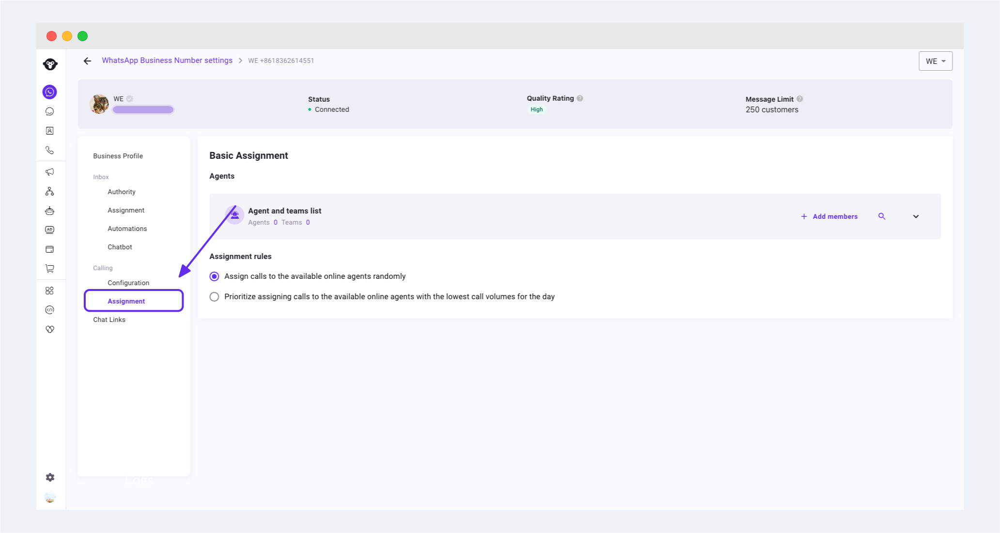
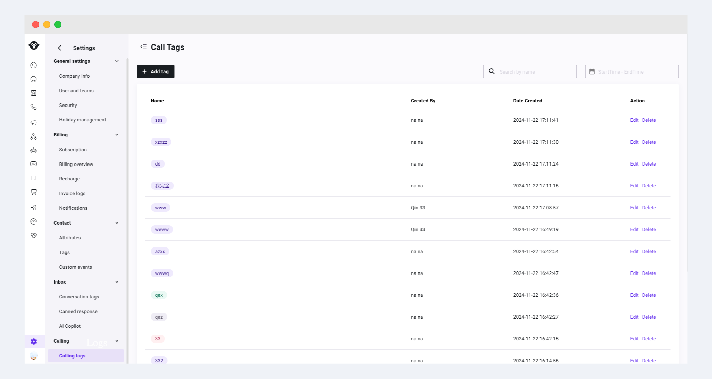
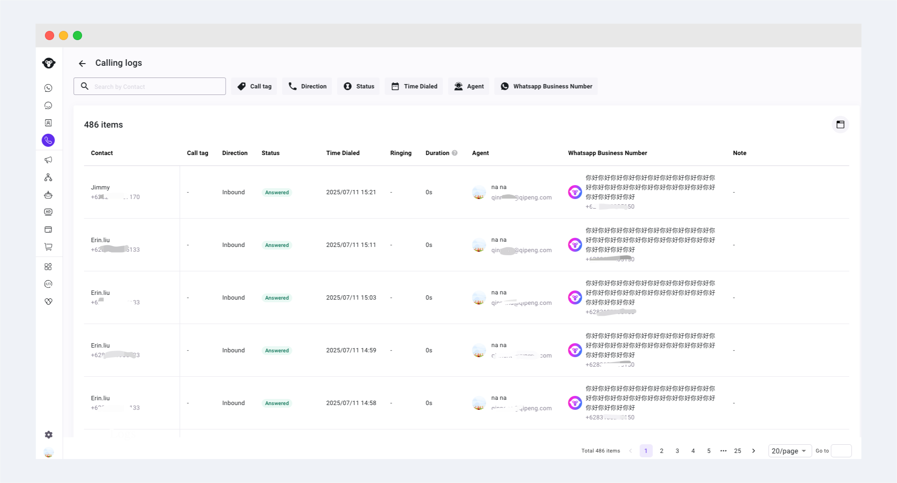

# 主管指南

## 添加团队成员


如果团队成员已被邀请过，无需再次邀请


### 步骤1: 邀请团队成员

1. 邀请团队成员，请点击左下角 Settings > Users and teams >[Users](https://www.ycloud.com/console/#/app/settings/usersAndTeams) 点击页面中的 “Invite user”按钮。

<figure><figcaption></figcaption></figure>

2. 填写待邀请成员的基本信息，点击按钮 “Add”。系统将向该成员邮箱发送一封激活邮件。

<figure><figcaption></figcaption></figure>

### 步骤2: 团队成员接受邀请

成员找到对应激活邮件并点击按钮“激活账号”接受邀请，完成账号的激活

<figure><figcaption></figcaption></figure>


请注意，受邀请的用户无需通过YCloud官网新注册账号。


## Calling设置

### 基础配置

点击需要配置的商业号码后的【设置】按钮，进入 Calling 的配置界面

<figure><figcaption></figcaption></figure>

允许语音通话：开启后，您的客户可以在 WhatsApp 上向您的商业号码发起通话。如果关闭该开关，则任何用户都无法在 WhatsApp 上向您发起通话

允许在展示通话图标：开启后，您的客户将在和您的对话和个人资料中看到呼叫图标。当关闭开关时，客户将无法在聊天中看到呼叫图标，也无法通过任何通话记录呼叫您的企业。不过，他们仍可通过包含呼叫按钮的消息拨打该号码。

### 分配规则设置

进入 Calling 的分配规则设置页面。添加对应的团队或具体成员到列表中。通过添加、删除、搜索，进一步管理查看列表人员

您可以选择以下的通话分配规则：

1. 将通话随机分配给当前在线的客服（随机分配）
2. 优先将通话分配给在线客服中当日接待通话量最少的客服（负载均衡分配）

<figure><figcaption></figcaption></figure>

### 通话标签设置

主管人员可以通过左下角 Setting 按钮，进入子菜单 Calling 中的通话标签界面，对通话标签进行增删改查操作

<figure><figcaption></figcaption></figure>

### 查看通话日志

通过 Calling 界面左下角的 Calling logs 进入查看历史通话数据，可以通过上方的筛选按钮对通话记录进行筛选，点击具体的某一条通话记录可查看通话详情

<figure><figcaption></figcaption></figure>
