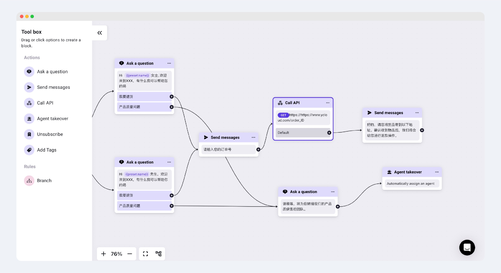
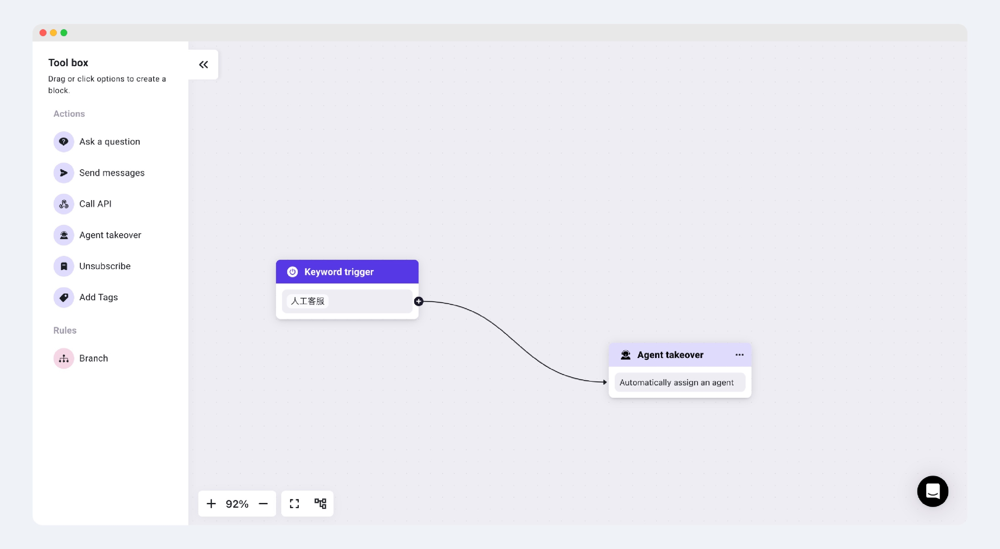

# Agent takeover

“Agent takeover”代表**客服接管对话**。当连接了“Agent takeover”的组件后，客户与Chatbot的对话将会分配给在线客服进行处理。

在"Agent takeover"中，您可以选择客服分配的规则

1. 和当前号码设置的分配规则一致
2. 指定给固定的团队进行接待
3. 指定给固定的客服/销售进行接待

<figure><figcaption></figcaption></figure>

## 适用场景

使用于处理一些Chatbot无法解决的复杂性对话，或者建议放在Chatbot的偏后环节。

_举例：当Chatbot的对话任务已经执行到后期时，可以添加一个询问是否解决了客户的需求的组件，当客户表示Chatbot并没有解决问题时，可以连接“Agent Takeover“组件，让客服来接管当前对话继续处理比较复杂的问题。_

<figure><figcaption></figcaption></figure>

或者，也可以专门设置触发人工客服的关键词。当触发了对应的Chatbot后，对话则会自动转接到人工客服。

<figure><figcaption></figcaption></figure>
