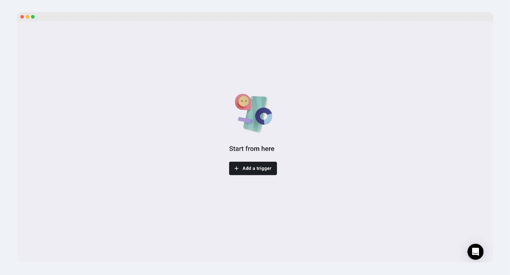
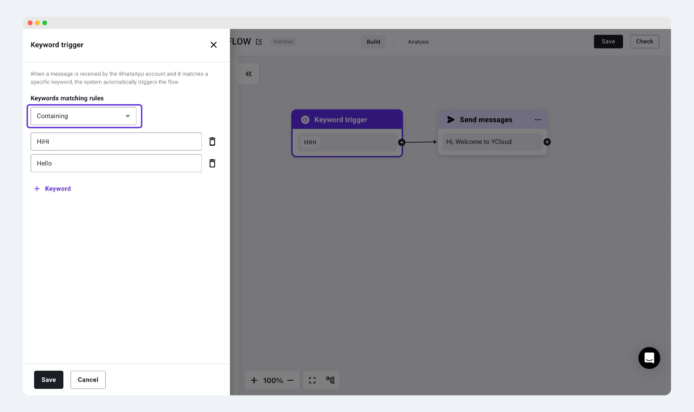

# Trigger

## 什么是Trigger？

当用户想要新建一个Chatbot时，界面中会首先跳出“ Add a trigger"，这代表需要添加这个Chatbot的触发关键词。

<figure><figcaption></figcaption></figure>

## Trigger类型：

### 完全符合（Exact matching)

* 只有当用户回复的内容完全命中了设置的任何一个关键词，才能触发。
* 适合用于一些特定的优惠码、邀请码的领券场景。

<figure><figcaption></figcaption></figure>

### 部分包含（Containing）

* 用户回复的信息需包含其中一个触发关键词，就可以触发Chatbot。

<figure><figcaption></figcaption></figure>

## 自然语言触发（Natural language trigger)


选择自然语言触发和选择特定关键词触发并不冲突。您在选择了自然语言触发之后，依然可以加入您想添加的特定触发关键词来进行对应chatbot的触发。


利用AI大语言模型来理解用户触发chatbot的关键词，无需输入特定的触发关键词。

您可以在"Conversation topic"中选择YCloud系统中默认的触发主题，如：打招呼，查询订单状态，转接人工等等；也可以选择定制特定的主题；\
同时，您可以在下方添加一些其他您认为需要补充的关键词，来帮助更好的识别到客户的语义，进而触发对应的chatbot。

<figure><figcaption></figcaption></figure>

## 快速回复按钮触发 (Click button trigger)

触发chatbot需要结合带有快速回复按钮的模版。

适用于企业向用户发送带有快捷回复按钮的营销/通知类型的消息时，用户点击了对应按钮，会跳转到对应的chatbot flow，在flow中进行与用户的活动。

<figure><figcaption></figcaption></figure>

<figure><figcaption></figcaption></figure>

