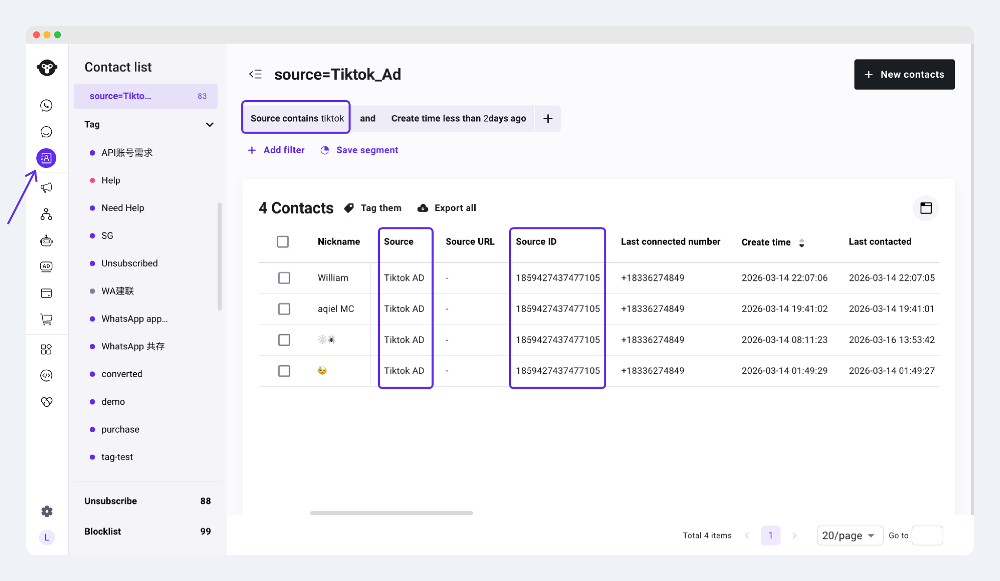

# 联系人属性设置

联系人属性用于记录联系人基础资料、来源、标签和互动状态。通过联系人属性，你可以在联系人列表和联系人详情中查看客户信息，也可以基于属性进行筛选、分组和后续运营。

联系人属性包括系统属性和自定义属性：

* 系统属性：由 YCloud 自动生成或更新，例如昵称、手机号、来源、创建时间、最后联系时间等。
* 自定义属性：由成员根据业务需要手动创建，例如客户等级、购买意向、所属门店、业务类型等。

### 常见系统属性

常见联系人属性包括：

<table><thead><tr><th width="126.328125">属性</th><th width="157.81640625">英文字段</th><th>说明</th></tr></thead><tbody><tr><td>昵称</td><td>Nickname</td><td>联系人的原始昵称，通常来自 WhatsApp 资料同步。</td></tr><tr><td>手机号</td><td>Phone number</td><td>联系人的主要手机号，通常来自 WhatsApp 同步或手动录入。</td></tr><tr><td>邮箱</td><td>Email</td><td>联系人的邮箱地址。</td></tr><tr><td>国家 / 地区</td><td>Country</td><td>联系人所属国家或地区，通常根据手机号或资料信息识别。</td></tr><tr><td>来源</td><td>Source</td><td>联系人来源，用于说明联系人是否来自消息、链接、导入、API、广告或其他入口。</td></tr><tr><td>来源 ID</td><td>Source ID</td><td>联系人来源对应的唯一标识，通常用于记录原始广告来源或渠道来源。</td></tr><tr><td>来源 URL</td><td>Source URL</td><td>联系人来源对应的原始 URL，例如广告、活动或入口链接。</td></tr><tr><td>标签</td><td>Tag</td><td>分配给联系人的标签，可用于分类、筛选和后续运营。</td></tr><tr><td>负责人</td><td>Owner</td><td>负责管理该联系人的成员邮箱。</td></tr><tr><td>创建时间</td><td>Create time</td><td>联系人在系统中首次创建的时间。</td></tr><tr><td>最后联系时间</td><td>Last contacted</td><td>最近一次与该联系人发生互动的时间。</td></tr><tr><td>最后联系的号码</td><td>Last connected number</td><td>最近一次与该联系人沟通时使用的 WhatsApp Business 号码或渠道号码。</td></tr></tbody></table>


带有 System 标记的属性为系统属性，通常由 YCloud 根据联系人资料、来源、会话、导入或集成数据自动生成或更新。


### 来源

来源（Source / Contact source）是联系人最常用的系统属性之一。它表示联系人最初进入 YCloud 的来源，适合用于判断获客渠道、分析广告效果，或筛选不同入口进入的客户。

来源可能包含以下枚举值：

<table><thead><tr><th width="133.66796875">来源</th><th width="175.40234375">英文枚举值</th><th>含义</th></tr></thead><tbody><tr><td>入站消息</td><td>Inbound message</td><td>联系人通过主动发送消息与您的 WhatsApp 号码建立联系。</td></tr><tr><td>链接 / 二维码</td><td>Link/QR Code</td><td>联系人通过链接或二维码与您的 WhatsApp 号码建立联系。</td></tr><tr><td>手动添加</td><td>Manually added</td><td>联系人通过成员手动添加与您的 WhatsApp 号码建立联系。</td></tr><tr><td>文件导入</td><td>File import</td><td>联系人通过文件批量导入与您的 WhatsApp 号码建立联系。</td></tr><tr><td>Shopify</td><td>Shopify</td><td>联系人通过 <a href="https://helpdocs.ycloud.com/help-center/zh/integrations/e-commerce/shopify/cod-order-confirmation">Shopify 集成</a> 将您 Shopify 商店内的顾客同步至 YCloud。</td></tr><tr><td>API 添加</td><td>API added</td><td>通过 <a href="https://docs.ycloud.com/reference/contact-create">YCloud API</a> 推送数据到YCloud的联系人模块。</td></tr><tr><td>广告</td><td>AD</td><td>联系人通过 Meta Click-to-WhatsApp 广告流量与您的 WhatsApp 号码建立联系（了解 <a href="../../ctwa-click-to-whatsapp-ad/facebook-ads/">Meta CTWA 广告</a>）。</td></tr><tr><td>TikTok 广告</td><td>Tiktok AD</td><td>联系人通过 TikTok 消息广告与您的 WhatsApp 号码建立联系（了解 <a href="https://helpdocs.ycloud.com/help-center/zh/ctwa-click-to-whatsapp-ad/tiktok-messaging-ad">TikTok 消息广告</a>）。</td></tr><tr><td>帖子</td><td>Post</td><td>联系人通过 Facebook 帖子等入口与您的 WhatsApp 号码建立联系。</td></tr><tr><td>通话</td><td>Calling</td><td>联系人通过 WhatsApp Calling 与您的 WhatsApp 号码建立联系。</td></tr><tr><td>WhatsApp Business App</td><td>Whatsapp Business App</td><td>联系人通过 WhatsApp Business App 与您的 WhatsApp 号码建立联系。</td></tr><tr><td>未知</td><td>Unknown</td><td>系统无法识别联系人与您的 WhatsApp 号码建立联系的来源，</td></tr></tbody></table>

例如，当你想查看 TikTok 广告带来的联系人时，可以筛选“TikTok 广告”。当你想查看通过 Shopify 同步或创建的联系人时，可以筛选“Shopify”。

<figure><figcaption></figcaption></figure>

### 新增自定义属性

如果系统属性不能满足你的业务管理需求，你可以新增自定义属性。

1. 登录 [YCloud 账号](https://www.ycloud.com)。
2.  导航至 **Contact > Settings > Attributes**。

    <figure><figcaption></figcaption></figure>
3. 点击 **Add Attribute**。
4. 填写属性名称，并选择属性类型。

<figure><figcaption></figcaption></figure>

点击 **Add** 完成添加。

### 编辑或删除属性

属性添加成功后，你可以在 **Contact > Settings > Attributes** 页面查看该属性，也可以根据需要进行编辑或删除。

<figure><figcaption></figcaption></figure>

编辑或删除属性前，建议确认该属性是否正在用于联系人筛选、分组、自动化流程或其他运营场景，避免影响已有联系人管理流程。

