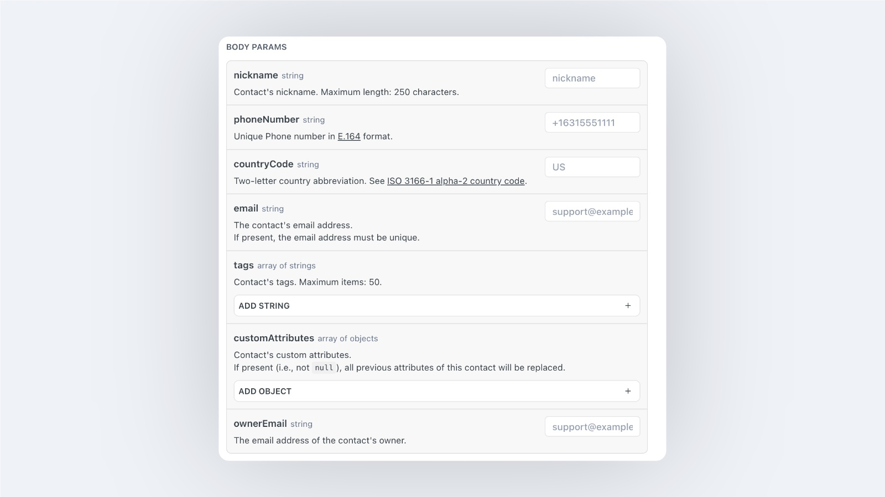

# Owner归属设置（专属客服/销售归属）

Owner是归属人的Email邮箱。在Contact中支持给每个客户设置1个Owner，这个Owner主要用于销售归属的判断。在YCloud的产品中，支持在Inbox(收件箱）收到消息时，根据客户归属进行对话分配。

## 如何设置Owner？

### 方法1: 在Contact中单个编辑

在Contact中找到客户的信息，点击后展开编辑页面。

<figure><figcaption></figcaption></figure>

找到Owner设置项，设置Owner。

输入Owner的email邮箱后点击保存，同时也支持下拉选择已存在的Agent（Inbox中的Agent）

<figure><figcaption></figcaption></figure>

### 方法2: 在Inbox中设置Owner

登录Inbox后，展开用户信息栏。点击Owner，选择想要转接的Owner，即刻完成转接。

<figure><figcaption></figcaption></figure>

### 方法3: 批量导入客户信息，并附带Owner

点击 Contact > Contact list > + New contacts > Upload a file

<figure><figcaption></figcaption></figure>

点击 【Download Template】 进行模板下载

<figure><figcaption></figcaption></figure>

编辑模板。保存后上传至YCloud。

<figure><figcaption></figcaption></figure>

上传完成后确认匹配字段无误，后点击【Next】

<figure><figcaption></figcaption></figure>

确认能够成功上传的数量，确认无误后点击 【Next】

<figure><figcaption></figcaption></figure>

完成上传

<figure><figcaption></figcaption></figure>

### 方法4: API上传

API文档：

* 点击查看[更新用户数据接口](https://docs.ycloud.com/reference/contact-update)
* 点击查看[新增用户数据接口](https://docs.ycloud.com/reference/contact-create)

Owner字段：OwnerEmail

非必填，需传入归属人的Email邮箱

<figure><figcaption></figcaption></figure>

