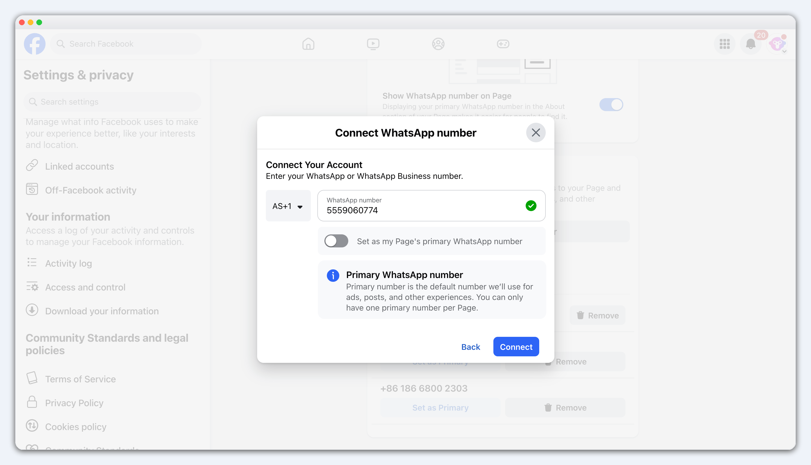
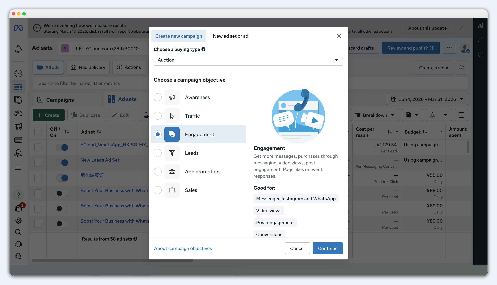
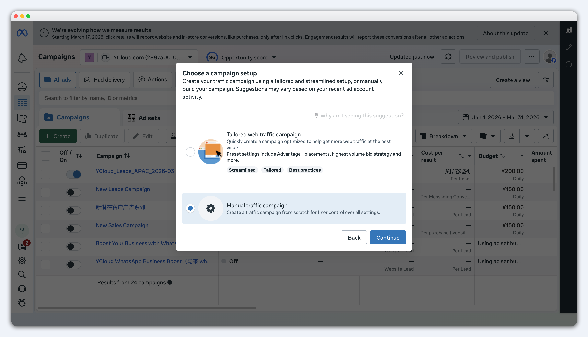
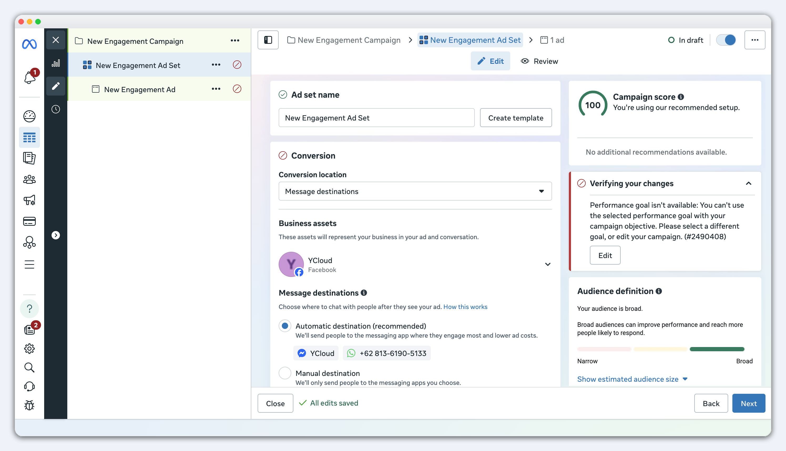
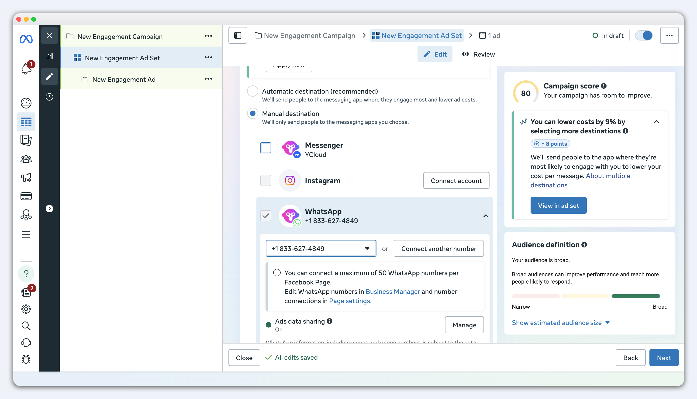
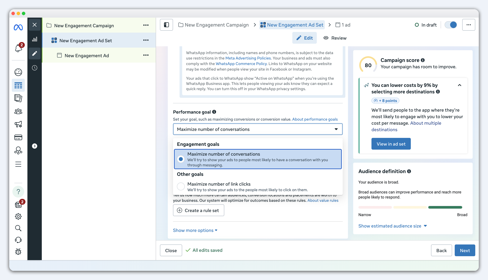
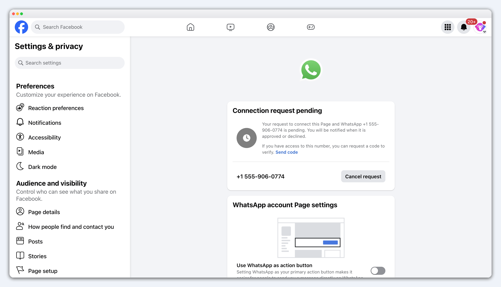

# 创建点击WhatsApp广告（CTWA）

按本篇操作后，用户点击 Facebook 或 Instagram 广告，即可直接进入 WhatsApp 与您的企业开始对话。

### 步骤1：通过 YCloud 创建 WhatsApp Business API 账户

您无法使用个人 WhatsApp 号码承接广告流量。在广告管理器中创建点击 WhatsApp 广告之前，请先通过 YCloud 创建 WhatsApp Business API 账户。

👇 了解如何创建 WhatsApp Business API 账户

[创建 WhatsApp API 账号](https://helpdocs.ycloud.com/help-center/zh/whatsapp-accounts-zhang-hao-guan-li/chuang-jian-whatsapp-api-zhang-hao)

### 步骤2：将 WhatsApp Business API 号码连接 Facebook 公共主页

Meta要求Facebook Page关联 WhatsApp API 账户后才可以创建点击 WhatsApp 广告

<figure><figcaption></figcaption></figure>

1. 确保您拥有该 Facebook 公共主页的管理员权限。
2. 进入 Facebook 公共主页，点击左侧菜单> **Settings > Linked accounts > WhatsApp**
3.  链接whatsapp号码-选择国家或地区代码，并输入要关联的 WhatsApp Business API 号码，点击继续&#x20;

    <figure><figcaption></figcaption></figure>

* 若您的WhatsApp账号跟广告账户归属于同一个BM，可直接完成绑定
* 若您的WhatsApp账号跟广告账户不属于同一个BM, 则重新登录WhatsApp归属的BM账号，访问[Request](https://business.facebook.com/settings/requests?)页面，批准绑定的请求。

_另外，如果您希望在 Instagram 上开展广告活动，您还应该将您的 Instagram 帐户与 Facebook 页面相关联。_

完成以上步骤，就可以开始设置您的第一个 Click-to-WhatsApp 广告。

### 步骤3：在 Facebook 广告管理器上设置 Click-to-WhatsApp 广告

#### 1. 打开 Facebook 广告管理器

访问您的 Facebook 广告管理器，点击 **创建** 开始创建广告。

#### 2. 选择营销活动目标

请选择 **Engagement**。

<figure><figcaption></figcaption></figure>

然后选择 **Manual sales campaign**。

<figure><figcaption></figcaption></figure>

点击继续

#### 3. 填写广告系列的基本信息

* 为您的广告系列命名
* 声明您是否有特殊的广告类别，例如招聘
* 定义是否要对广告进行 A/B 测试
* 注意：该步骤中需要关闭Advantage+ catalog ads

<figure><figcaption>
创建广告系列
</figcaption></figure>

#### 4. 填写广告组的信息

在广告组中，按以下方式配置：

*   **Conversion location**：选择 **Messaging destinations**。&#x20;

    <figure><figcaption></figcaption></figure>


只有完成步骤2：将 WhatsApp Business API 帐户连接到您的 Facebook 页面后，您才会看到 WhatsApp 号码


*   **Facebook Page**：选择要投放广告的 Facebook 公共主页。 选择 **Manual Destination**

    <figure><figcaption></figcaption></figure>
* **Messaging Apps**：选择 **WhatsApp 和Whatsapp 号码,**&#x4E0D;要选择 Messenger 等其他消息应用。
*   **Performance goal**：选择 **Maximize number of conversations**。

    <figure><figcaption></figcaption></figure>
*   **Placements：**&#x70B9;击 **show more settings，**&#x9009;择**feeds**

    <figure><figcaption></figcaption></figure>

#### 5. 选择受众、展示位置、预算和时间表

根据您的投放目标，继续设置受众、展示位置、预算和时间表。

#### 6. 设置广告创意

设置广告素材时，可以参考以下清单：

* 针对 Facebook 和 Instagram 的不同展示位置调整图片尺寸。
* 如有需要，可将一组图片转换为视频幻灯片，提高点击率。
* 为 Click-to-WhatsApp 广告添加主要文字和标题。您可以添加多个主要文本和标题版本。
* 添加广告说明，补充更多上下文。
* 为 WhatsApp 广告选择 CTA 按钮。
* 使用高级预览检查广告在不同展示位置中的效果。

#### 7. 创建和预览消息模板

在广告创意设置中，点击 **New** 创建消息模板。消息模板用于设置用户点击广告进入 WhatsApp 后，如何更快发起第一条消息。

<figure><figcaption></figcaption></figure>

常见方式有2种：

* **Frequently asked questions**：展示几个用户可以点击发送的问题。
  *

      <figure><figcaption></figcaption></figure>
* **Pre-filled message**：在 WhatsApp 输入框中预先填入一段文字，用户可以直接发送，也可以修改后再发送。

<figure><figcaption></figcaption></figure>

发布前，建议使用预览功能检查用户点击广告后看到的 WhatsApp 开场效果。

#### 8. 发布广告

完成设置后，提交广告审核。Facebook 审核通过后，广告会根据您设置的受众、预算和时间表开始投放。

#### 常见问题

<strong>Q：创建广告时，需要注意的问题</strong>

✅正确设置

1. 投放设备，只选择：app（ios设备 或android设备）。
2. 广告版位：投放feed、facebook、ig广告位

❌不要做

1. 投放设备，不要选择web、pc。会丢失广告参数。ctwa广告业务 是针对app用户设计的。
2. 广告版位：不要投放Reels、Stories 系列广告位。会出现广告归因失败，meta正在修复中。

<strong>Q：什么是 CTWA 广告中的消息模板（Message templates）？</strong>

CTWA 广告中的消息模板，是用户点击 Facebook 或 Instagram 广告并跳转到 WhatsApp 后，用来引导用户发起第一条消息的开场设置。

<figure><figcaption></figcaption></figure>

在创建广告时，通常可以选择两种方式：

* Frequently asked questions：展示几个用户可以点击发送的问题。
* Pre-filled message：在 WhatsApp 输入框中预先填入一段文字，用户可以直接发送，也可以修改后再发送。

> 这里的消息模板，指的是 CTWA 广告创建流程中的开场对话设置，不是 YCloud 中用于主动发送通知、营销或验证码的 WhatsApp 消息模板。

**两种方式有什么区别？**

| 类型                         | 用户看到什么                | 适合场景                         | 设置建议                |
| -------------------------- | --------------------- | ---------------------------- | ------------------- |
| Frequently asked questions | 用户看到多个可点击的问题选项        | 希望用户主动选择咨询方向，例如价格、商品、配送、联系销售 | 设置 3-5 个最常见、最有价值的问题 |
| Pre-filled message         | WhatsApp 输入框中自动填入一段消息 | 希望用户直接发送固定意图，例如咨询某个活动、商品或服务  | 文案要短，直接说明用户的意图      |

**Frequently asked questions 适合什么时候使用？**

如果您希望先判断用户想咨询什么，可以使用 Frequently asked questions。

例如：

* I want to know the price
* Show me the product catalog
* Do you ship to my country?
* I want to talk to sales

这种方式适合：

* 商品或服务类型较多
* 需要区分询价、售前、售后或销售咨询
* 已配置 Chatbot，希望根据用户点击的问题进入不同回复流程
* 客服需要更快判断用户意图

设置时，建议只保留最重要的 3-5 个问题。问题越多，用户越难选择。

<figure><figcaption></figcaption></figure>

**Pre-filled message 适合什么时候使用？**

如果您希望用户点击广告后直接发送一段固定内容，可以使用 Pre-filled message。

例如：

* Hi, I’m interested in this product. Can you tell me more?
* Hi, I want to know more about the promotion.
* Hello, I’d like to get a quote.

这种方式适合：

* 广告只推广一个明确的商品、活动或服务
* 不需要用户先选择问题，只希望尽快开始对话
* 希望用固定文案作为 Chatbot 触发词
* 希望降低用户输入成本，让用户直接点击发送

设置时，建议让预填文本和广告内容保持一致。用户点击的是折扣广告，预填文本就应围绕折扣；用户点击的是报价广告，预填文本就应围绕询价。

<figure><figcaption></figcaption></figure>

**应该选择哪一种？**

如果您刚开始使用 CTWA 广告，可以按广告目标选择：

| 广告目标          | 推荐方式                       | 原因                     |
| ------------- | -------------------------- | ---------------------- |
| 获取更多泛咨询       | Pre-filled message         | 用户只需点击发送，开聊成本最低        |
| 区分用户需求        | Frequently asked questions | 可以提前判断用户想问价格、商品、配送还是销售 |
| 推广单一商品或活动     | Pre-filled message         | 对话意图更集中，适合承接单一广告内容     |
| 配合 Chatbot 分流 | Frequently asked questions | 每个问题都可以对应不同自动回复或流程     |
| 用关键词触发自动化     | Pre-filled message         | 固定文本更容易作为触发条件          |

**最佳实践**

* 模板内容要和广告文案保持一致。广告主推折扣时，问题或预填文本应围绕优惠、价格或购买。
* 不要让用户看完后还要思考怎么开口。无论选择哪种方式，都要让第一条消息足够自然。
* Frequently asked questions 不要设置太多，建议 3-5 个。
* Pre-filled message 不要写太长，用户能一眼看懂并愿意发送即可。
* 如果使用 Chatbot，建议让问题选项或预填文本与自动回复触发条件保持一致。
* 发布广告前，使用预览功能检查用户点击广告后的 WhatsApp 开场效果。

<strong>Q：</strong>Facebook 公共主页 <strong>绑定 WhatsApp Business API 号码时，收不到验证码？</strong>

#### 如果您使用的是 WhatsApp Business API 号码

通常不能通过手机或 WhatsApp Business App 接收验证码（meta的限制）。

只能通过BM对WhatsApp Business 号码 走资产授权的流程。

根据资产归属bm情况，有不同的流程：

* 如果号码和 Facebook 公共主页属于同一个 BM，会直接绑定成功。
* 如果**号码和 Facebook 公共主页 属于不同 BM ：**&#x20;
  * 页面会显示 **Connection request pending**，表示绑定申请已提交，
  *

      <figure><figcaption></figcaption></figure>
  * 需要 Facebook 公共主页所属 BM 审批：
  * 进入 Meta Business Settings 的 **Requests** 菜单同意申请。

#### 如果您使用的是 WhatsApp Business App 号码

可以按页面提示点击 **Send WhatsApp code**，在手机上的 WhatsApp Business App 中查看验证码，并完成验证绑定。

<strong>Q：创建广告时：在广告组-广告优化目标的选项中，没有 购物次数最大化 ？</strong>

创建广告时，广告优化目标，一般包含3种：

1. 点击最大化
2. 对话数最大化
3. 购物次数最大化

如果您发现，没有该**购物次数最大化**，表示：

您还未上传过[转化(Converted)](https://helpdocs.ycloud.com/help-center/zh/ctwa-fen-xi#id-2.-she-zhi-converted)数据。

解决办法：先选择【对话次数最大化】作为目标，当回传的转化数据超过10个（每周）后，meta会逐步为您开放【最大转化-purchase】选项。您再创建广告或修改广告目标。

