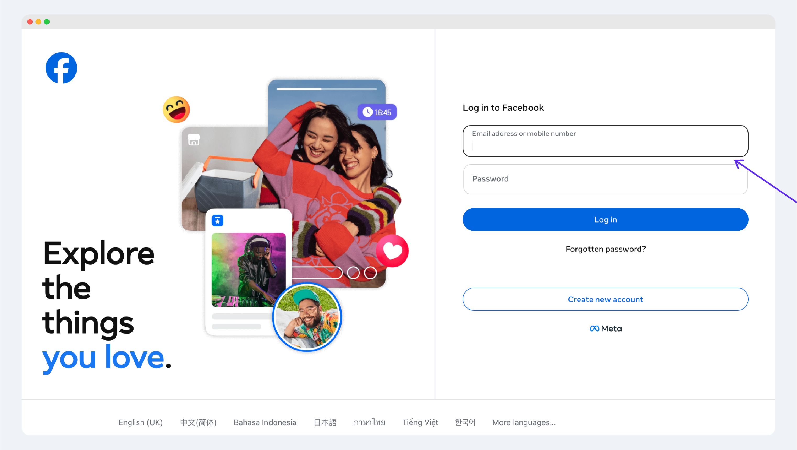
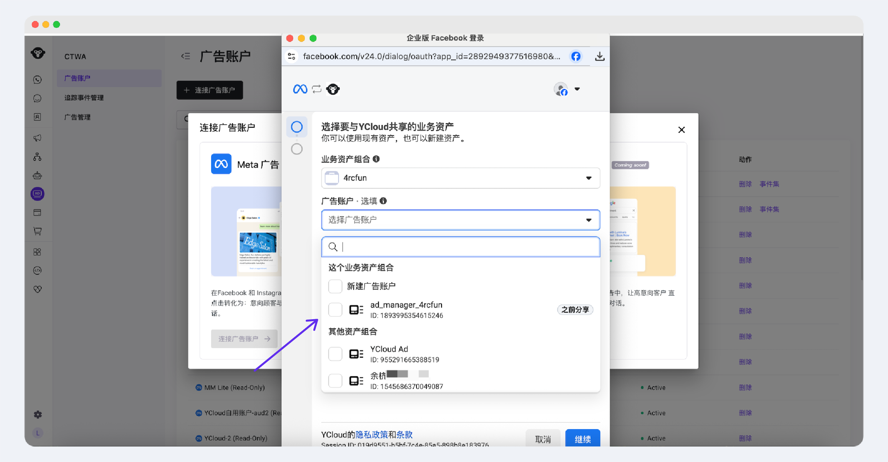

# 连接Meta广告帐户


如果您对Meta广告不太了解，建议先阅读：

* [Meta CTWA 广告](https://helpdocs.ycloud.com/help-center/zh/ctwa-click-to-whatsapp-ad/facebook-ads)


### 开始前请确认

在发起授权前，请先确认以下条件已满足：

* 您可以正常登录 YCloud。
* 当前登录的 Meta 账号拥有目标 Business Manager 和广告账户的管理权限。
* 您已经确认本次需要接入 YCloud 的广告账户范围。

### 第一步：在 YCloud 中发起授权

1. 登录 YCloud，进入 `CTWA`。
2. 点击 **Connect Ad Account (Meta Ads)**。

<figure><figcaption></figcaption></figure>

如果您已经授权过至少一个广告账户，也可以在 `CTWA > Ad Account` 页面中点击 **Connect Ad Account**，继续发起新的授权流程。

<figure><figcaption></figcaption></figure>

### 第二步：在 Meta 页面完成授权

#### 1. 登录 Meta 账号

在跳转后的授权页面中，登录您的 Meta 账号。&#x20;

<figure><figcaption></figcaption></figure>

#### 2. 选择 Business Manager

选择本次要操作的 Business Manager，然后点击继续。 &#x20;

<figure><figcaption></figcaption></figure>

#### 3. 选择广告账户并完成授权

在该 Business Manager 下，选择要授权给 YCloud 的广告账户。您可以按需多选，然后点击继续完成授权。&#x20;

<figure><figcaption></figcaption></figure>


当有多个广告账户时：

* 只勾选本次需要接入 YCloud 的目标广告账户。
* **默认已勾选的广告账户不要取消勾选**。

已默认勾选，通常表示这些广告账户此前已经授权给 YCloud。只有在您确认后续不再使用该广告账户时，才建议解除授权。


完成授权后，点击 **Got it** 返回 YCloud。

### 第三步：确认连接成功

返回 YCloud 后，系统会提示广告账户授权已完成。您可以在 `Ad Account` 页面查看已授权的广告账户列表。

<figure><figcaption></figcaption></figure>

当目标广告账户出现在列表中时，说明连接成功。接下来，您可以继续创建广告并完成后续配置。

### 下一步

#### 创建点击 WhatsApp 广告

完成广告账户连接后，您可以前往 Meta Ads Manager 开始创建广告。

* [创建点击WhatsApp广告（CTWA）](https://helpdocs.ycloud.com/help-center/zh/ctwa-click-to-whatsapp-ad/facebook-ads/chuang-jian-dian-ji-whatsapp-guang-gao-ctwa)

#### 配置转化回传与查看数据

广告上线后，您可以继续配置转化回传，并查看广告表现和转化数据。

* [Meta广告：流量承接、转化回传](https://helpdocs.ycloud.com/help-center/zh/ctwa-click-to-whatsapp-ad/facebook-ads/zhuan-hua-api-capi)

### 相关文档

* [接待CTWA的访客](https://helpdocs.ycloud.com/help-center/zh/ctwa-click-to-whatsapp-ad/jie-dai-ctwa-de-fang-ke)
* [CTWA分析](https://helpdocs.ycloud.com/help-center/zh/ctwa-click-to-whatsapp-ad/ctwa-fen-xi)

### 常见问题

1、授权流程，选择BM（业务资产组合） 时，下拉框找不到想选的BM 、或看得见BM但无法选中？

<table><thead><tr><th width="154.72265625">BM的下拉框 分情况：</th><th width="278.0390625">原因分析</th><th>解决办法</th></tr></thead><tbody><tr><td>找不到想选的BM</td><td>
当前FB账号，

<strong>没有该BM的任何权限</strong>
</td><td>登录该bm后台，为当前登录的Meta账号 授权。</td></tr><tr><td>能看到某个BM 但无法选</td><td>当前FB账号，有该BM的部分/基本权限，但<strong>缺少权限：完全控制权/full control</strong></td><td>为该Meta账号，开通full control</td></tr></tbody></table>

2、授权流程，选择广告账号时，下拉框找不到想选的选项 、或看得见广告账号但无法选中？

<table><thead><tr><th width="160.75390625">广告账号下拉框  分情况：</th><th width="278.0390625">原因分析</th><th>解决办法</th></tr></thead><tbody><tr><td>找不到想选的</td><td>
当前登录的FB账号，

<strong>没有该广告账号的权限</strong>
</td><td>登录该bm后台，为当前登录的Meta账号 授权。</td></tr><tr><td>能看到某广告账号 但不能选 （提示给予bm 完全控制权）</td><td>当前FB账号，有该<strong>广告账号</strong>的部分/基本权限，但<strong>缺少权限：完全控制权/full control</strong></td><td>为该Meta账号，开通full control</td></tr></tbody></table>

#### 情况1、广告账号是归属您的BM

联系BM的管理员确认，当前 Meta 账号已拥有对应 Business Manager 和广告账户的管理权限。

BM后台-users-people，找到您的Meta账号，添加或编辑权限，找到广告账号，打开【完全控制权/full control】-保存。

刷新浏览器页面，并尝试YC后台 重新开始授权。

#### 情况2、广告账号和您的waba 属于不同的BM


这类情况常见于**通过广告代理开通广告账户**的场景。

* 您：对广告账号的使用权；
* 广告代理：对广告账号的所有权；


您需要先确认承接 WhatsApp 号码所属的 Business Manager，以及广告账户所属的 Business Manager 是否已建立正确的资产授权关系。

可参考以下处理方式：

1. 登录**承接 WhatsApp 资产**的 Business Manager，找到该 Business Manager 的业务资产编号。

<figure><figcaption></figcaption></figure>

2. 将该编号提供给**代理或广告账户所属的 Business Manager 管理员**。
3. 由对方在其 Business Manager 后台，将广告账户授权给您的 Business Manager，并勾选 **Full control** 权限。

<figure><figcaption></figcaption></figure>

<figure><figcaption></figcaption></figure>

4. 确认当前 Meta 账号已经拥有您的 Business Manager 管理权限后，再重新按本页流程进行授权。

3、为什么进入 CTWA 页面后，系统提示我需要先绑定 WABA 号码？

因为 Meta CTWA 广告最终需要通过 WhatsApp Business 号码承接用户会话。

如果您尚未在 YCloud 中接入并绑定对应的 WhatsApp Business 号码，请先完成号码接入，再继续广告配置流程。

4、如何移除 Meta 广告账户对 YCloud 的授权？

此操作需要在 Meta 的 Business Manager 后台完成，而不是在 YCloud 中完成。

操作步骤如下：

1. 登录 [Meta 商务管理平台设置](https://business.facebook.com/settings/)。
2. 在左侧菜单中选择“用户” > “系统用户”。
3. 找到 YCloud 使用的系统用户。
4. 在右侧资产列表中，找到当前已授权的广告账户，并点击移除。

请注意：

* 移除后，YCloud 将无法继续访问该广告账户的数据。
* 如果后续还需要继续使用该广告账户，您需要重新执行一次授权流程。

