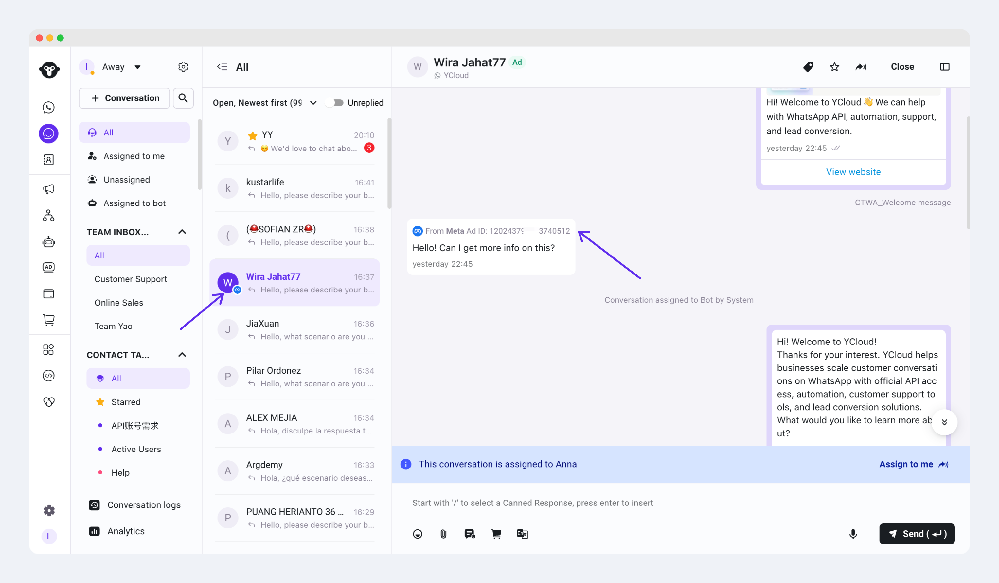
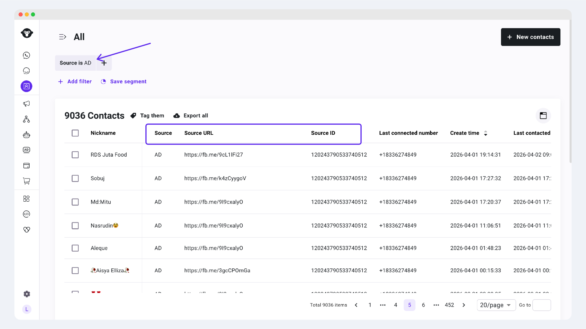

# Meta广告: 流量承接 & 转化上报


开始前，建议先阅读：

* [Meta CTWA 广告](https://helpdocs.ycloud.com/help-center/zh/ctwa-click-to-whatsapp-ad/facebook-ads)
* [连接 Meta 广告账户](https://helpdocs.ycloud.com/help-center/zh/ctwa-click-to-whatsapp-ad/facebook-ads/connect-facebook-ad-account)
* [创建点击 WhatsApp 广告（CTWA）](https://helpdocs.ycloud.com/help-center/zh/ctwa-click-to-whatsapp-ad/facebook-ads/chuang-jian-dian-ji-whatsapp-guang-gao-ctwa)


### 1、在 YCloud 中查看来自 Meta 广告的会话

当广告开始投放后，用户点击 Meta CTWA 广告并进入 WhatsApp 发起对话，这些会话会进入 YCloud。\
这一步的重点，是先确认广告流量是否已经正常进入 WhatsApp，并检查来源信息是否记录正常。

#### 您会看到什么

当广告已经开始带来真实会话后，您通常可以在 YCloud 中看到以下结果：

* 新会话会出现在 YCloud Inbox 中
* 联系人详情中会显示与广告来源相关的信息

<figure><figcaption></figcaption></figure>

<figure><figcaption></figcaption></figure>

其中

* Source = AD：代表这个联系人首次与您的号码联系时，是来自于Meta广告
* Source URL：这个联系人首次与您的号码联系时，来自Meta的哪1个广告链接
* Source ID：这个联系人首次与您的号码联系时，来自Meta的哪1个广告ID


如果广告已经上线，但您暂时还没有看到任何会话或数据，请先检查：

* 广告是否已通过审核并实际开始投放
* 广告中选择的 WhatsApp Business 号码，是否就是 YCloud 中已接入的号码
* 对应 Meta 广告账户是否已经成功连接到 YCloud
* 是否已经有用户真正点击广告并发起 WhatsApp 对话


### 2、了解 Meta 转化回传、CAPI 与深层漏斗事件

如果您希望 Meta 不仅看到“广告被点击”或“开始对话”，还能够看到用户在 WhatsApp 会话后的更深层业务结果，就需要使用转化回传能力。

#### 什么是转化回传

转化回传，是指当用户点击 Meta CTWA 广告并发起 WhatsApp 对话后，YCloud 再将该用户后续发生的关键业务行为，作为事件通过 CAPI 回传给 Meta。

#### 什么是深层漏斗事件

深层漏斗事件，是指比“开始对话”更接近实际业务结果的事件。\
例如，用户在对话后完成下单或付款，这类事件更能反映广告是否真正带来了业务转化。

在 Meta CTWA 场景中，YCloud 当前支持的深层漏斗事件是：

* `Purchase`

#### 什么是 CAPI

CAPI（Conversion API）是 Meta 提供的事件回传接口。\
它可以帮助商家将会话后发生的业务事件回传给 Meta，用于广告效果衡量和后续投放优化。

连接广告账户后，YCloud 可以将符合条件的事件通过 CAPI 回传给 Meta。\
当后续有真实会话和 Purchase 事件发生时，相关数据就会逐步进入 Meta 的事件查看体系。

### 3、在 YCloud 中配置 Purchase 回传

如果您希望 Meta 能看到“购买”这类更深层的业务结果，就需要在 YCloud 中配置对应的 Purchase 事件。

#### 当前支持的深层漏斗事件

YCloud 当前在 Meta CTWA 场景下，仅支持将以下深层漏斗事件回传给 Meta：

* `Purchase`

这意味着，如果您希望后续在 Meta 中查看更深层的业务转化，或尝试使用以购买为导向的优化目标，当前应围绕 Purchase 事件进行配置。


但Purchase并不一定适合所有客户。建议您在本篇常见问题，了解：广告优化目标选择对话数、购物次数等指标 分别适合什么场景。


#### 如何在 YCloud 中配置追踪事件

1. 进入 YCloud，找到 `CTWA` 相关页面。
2. 在广告列表中选择目标广告，进入 `Track events`。
3. 点击 `+ Track new event`，新增一个追踪事件。
4. 按需完成以下配置：
   * 事件名称：仅用于内部识别和管理
   * 事件触发方式：定义什么情况下触发该事件
   * 回传事件类型：固定为 `Purchase`

#### 常见触发方式

YCloud 当前支持 3 种常见的 Purchase 触发方式。\
您可以根据自己的业务流程，选择最适合的一种来作为 Purchase 回传条件。

**方式一：通过联系人标签触发 Purchase**

如果您的团队会在客户完成购买后，手动或自动给联系人打上某个标签，那么最适合使用这种方式。

例如：

* 客户完成付款后，被打上 `Paid`
* 客户确认下单后，被打上 `Purchased`

当联系人被添加指定标签时，YCloud 就会触发一次 Purchase 回传。

**操作步骤：**

1. 进入 YCloud 的 `CTWA` 相关页面。
2. 选择目标广告，进入 `Track events`。
3. 点击 `+ Track new event`。
4. 在事件类型中，选择“联系人标签”或对应的标签触发方式。
5. 选择要作为 Purchase 条件的标签。
6. 在回传事件类型中，选择 `Purchase`。
7. 保存配置，并启用该追踪事件。

**适用场景：**

* 您的销售或客服团队会在成交后统一打标签
* 您已经有稳定的标签管理流程
* 您希望用最简单的方式开始回传 Purchase 数据

**方式二：通过关键词触发 Purchase**

如果客户完成购买后，通常会在对话中发送固定关键词，例如订单号、付款确认语，或某些业务确认词，也可以使用关键词触发。

当客户在 WhatsApp 对话中提到符合条件的关键词时，YCloud 会触发一次 Purchase 回传。

**操作步骤：**

1. 进入 YCloud 的 `CTWA` 相关页面。
2. 选择目标广告，进入 `Track events`。
3. 点击 `+ Track new event`。
4. 在事件类型中，选择“关键词”。
5. 添加一个或多个关键词，作为触发条件。
6. 在回传事件类型中，选择 `Purchase`。
7. 保存配置，并启用该追踪事件。

**适用场景：**

* 您的客户通常会在成交后发送固定关键词
* 您希望通过对话内容快速判断是否发生购买
* 您当前还没有完善的标签或系统回传机制


如果关键词本身容易歧义，建议不要直接把它作为 Purchase 条件。\
否则可能会出现误触发，影响后续 Meta 对 Purchase 数据的理解和优化。


**方式三：通过 API + Custom Event 触发 Purchase**

如果您的业务系统可以明确判断“什么时候才算一次购买完成”，那么更推荐使用 API + Custom Event 的方式。

这种方式通常更适合：

* 订单系统
* 支付系统
* CRM / ERP
* 自建后端服务
* app应用

当您的系统在业务侧确认购买完成后，可以通过 YCloud API 创建一个自定义事件，再由该事件触发一次 Purchase 回传。

**操作步骤：**

1. 进入 YCloud 的 `CTWA` 相关页面。
2. 选择目标广告，进入 `Track events`。
3. 点击 `+ Track new event`。
4. 在事件类型中，选择 `API + Custom Event`。
5. 配置该追踪事件对应的自定义事件条件。
6. 在回传事件类型中，选择 `Purchase`。
7. 保存该追踪事件。
8. 当您的业务系统确认购买完成后，通过 YCloud API 发送对应的 Custom Event。
9. 事件命中后，YCloud 会将该次 Purchase 回传给 Meta。

**适用场景：**

* 您希望以业务系统里的真实购买状态作为唯一标准
* 您不希望依赖人工打标签或关键词识别
* 您对 Purchase 数据准确性要求更高


如果您有自己的订单或支付系统，通常更建议优先使用 `API + Custom Event`。\
因为这种方式更接近真实业务结果，也更适合作为后续 Meta 优化广告的数据信号来源。



建议先把 Purchase 的业务定义约定清楚，再开始回传。\
例如，您需要先确认：什么情况才算一次有效购买，是“下单成功”还是“付款完成”。只有定义稳定，后续数据才更有参考价值。


### 4、广告优化目标怎么选

在 Meta CTWA 广告投放中，优化目标的选择应与当前阶段匹配。

#### 广告投放初期，优先使用对话数最大化

如果广告刚开始投放，或者当前还没有稳定的 Purchase 回传数据，建议优先选择：

* `对话数最大化`

这样更适合先验证广告是否能够稳定带来 WhatsApp 会话，并帮助您尽快跑通从“广告点击”到“进入对话”的基础链路。

#### 什么时候再考虑购物次数最大化

当您已经满足以下条件时，再评估是否切换到：

* `购物次数最大化（Purchase）`

建议至少先满足：

* 已经在 YCloud 中正确配置 Purchase 回传
* 已经有真实客户触发 Purchase 事件
* Purchase 的业务定义已经稳定，不会频繁变动
* 您当前的核心投放目标，已经从“获取更多对话”转向“获取更多购买”

### 5、查看广告表现与转化数据

完成会话承接和 Purchase 回传配置后，您可以分别在 Meta 和 YCloud 中查看数据。

#### 在 Meta 中查看

您可以在 Meta Ads Manager 中查看广告层面的投放数据，例如：

* 花费
* 展现
* 点击
* 对话结果

如果您已经配置了 Purchase 回传，并且有真实用户触发，也可以在 Meta 的事件相关页面中查看通过 CAPI 回传的 Purchase 数据。

#### 在 YCloud 中查看

您可以在 YCloud 中查看两类数据：

**1. 查看广告整体数据**

进入 `CTWA` -`Ad Manage`相关页面后，您可以查看：**某个广告账户，在某段时间内**的 CTWA 广告的基础投放数据，例如：

* 花费
* 展现
* 点击
* 开始的会话

**2. 查看广告带来的 Leads 与追踪事件明细**

如果您要看某一条广告具体带来了哪些线索，或哪些客户触发了 Purchase 事件，可以进入该广告的 `Track events / View Leads` 页面查看明细。

在这里，您可以进一步查看：

* 哪些客户来自该广告
* 哪些客户触发了 Purchase 事件
* 对应 Leads 或事件明细是否可以导出

### 下一步

#### 接待来自 CTWA 广告的访客

广告开始带来会话后，您可以继续在 YCloud 中接待客户，并安排销售或客服团队跟进。

* [接待 CTWA 的访客](https://helpdocs.ycloud.com/help-center/zh/ctwa-click-to-whatsapp-ad/jie-dai-ctwa-de-fang-ke)

#### 查看 CTWA 整体分析数据

如果您希望从整体视角查看 CTWA 广告的投放表现和 Leads 数据，也可以继续阅读：

* [CTWA 分析](https://helpdocs.ycloud.com/help-center/zh/ctwa-click-to-whatsapp-ad/ctwa-fen-xi)

### 常见问题

Q：为什么广告已经上线了，但我在 YCloud 中还看不到会话或数据？

A：请先确认广告是否已经实际开始投放，以及是否已经有用户真正点击广告并发起 WhatsApp 对话。如果广告只有曝光或点击，但还没有人开始会话，YCloud 中就不会出现对应的会话和后续数据。同时，也请检查广告中使用的 WhatsApp Business 号码，是否就是 YCloud 中已接入的号码。

Q：为什么我在 Meta 中暂时看不到 Purchase 数据？

A：这通常是因为您还没有在 YCloud 中正确配置 Purchase 回传，或者虽然已经配置，但暂时还没有真实客户触发 Purchase 事件。请先确认 Purchase 的触发条件是否正确，以及是否已经有真实业务数据产生。

Q：广告投放初期，应该选择什么优化目标？

A：如果广告刚开始投放，建议优先选择“对话数最大化”。这个阶段的重点，是先验证广告是否能够稳定带来 WhatsApp 会话。等 Purchase 回传已经配置完成，并且有稳定数据后，再评估是否切换到“购物次数最大化（Purchase）”。

Q：购物次数最大化、对话数最大化，应该怎么选？

A：这两个优化目标，适合的阶段不同。

如果您选择“购物次数最大化（Purchase）”，Meta 优化广告时，主要依赖的是“顾客是否发生购买”的数据信号。\
但在 CTWA 场景中，Meta 并不能天然直接知道顾客是否在 WhatsApp 对话后完成了购买，因此这类信号主要依赖您在 YCloud 中配置广告转化事件，并由 YCloud 通过 CAPI 回传给 Meta。

这意味着：

* 如果您还没有在 YCloud 中配置 Purchase 事件；
* 或者虽然已经配置，但目前还没有稳定的 Purchase 数据；
* 或者您当前还在验证广告是否能稳定带来会话；

那么更建议优先选择“对话数最大化”。因为这个阶段，广告优化更适合先围绕“是否带来更多 WhatsApp 对话”来进行。

如果您已经满足以下条件，再考虑选择“购物次数最大化”会更合适：

* 已在 YCloud 中正确配置 Purchase 转化事件；
* 已经有真实客户触发 Purchase，并持续回传给 Meta；
* Purchase 的业务定义已经稳定，例如您已经明确“下单成功”还是“付款完成”才算一次 Purchase；
* 当前广告的核心目标，已经从“获取更多对话”转向“获取更多购买”。

简单理解：

* 如果您当前更关注“先把会话跑起来”，选“对话数最大化”
* 如果您当前更关注“让广告尽量带来购买”，并且已经有稳定的 Purchase 回传数据，再选“购物次数最大化”


实操建议：广告投放初期，优先使用“对话数最大化”；等 Purchase 回传稳定后，再评估是否切换为“购物次数最大化”。


Q：为什么我的 CTWA 广告在广告组层级，无法选择“购物次数最大化（Purchase）”？

A：通常有两类原因：

1. 您当前还没有通过 YCloud 向 Meta 稳定回传 Purchase 事件；
2. 虽然已经配置了 Purchase 回传，但当前账号或广告还没有积累到足够的有效 Purchase 信号，因此 Meta 暂时不会开放该优化目标。

在这种情况下，建议先使用“对话数最大化”作为优化目标，先跑通基础会话链路；等 Purchase 回传配置正确、并且已经有稳定的购买数据后，再回到 Meta Ads Manager 检查是否可以选择“购物次数最大化”。

Q：我是否必须先配置 Purchase 回传，才能开始投放 Meta CTWA 广告？

A：不需要。您可以先完成广告创建并开始投放，先验证是否能够稳定带来 WhatsApp 会话。Purchase 回传的作用，是在基础会话链路跑通之后，进一步帮助您衡量和优化更深层的业务转化。

Q：我明明选择的是对话数最大化，为什么Dataset数据集中，会有Purchase数据？

A：当您没有个性化设置Purchase事件的规则时，YCloud会默认上报一个Engage动作 作为Purchase事件给Meta。

Engage的含义：广告流量进入wa，并与您发出至少2条消息；

这么做的好处？

发生engage行为的广告流量，相对来说 lead质量和意愿度都更高。

默认上传，方便您积累一些高质量的数据，不管是后续是作为样本来找相似受众 还是 后续转优化目标=购物次数，都有显著的帮助。

在您保持对话次数最大化作为优化目标时，上报的这个数据对您的广告，不会产生什么影响。

