# TikTok：流量承接、广告追踪与转化


开始前必读：[TikTok消息广告](./)

其他步骤的操作指引

* 步骤1、2：在YCloud后台配置：[链接广告账户](connect-tiktok-ad-account.md)、[绑定WhatsApp号码](connect-tiktok-ad-account.md)
* 步骤3、4、5：[在TikTok 广告后台 创建TikTok 消息广告](create-tiktok-instant-messaging-ad.md)；


### 第六步：在 YCloud Inbox 中查看 TikTok 广告带来的新会话

广告开始投放后，您可以在 YCloud Inbox 中查看由 TikTok 广告带来的新会话，并确认来源信息是否正常记录。

#### 您会看到什么

当用户通过 TikTok 广告进入 WhatsApp 并发起会话后，相关对话会出现在 YCloud Inbox 中。您可以通过以下信息识别该会话来自 TikTok 广告：

* 对话列表中的联系人：头像旁会显示 TikTok 广告角标。
* 联系人发出的消息：显示来源信息，例如 From TikTok Ad ID: xxx。

<figure>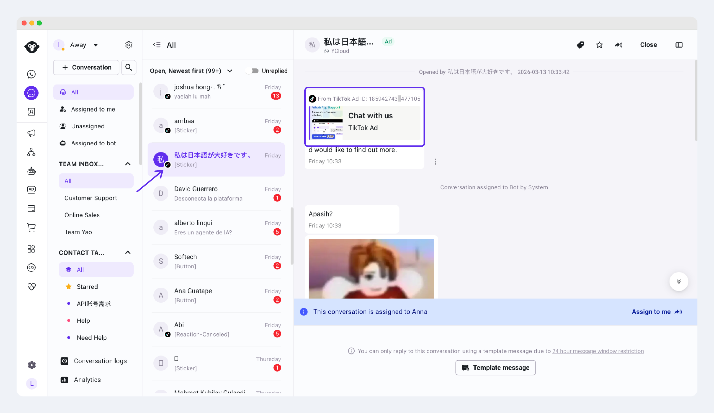<figcaption></figcaption></figure>

* 如果该联系人是第一次通过当前 WhatsApp Business 号码发起会话，您还可以在 Contact 中看到：
  * Source = TikTok Ad：表明这个顾客来自于TikTok 广告；
  * Source ID = 顾客来自哪一条TikTok广告ID。

<figure>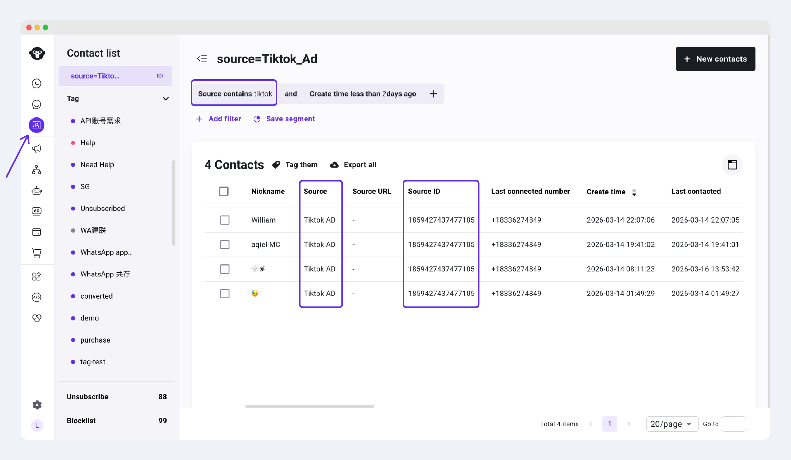<figcaption></figcaption></figure>

### 第七步：配置广告追踪与转化回传

如果希望 TikTok 不仅看到广告点击，还能看到 WhatsApp 会话和后续转化结果，则需要完成相关事件追踪配置。

#### 什么是转化回传？

转化回传是指在用户点击广告并进入 WhatsApp 后，将会话或后续关键行为作为事件返回给 TikTok。这样可以帮助广告平台更准确地评估投放效果，并为后续优化提供数据支持。

#### 运作方式

1. 客户通过Eventtype 来定义:广告的上报规则
2. 客户或YCloud系统，按规则触发上报。
3. YCloud收到“客户被转化”，查看客户近期访问的广告数据，
4. YCloud上报给广告平台（Meta、TikTok）

#### 可回传的事件类型&#x20;

* 会话事件：用户点击广告后，在 WhatsApp 中发起会话。
* 低漏斗事件：用户在会话后进一步完成的关键动作，例如注册、预约、下单或支付。

#### 操作步骤


每个广告账号，需要设置一套CAPI的转化规则。该账号下的所有广告，都会按照这套设置 进行上报。


1. 在 YCloud 中进入 CTWA -> 追踪转化事件

<figure><figcaption></figcaption></figure>

2. 点&#x51FB;**+track new event**

<figure>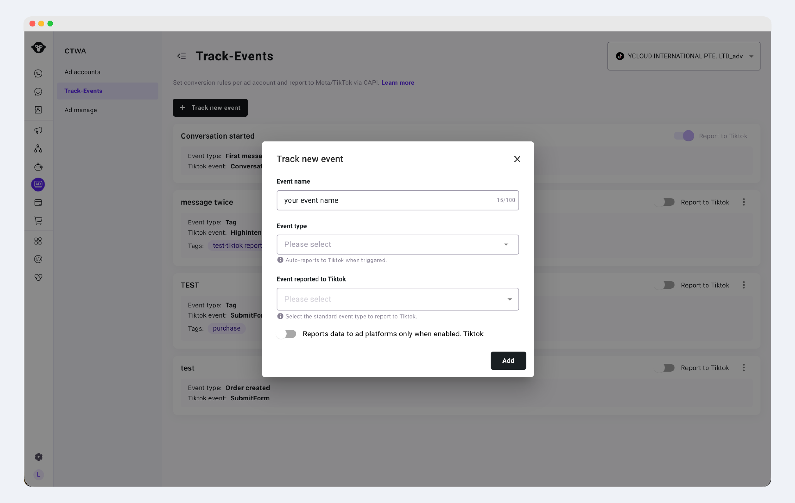<figcaption></figcaption></figure>

* event name ：类似备注， 随便填，仅用于您的内部管理，不会影响广告上报
* event type：设置：这个上报行为的触发条件。
* tiktok event：选择您要**上报给tiktok的是哪一个低漏斗事件**。单选，必填。


如果您选择了某个事件，但上报的开关（关闭状态），这会导致：

1. YCloud统计这个事件的数据：会
2. YCloud上报数据给Meta/Tiktok ：不会。


#### **Event type/事件类型**&#x20;

这个字段代表着：您用什么规则/条件 通知 YCloud，客户被转化了。

YCloud提供3种方式

<table><thead><tr><th width="170.33203125">Event type/事件类型</th><th>解释</th><th>适合哪些人</th></tr></thead><tbody><tr><td>通过自定义事件</td><td>通过第三方事件或您的系统对接API 来和YCloud对接，并传递"某客户被转化"。</td><td>
符合任意一条
<ol><li>您拥有技术开发的能力，可以对接YCloud的api。</li><li>您使用的平台，已和YCloud完成对接，如:Shopify。</li></ol></td></tr><tr><td>为联系人打tag</td><td>您设置一个规则：当给某个wa用户 打tag=“ycloud”时，就视为：这个用户完成了一次广告转化。 ---------------------- 之后， 您给这个联系人打tag="ycloud"时，yc就认为：这个客户被转化了。 </td><td><ol><li>广告转化数据不多，如：每天不超过50个； （更多转化，还是建议走自定义事件。打tag毕竟是人工处理，可能搞错、忙不过来）</li></ol></td></tr><tr><td>Whatsapp对话关键词(keyword)</td><td>设置1个或多个关键词。 当顾客在wa聊天发出的消息，包含这个关键词时，就视为转化。 </td><td>适合：筛选高意愿度的lead时使用。  但注意，关键词有一些风险。 如：询问商品的支付方式，就视为高质量线索。 关键词=payment 但顾客询问时， - 对话1：这个商品如何支付？ - 对话2：这个商品太烂了，我才不会支付。 显然，对话2的画像不是您需要的客户。</td></tr></tbody></table>

1. 联系人打tag：当给某联系人打上某tag时，就触发一次上报。
2. keyword：即设置多个关键词。当Whatsapp对话中 潜在客户问到这些关键词时，触发上报。
3. API+自定义事件：通过YCloud的API创建某个自定义事件，并将该事件作为触发广告上报的条件。

#### 联系人打Tag，触发

<figure>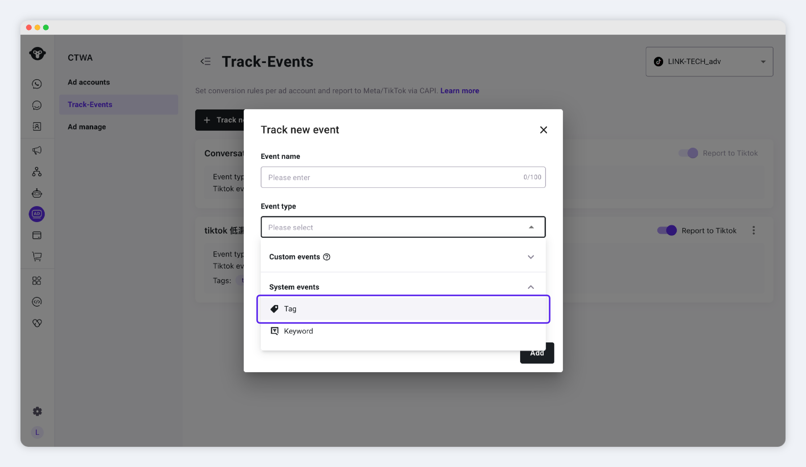<figcaption></figcaption></figure>

步骤

1. Eventtype 选择：**system events - tag；**
2. 您需要设置一个特殊的标签，负责定义客户的转化行为。&#x20;
   1.

       <figure>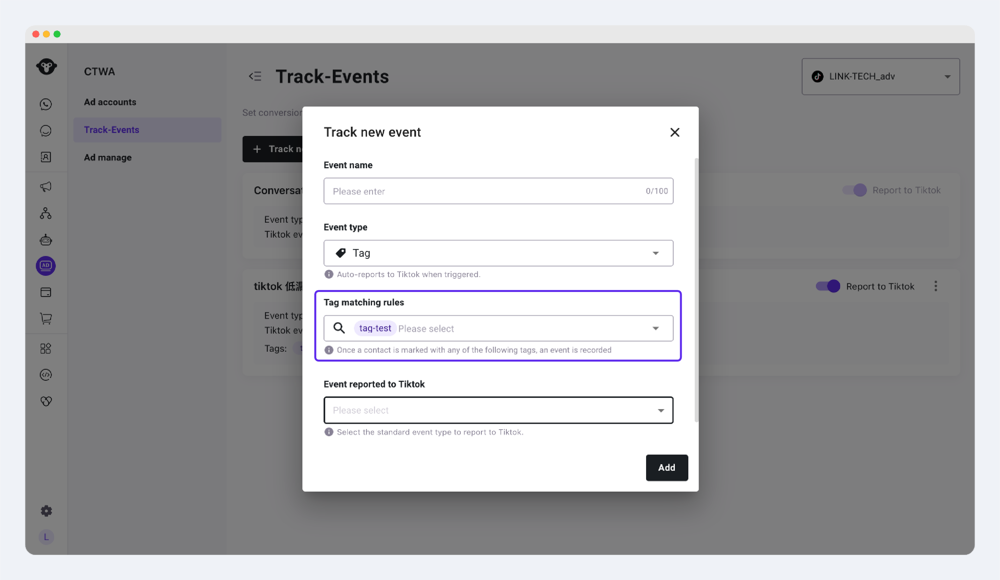<figcaption></figcaption></figure>
   2. 如果有多个不同广告需要区分，建议区分多个广告tag
3. 选择要上报给TikTok的事件，打开开关，添加。

<figure>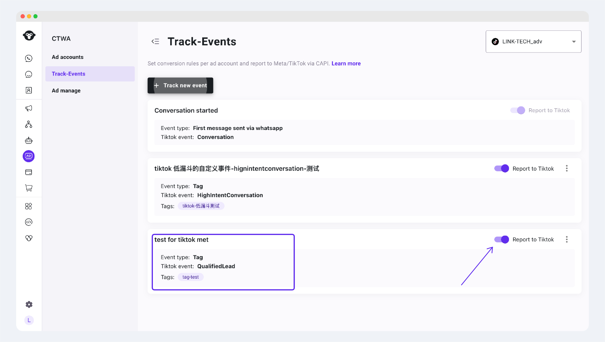<figcaption></figcaption></figure>


如果您只需要YCloud帮您统计这个事件的发生行为：请关闭开关。

如果您需要上报该事件给TikTok平台，用于优化广告，请打开开关。


#### 自定义事件


选择此方式，需要您拥有技术api对接能力，或使用YCloud已对接平台的事件能力。


步骤

1. 选择一个自定义事件（custom events），作为“用户被广告转化”的标识。&#x20;
   1.  YCloud提供了一系列默认事件。

       <figure>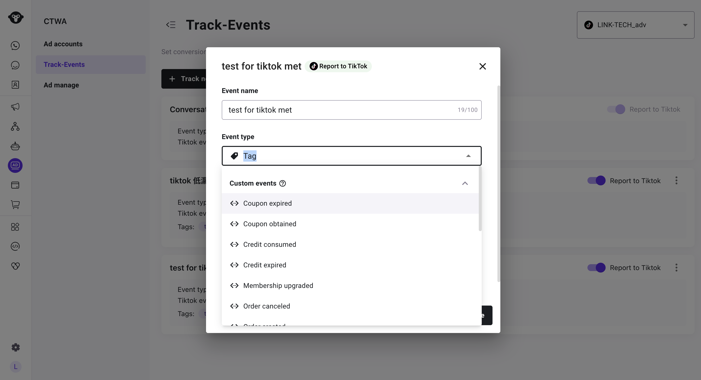<figcaption></figcaption></figure>
   2. 如果没有您需要的，您可以通过YCloud的API创建（[创建自定义事件](https://docs.ycloud.com/reference/custom_events-create-definition)）。
      1.  创建后，在settings-contact-custom events可以看到。&#x20;

          <figure>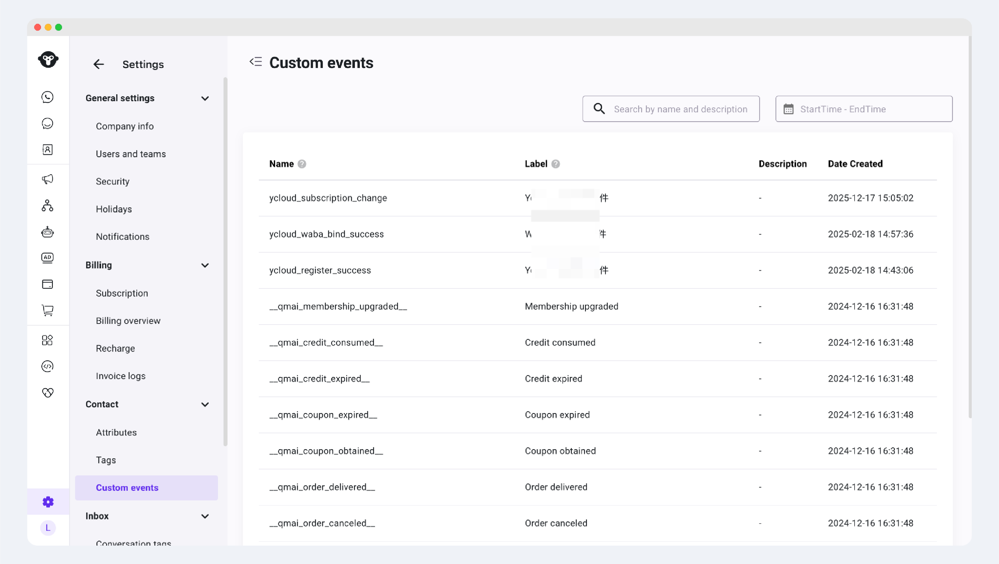<figcaption></figcaption></figure>
   3. 回到步骤1选择事件。
      1.

          <figure>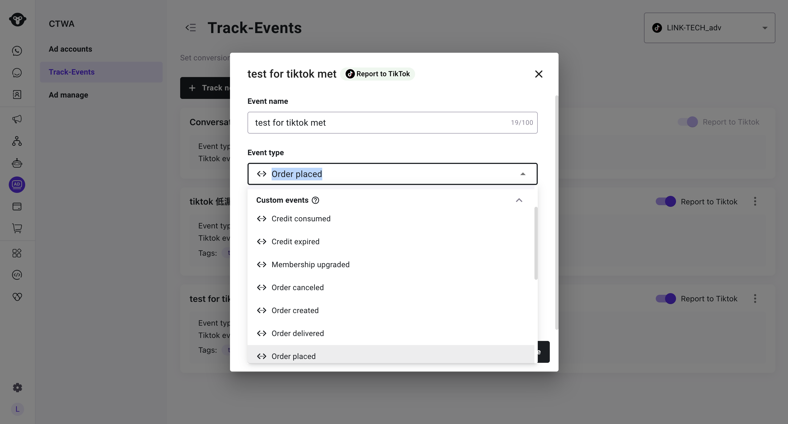<figcaption></figcaption></figure>

### 第八步：查看广告表现与转化数据

广告发布后，您可以分别在 TikTok Ads Manager 和 YCloud 中查看投放效果与会话数据。

#### 在TikTok 广告后台

你可以在campaign模块，查看每条广告（或组或系列）的数据表现：如花费、曝光次数、点击、对话、以及各种分析指标。

<figure>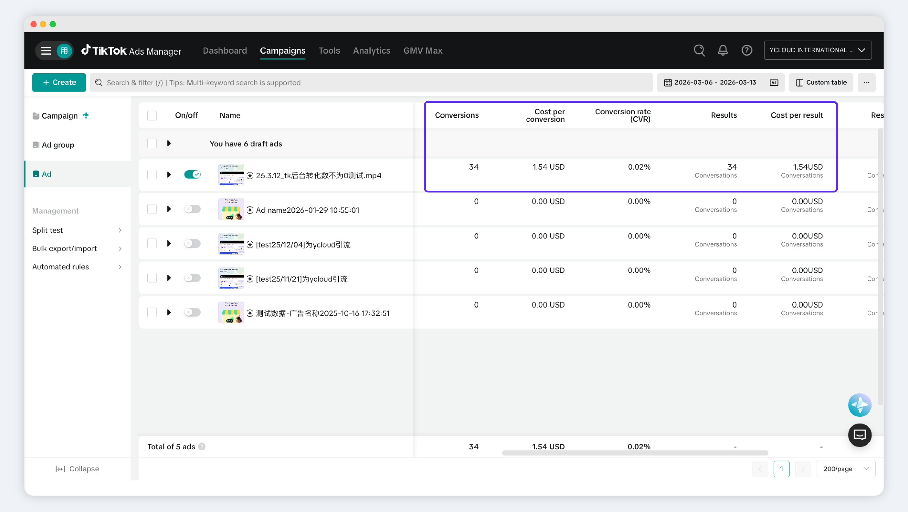<figcaption></figcaption></figure>

同时，你还可以查看 通过YCloud上传到TikTok事件集的所有数据。 

<figure>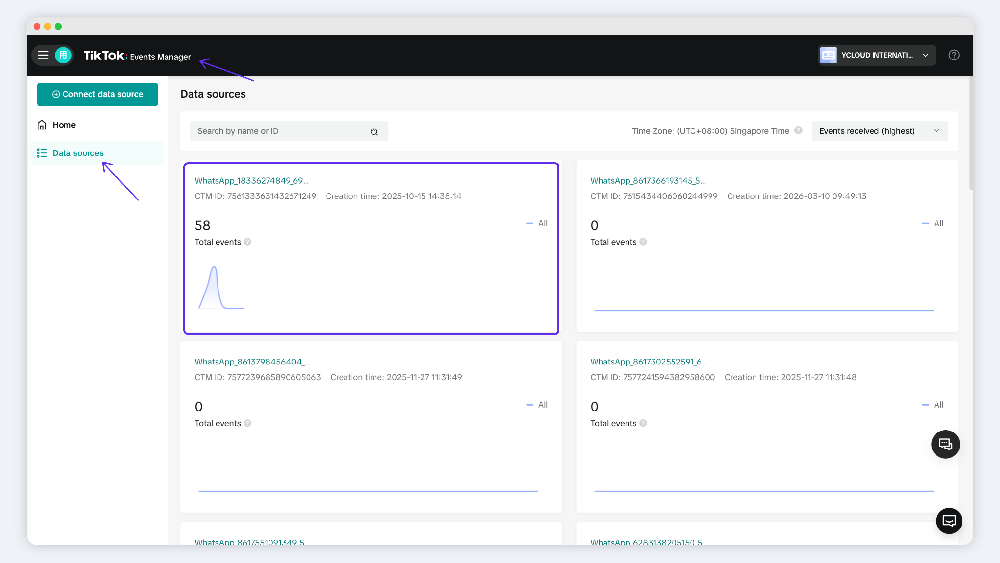<figcaption></figcaption></figure>


在事件集管理模块-选择数据源，可以看到：个别事件集名称为WhatsApp + \[Phone Number]。\
这些事件集就代表：为Whatsapp 某商业号码创建的事件集。

1. 您在创建广告组时，需要确认事件集是哪个（一般Tiktok会根据您的wa号码自动匹配）

在这里，您可以搜索WhatsApp 商业号码，来寻找对应的事件集。


点击某个消息事件集，进入详情，可查看YCloud针对这个事件集 上报的所有事件和数据。

<figure>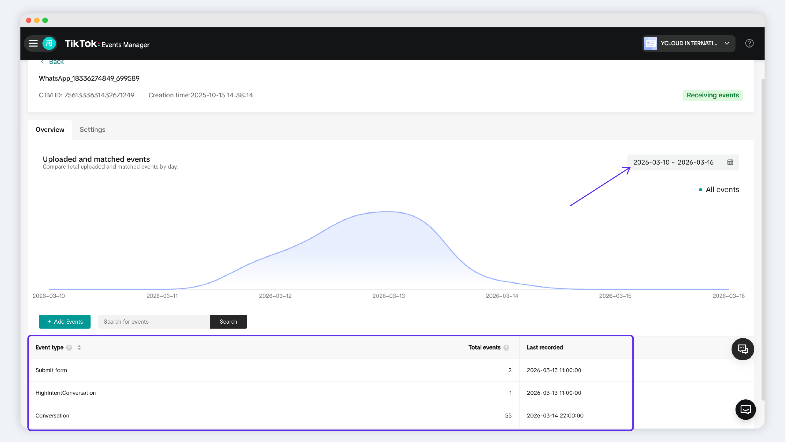<figcaption></figcaption></figure>

其中，

对话事件（Conversation）由YCloud进行统一上报，您无需关注；\
除此以外的其他事件，必须由您在第7步 设置追踪事件的规则，并开启\[上报到TikTok],YCloud才会上报数据到这里。 

#### In YCloud&#x20;

View ad and conversion data for specific TikTok ad accounts under **CTWA > Ad Manage**.

<figure>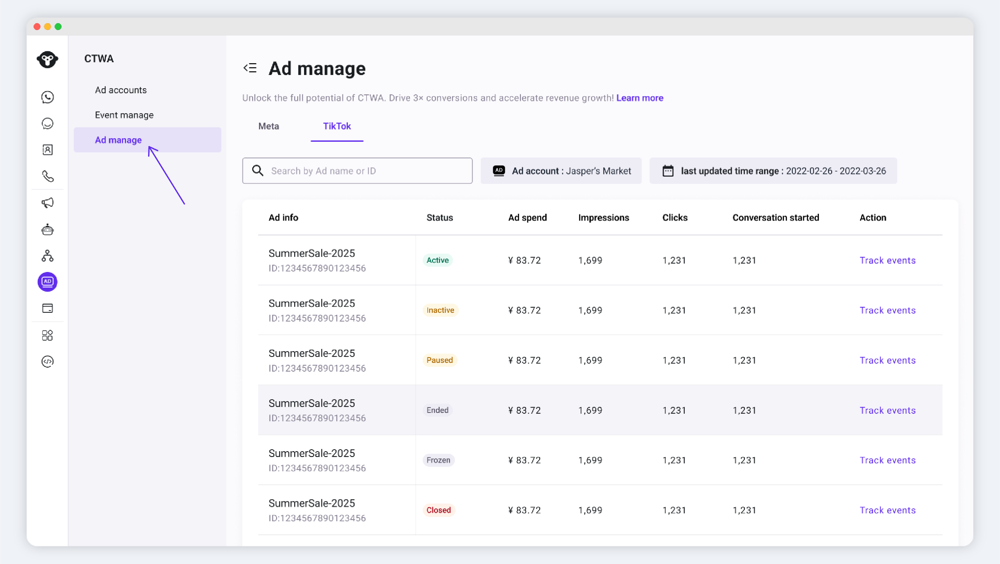<figcaption></figcaption></figure>

Detailed YCloud reporting is also available under Tracking Events / View Leads.

For a complete overview, [click here to learn more about YCloud CTWA data analytics](/broken/pages/ez2xIIJ27dUu4wUZ5000).
