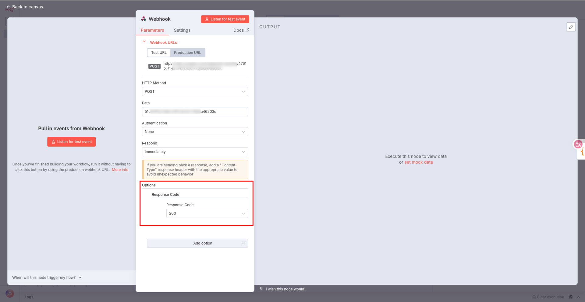
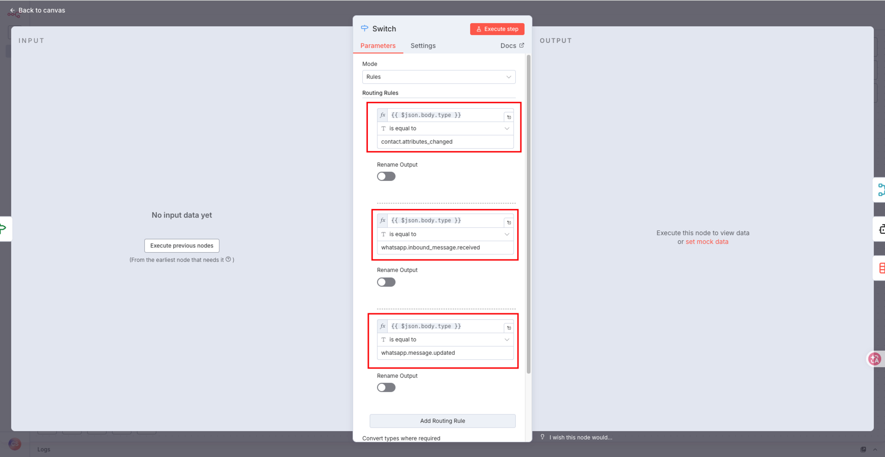
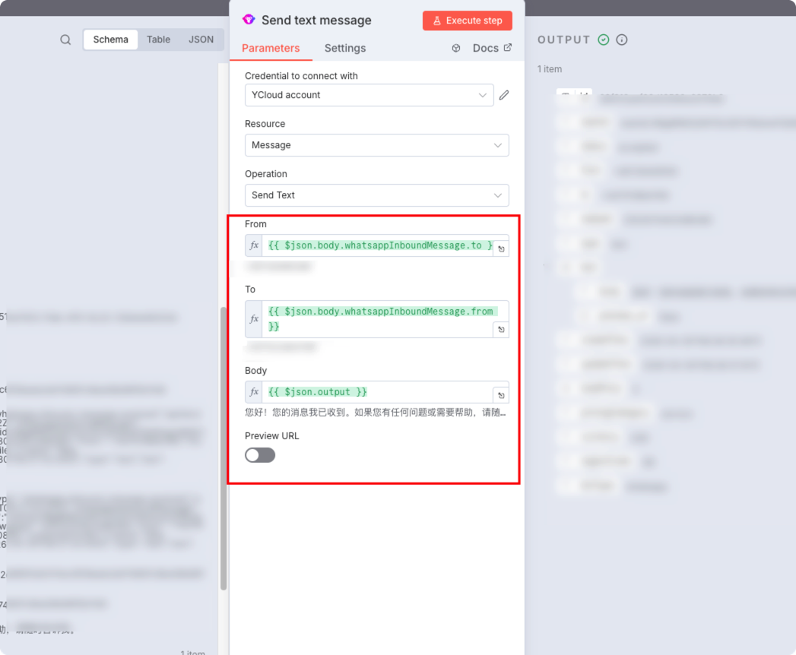
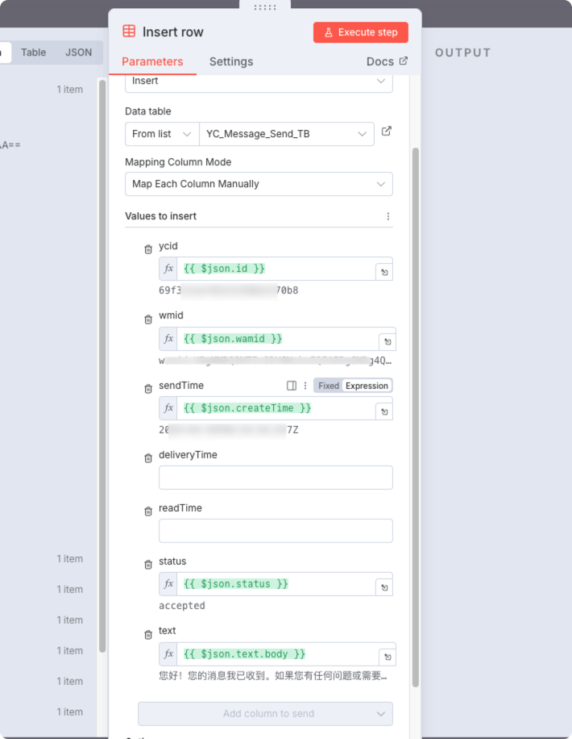
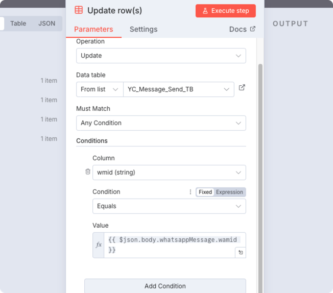
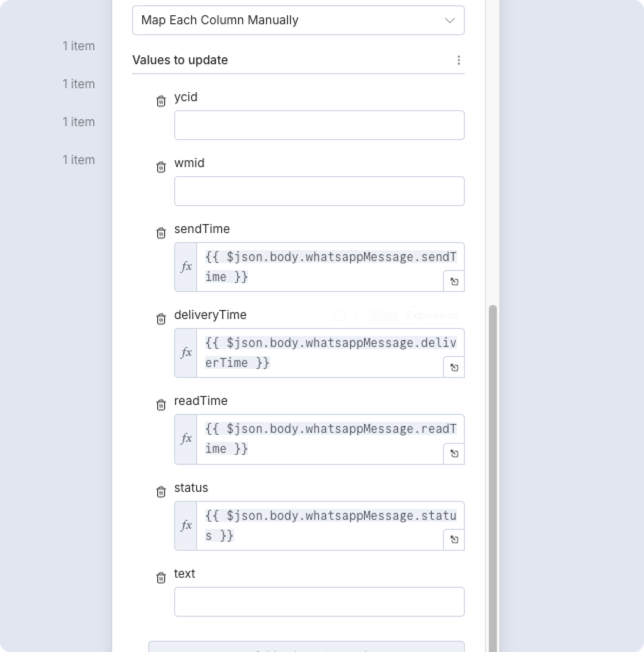

# 示例1：AI自动回复

本示例将演示如何通过 n8n + 大语言模型 + YCloud 节点实现一个基础的自动回复流程：

当 YCloud 平台收到 inbound message 后，将通过 Webhook 触发 n8n 工作流。调用大模型生成回复内容，并通过 YCloud 节点将消息返回给用户。

> YCloud Chatbot 为您构建了完整的AI工作流，提供全链路简单易懂的AI知识库，语料，自动化流程。您可以[点此链接](https://app.gitbook.com/s/78HV6e8vN6mhwsbohgTK/chatbot)查看详情。

### 总体流程

<figure><figcaption></figcaption></figure>

### Webhook 事件触发

1. 创建Webhook端点
   1. 使用n8n Webhook Node 创建新的监听接口
   2. 选择HTTP Method 为 POST
   3. 在Options中将Response Code 设置为200，且务必配置为立即返回 Immediately

<figure><figcaption></figcaption></figure>

2. 将端点信息加入YCloud平台，并选择你需要监听的 Webhook 事件

<figure><figcaption></figcaption></figure>

### 解析返回值，验证签名

#### 解析返回值

使用n8n内置的code节点对Webhook返回值中的Header进行解析

<figure><figcaption></figcaption></figure>

选择Javascript进行解析

```js
function parseSignatureHeader(signatureHeader) {
  const result = {};
  for (const part of (signatureHeader || '').split(',')) {
    const [key, value] = part.split('=');
    if (key && value) {
      result[key.trim()] = value.trim();
    }
  }
  return result;
}

const input = $input.first().json;
const headers = input.headers || {};
const body = input.body;

const signatureHeader = headers['ycloud-signature'] ;
const parsed = parseSignatureHeader(signatureHeader);

const timestamp = parsed.t;
const receivedSignature = parsed.s;

const payload =
  body === undefined || body === null
    ? ''
    : typeof body === 'string'
      ? body
      : JSON.stringify(body);

const signedPayload = `${timestamp}.${payload}`;

return [
  {
    json: {
      ...input,
      timestamp,
      receivedSignature,
      payload,
      signedPayload,
      signatureHeader,
      
    }
  }
];
```

本节点的返回值为：

* 原始值，
* 时间戳timestamp，
* 签名receivedSignature, 负载payload, 签名负载signedPayload, 请求头中的签名信息signatureHeader

#### 加密数据

在上一步中，已将数据完整的划分。在本节点中，将使用SignedPayload和Secret。使用 Crypto 节点对数据进行加密

<figure><figcaption></figcaption></figure>

获取Secret

<figure><figcaption></figcaption></figure>

#### 比较签名

使用if节点对签名信息进行校验，如果相符则认为验证成功。

<figure><figcaption></figcaption></figure>

### 通过AI回复消息

当你订阅了whatsapp\_inbound\_message 与 whatsapp\_messages\_updated这些事件后，你将在接收到消息时被推送 / 在发送消息后收到后续状态

1. 使用switch节点来配置多种webhook推送type

<figure><figcaption></figcaption></figure>

2. 当接收到inbound\_message\_received时，可以通过调用AI接口来完成回复

<figure><figcaption></figcaption></figure>

3. 通过merge节点，将前段的webhook推送数据集合保留

<figure><figcaption></figcaption></figure>

4. 使用YCloud节点发送消息

<figure><figcaption></figcaption></figure>

填入对应的信息将AI输出的信息放置在Body中发送。


此处请务必注意消息发送方与接收方为**反向**，此处为回复消息。


至此，一个完整的 Webhook → 大语言模型 → 自动回复 的n8n流程即配置完成。

### 保存至数据表中（可选）

<figure><figcaption></figcaption></figure>

### 监听发送信息的后续更新（可选）

当完成步骤5，数据将会通过whatsapp.message.update 事件进行推送更新

当收到此推送后，可使用datatable - update rows节点对数据表进行更新，以追踪发信的完整链路

<div align="center"><figure><figcaption></figcaption></figure></div>

<figure><figcaption></figcaption></figure>

### 小结

通过以上步骤，你可以快速构建一个基于 n8n 的自动回复工作流，实现：

* Webhook 监听
* 消息数据处理
* LLM 自动生成内容
* 通过 YCloud 节点回复用户

该示例作为通过n8n集成的起点。
