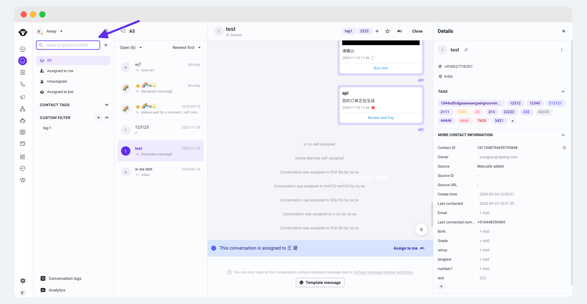

# 初识Inbox界面

Inbox界面

通过区域划分，快速了解inbox操作界面。

<figure><figcaption></figcaption></figure>

**橙色区域: Inbox 搜索及筛选区（Inbox search and filtering area）通过输入关键词或设置特定条件，帮助用户快速找到所需的对话或消息，包括**

* 客服状态（Agent status）：设置当前状态“离开”或“可接待”，离开状态下（除分配规则特殊设置）不自动分配对话。
* 搜索区域（Search area）：基础搜索和高级筛选，帮助快速找到目标客户会话
* 筛选区域：通过分配情况、标签以及自定义筛选器对Inbox会话进行快速筛选。
* 功能入口（Options）：数据分析，Inbox设置

**绿色区域：会话列表（conversation list）列出所有的会话，方便用户快速切换和选择想要查看或继续的对话，支持筛选会话状态以及按照不同顺序给对话排序**

**紫色区域：聊天区域（Chat area）：这是用户与对方进行实时交流和发送消息的主要区域，用于显示双方的消息内容，包括**

* 对话展示区域（Conversation area）：对话内容展示区。
* 消息输入区域（Message input area）：用户在此处输入要发送的文本、表情、文件、模版等消息内容。
* 用户操作区（Operation area）：提供一系列用户可执行的操作，如标记收藏、转接会话等。

**黄色区域：客户详情（Customer details）：展示与当前对话相关的用户的详细信息，例如姓名、头像、联系方式等, 可为用户添加标签。修改联系人属性。**

## Inbox搜索及筛选区

帮助用户快速找到所需的对话或消息

### 基础搜索

Inbox支持通过**电话号码和名字**来搜索历史聊天对话记录。请注意，目前暂时还不支持通过文本的形式来搜索对话。

操作路径：登陆YCloud Inbox > 点击左上方的搜索框 > 输入名字/号码进行查询

<figure><figcaption></figcaption></figure>

### 快速筛选

通过分配情况、用户标签以及自定义筛选器对Inbox会话进行快速筛选。每个分类仅支持单选。

<figure><figcaption></figcaption></figure>

### 自定义筛选

Inbox支持组合单个或者多个条件对会话进行自定义筛选，并保存为子菜单，条件内支持多选。

点击自定义筛选器的加号，开启高级筛选。可在下拉中添加需要筛选的其他条件。

<figure><figcaption></figcaption></figure>

**条件的添加**

选择需要筛选的条件，设置条件的筛选规则。添加完成后可继续点击“Add filter”添加更多条件


条件与条件之间的关系是并且的关系


<figure><figcaption></figcaption></figure>

**条件的删除**

**鼠标悬浮到对应条件上，点击叉号删除已添加的筛选条件**

<figure><figcaption></figcaption></figure>

**查看筛选结果**

在会话列表中查看筛选结果

<figure><figcaption></figcaption></figure>

### 筛选批量转接、关闭会话

Inbox 提供批量转接、关闭会话功能。使用鼠标悬浮在您想要批量操作的会话上，会话左侧将会出现可勾选的复选框，勾选您需要批量处理的会话。在右侧页面您可以看到当前已选中的会话数，按下键盘上的 ESC 键将取消当前的选中。

如果您需要对对话进行批量转接，点击右上角的转接按钮，并选择您想要将这些会话转接给具体的某个客服或转接到“未分配”分组内，系统将弹出二次确认弹窗，确认后系统将为您完成转接操作。

如果您需要对对话进行批量关闭，点击右上角的关闭按钮，系统将弹出二次确认弹窗，确认后系统将为您批量关闭选中会话。

<figure><figcaption></figcaption></figure>

## Inbox聊天区域

### 会话展示区域

在Inbox中，“会话”是您和特定联系人之间的整个交流过程，包括所有的往来内容。“消息”则是在这个交流过程中每次发送或接收的具体一条内容。


由于Inbox关联了YCloud账号下所有WhatsApp号码中的会话，因此会出现同一个客户有多个会话窗口，请通过聊天区顶部用户名称旁的Inbox名称区分该对话对应的WhatsApp号码。


#### **会话状态**

* Open（开启）
* Close（关闭）

**会话状态解释**

Conversation open by \{{1\}}: 会话被客户端/客服端开启

Conversation was assigned to 客服B by 客服A: 当前对话由客服A转接给客服B

The ”\{{1\}}“ tag was added by 客服A：客服A给当前客户添加了一个“XXX”的标签

Conversation was starred by 客服A：客服A给当前对话进行了星标

Conversation was unstarred by 客服A：客服A给当前对话取消了星标

Conversation status was changed to "Closed" by 客服A：当前对话被客服A关闭

Conversation status was changed to "Closed" automatically: 当前会话超过24小时客户没有再次回复，被自动关闭。

#### **消息状态**

已发送：消息已成功发出。

已送达：消息已成功送达接收人的手机或任一已连接设备。

已读：消息已读

发送错误：鼠标悬浮显示错误原因

#### **消息操作**

鼠标悬浮到消息上，会出现“三个点的操作按钮”，点击操作按钮可进行相关操作

<figure><figcaption></figcaption></figure>

* **消息引用（Reply）**：当你在 WhatsApp 上引用一条消息时，它会将原始消息附加到你的新消息中，使其他人可以清楚地看到你在回复哪条消息，避免混淆。

<figure><figcaption></figcaption></figure>

* **消息反应（React）**：WhatsApp 中的消息反应功能与 Facebook 的 Reaction 表情类似。用户可以对消息进行点赞、表达喜爱、惊讶、伤心等各种反应。这一功能可以让你更快速、直观地表达对消息的感受，而无需输入文字回复。

<figure><figcaption></figcaption></figure>

#### **发送对象**

通过头像区分发送者

<table><thead><tr><th width="247">发送者</th><th>头像</th></tr></thead><tbody><tr><td>客服</td><td></td></tr><tr><td>Chatbot</td><td></td></tr><tr><td>API</td><td></td></tr><tr><td>Inbox自动回复</td><td></td></tr></tbody></table>

### 消息输入区域

**会话转接给我**

<figure><figcaption></figcaption></figure>

**通过聊天区域图标完成消息添加，支持以下功能：**

1. 添加表情
2. 添加附件
3. 发送模版

<figure><figcaption></figcaption></figure>

**添加快捷回复**

输入“/”选择快速回复添加进入聊天框，详情请见：[快捷回复](kuai-jie-hui-fu.md)

**发送消息**

通过键盘按下回车或者点击“发送按钮”发送消息

## 用户信息及操作区

### 支持的基础操作

**会话标签**

可对当前会话或历史会话进行打标操作，详情请见：[会话标签](hui-hua-biao-qian.md)

**星标用户**

遇到高价值客户，还可以点击星标，收藏这个客户。之后，这个客户会被归到左侧的Starred标签中。

<figure><figcaption></figcaption></figure>

**会话转接**

点击会话区域顶部用户名称边上的“转接”按钮，在下拉列表中选择要转接的人员，可输入名字快速搜索。

<figure><figcaption></figcaption></figure>

**会话关闭**

&#x20;点击会话区域顶部用户名称边上的“关闭”按钮，结束会话。会话状态转为“已关闭”。

<figure><figcaption></figcaption></figure>

## 客户详情

点击“展开按钮”或者“客户头像”展开客户详情，通过客户详情编辑修改客户属性

* 修改客户备注名：点击客户名称边上的修改图标
* 修改客户分配：点击分配下拉框，选择客服人员或者团队
* 添加标签：找到Tags类，点击“➕”按钮选择已有标签
* 修改属性：点击属性后面的文字修改相关属性。鼠标点击空白区域即可保存（也可按下键盘的回车键进行保存）。

<figure><figcaption></figcaption></figure>

<figure><figcaption></figcaption></figure>

