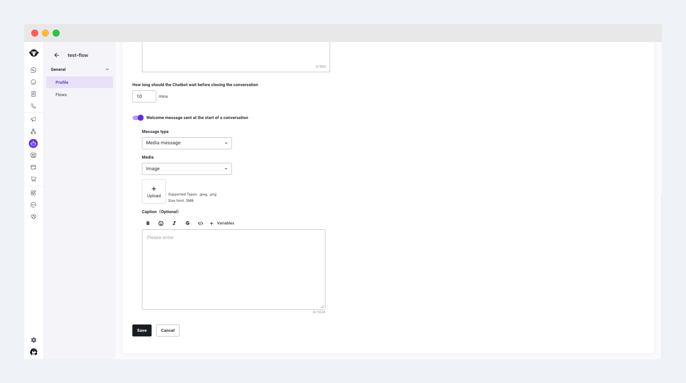
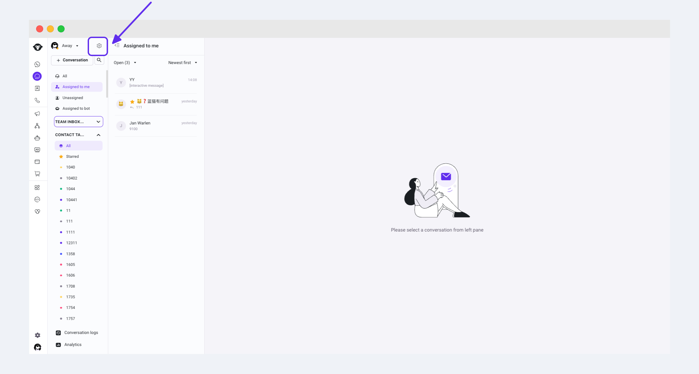
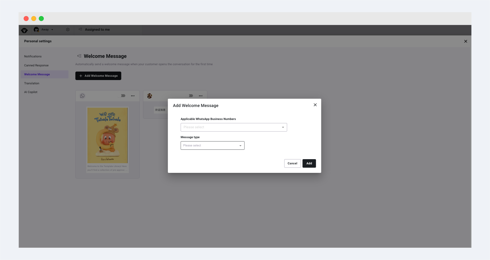
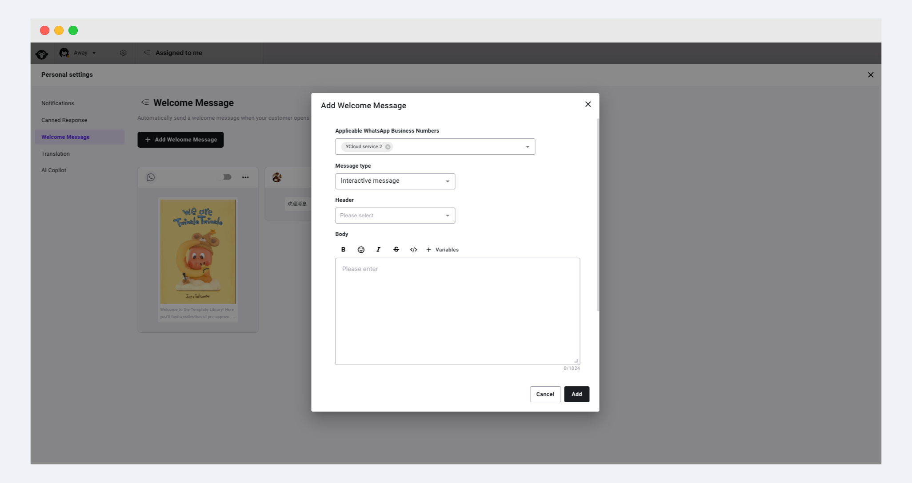
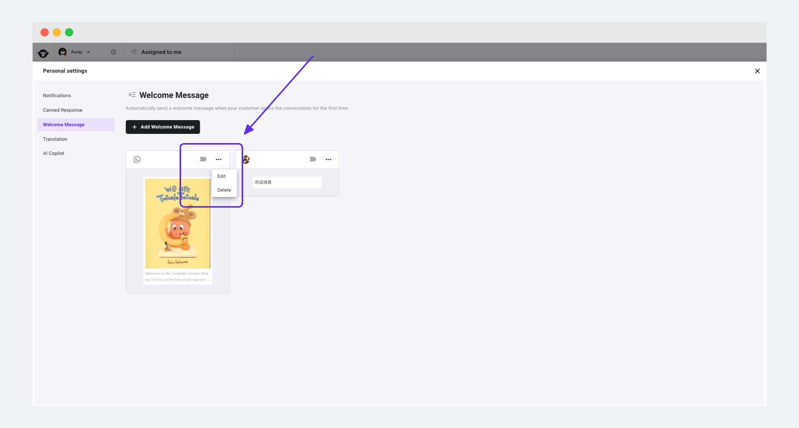
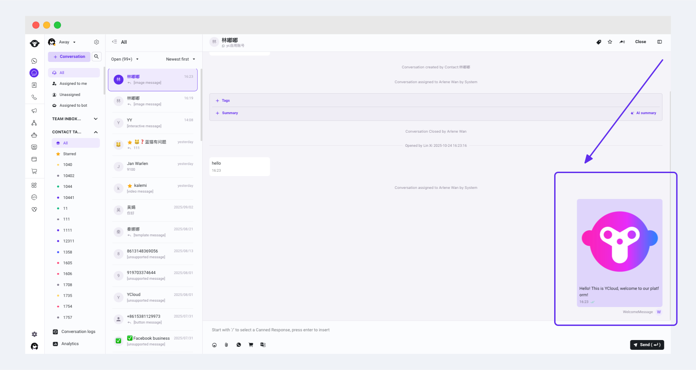

# 欢迎消息

当您希望客户进入会话时，无论上行什么内容的消息，都回复一条固定配置的消息，那么欢迎消息功能可以满足您的需求。

<figure><figcaption></figcaption></figure>

#### 一、客服的欢迎消息

1. 进入 Inbox 后点击头像右侧的【设置】按钮

<figure><figcaption></figcaption></figure>

2. 选择【欢迎消息】菜单，即可管理您的欢迎消息。

<figure><figcaption></figcaption></figure>

3. 点击新增欢迎消息按钮即可创建一条新的欢迎消息，选择该欢迎消息针对哪些商业号码生效，支持配置三种不同类型的欢迎消息（文本、媒体、互动消息）

<figure><figcaption></figcaption></figure>

<figure><figcaption></figcaption></figure>

4. 通过打开开关使欢迎消息正式生效，您还可以通过点击右上角按钮对欢迎消息进行编辑或删除

<figure><figcaption></figcaption></figure>

#### 二、Chatbot 的欢迎消息

您还可以为 Chatbot 配置欢迎消息，当号码分配规则优先分配给 Bot 时，在用户上行消息时它将会自动回复配置好的欢迎消息。可通过 Chatbot-Profile 中的Welcome message sent at the start of a conversation进行设置。

<figure><figcaption></figcaption></figure>
