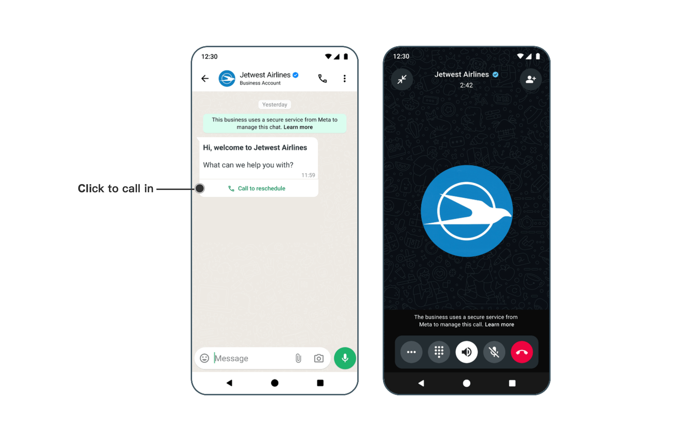

# Inbox中发起语音通话

为了能帮助企业更好得跟客户进行沟通，Inbox中已经集成了WhatsApp语音通话的能力。

如何开启WhatsApp的语音通话请看：


[overview.md](../calling/overview.md)


本文重点介绍在Inbox中如何跟用户进行语音通话

## 一、 邀请客户呼入

当我们在跟客户对话过程中，通过文本的形式沟通比较困难，可以邀请客户跟您发起语音通话。快速语音解决。

呼入类的通话费用免费。

### 1. 发送邀请消息

邀请入口： 点击 WhatsApp Calling > 邀请用户呼入

<figure><figcaption></figcaption></figure>

输入请求通话的原因，确认无误后点击发送

<figure><figcaption></figcaption></figure>

发送后客户手机上会收到一条类似下图的邀请呼入的消息，客户点击呼入按钮即可发起呼入。

<figure><figcaption></figcaption></figure>

### 2. 接听客户呼入消息

当客户通过你发送的邀请链接发起语音通话，您将在Inbox平台上看到提醒，点击 接听键 开始接听。

<figure><figcaption></figcaption></figure>

##

## 二、主动发起外呼

在发起外呼前，您需要有使用该商业号码进行外呼的权限。[参考文档](https://helpdocs.ycloud.com/help-center/zh/calling/overview#pei-zhi-wai-hu-quan-xian)


语音外呼是收费的。价格请查看：[https://www.ycloud.com/pricing#price-table](https://www.ycloud.com/pricing#price-table)


### 1. 获得授权

发起入口：WhatsApp Calling > 发起语音通话

<figure><figcaption></figcaption></figure>

YCloud会引导你先发送一条外呼请求消息。

<figure><figcaption></figcaption></figure>

### 2.获得授权

当用户同意后，你将收到一条系统消息提醒。

<figure><figcaption></figcaption></figure>

### 3. 外呼

获得授权后即可再次点击此按钮发起语音外呼

<figure><figcaption></figcaption></figure>

## 三、查看通话记录

打开右侧通话记录板块可看到详细的通话记录。

<figure><figcaption></figcaption></figure>
