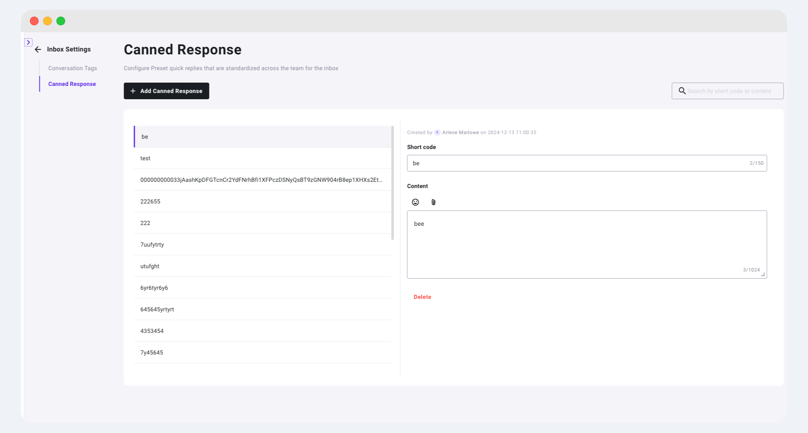
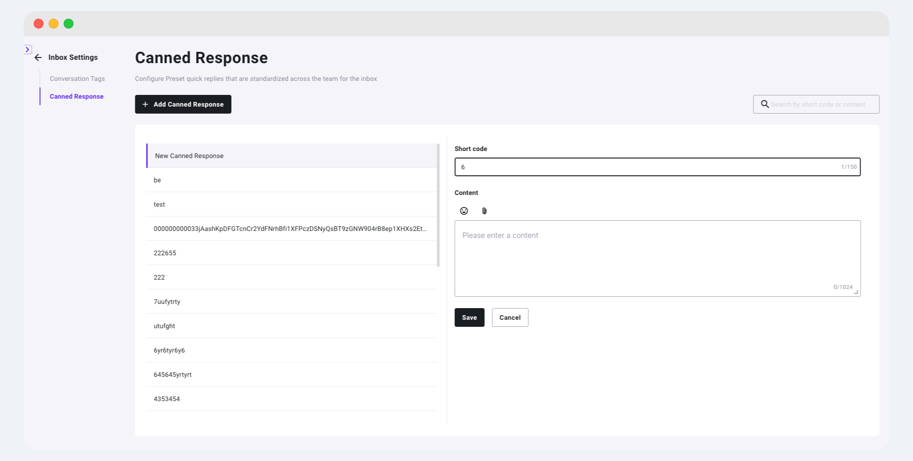
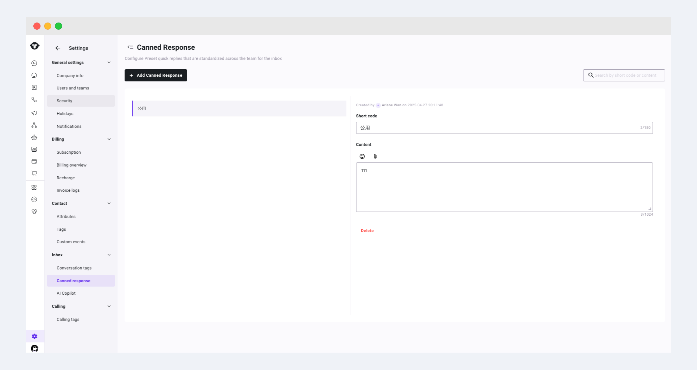

# 快捷回复

快捷回复是什么

在为客户服务几天后，你会发现每次你都会使用相同的问候语或告别语，或者有一些特定的常见问题。

因此，我们引入了快捷回复，以减少重复工作。这样您就可以将经常发送的消息保存为模板，并借助快捷键在聊天中快速使用它们。在Inbox中管理员有权限设置全局的公司快捷回复，设置后租户下所有用户都可以在Inbox中进行调用。

## 如何创建快捷回复

Inbox manager/Admin可创建/修改账户通用的快速回复。要添加新的预设回复，请按照以下步骤操作。

### 步骤1:  从Inbox的Inbox Settings中进入设置菜单，并选中左侧的快捷回复子菜单

<figure><figcaption></figcaption></figure>

### 步骤2: 将在左侧新建一条快捷回复，需要填写的内容如图所示。

1.  简码

    编写一个以后可以轻松记住的短代码，用来唤起快捷回复的短语或词组。每个短代码不可重复，限制最多150个字符。
2.  **内容**

    输入您想要保存为模板的消息。内容中支持添加标签和1个附件。内容最多支持1024个字符。

<figure><figcaption></figcaption></figure>

### 步骤3: 保存快捷回复

点击底部的保存按钮保存快捷回复。

点击取消，该条记录将不被保存。

保存后，可点击红色的删除按钮，删除该条记录

<figure><figcaption></figcaption></figure>

## 如何创建公司快捷回复

公司快捷回复可以在设置 > Inbox > 快捷回复中设置。公司快捷回复是全局的，设置后可以被所有客服坐席使用。

<figure><figcaption></figcaption></figure>

## 如何使用快捷回复

步骤1：唤起快捷回复。在聊天输入框中输入“`/`”，该符号需要在聊天框的最开始，不能跟在文字内容后。这将显示所有预设回复的列表。左侧为快捷回复列表，右侧为内容预览。

<figure><figcaption></figcaption></figure>

步骤2：选择快捷回复。您可以用鼠标从左侧列表中选择，或者只需输入简码（如果您记得的话）。然后，通过键盘的上下键切换选择的内容，按下键 `Enter` ，您的文本编辑器就会填充回复。

<figure><figcaption></figcaption></figure>

 
