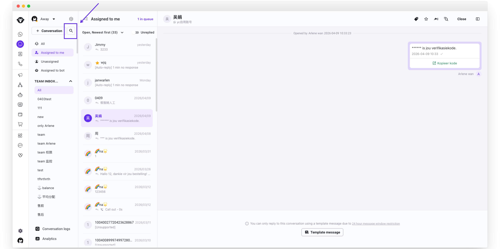
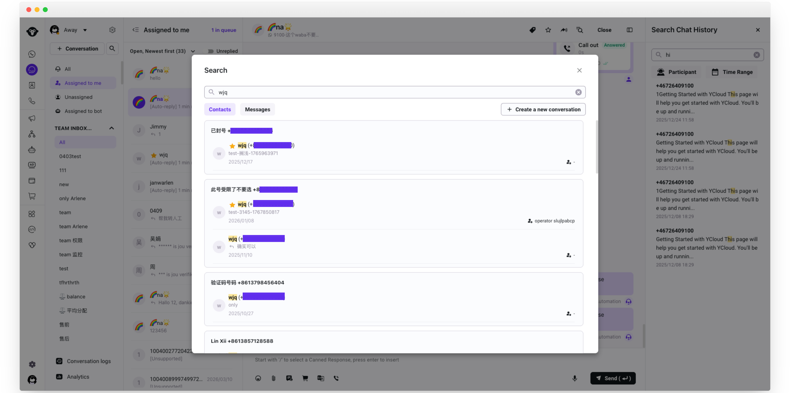
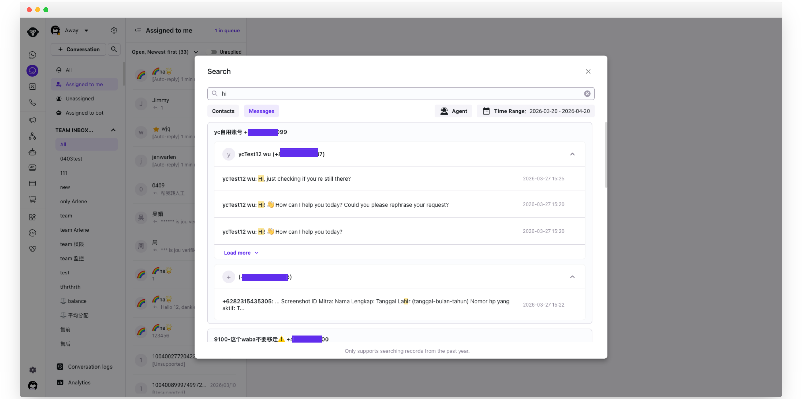
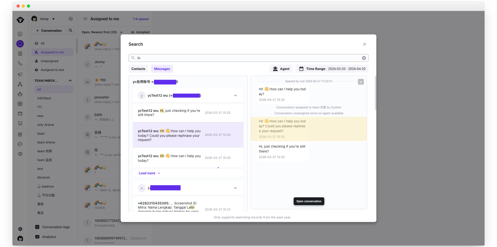
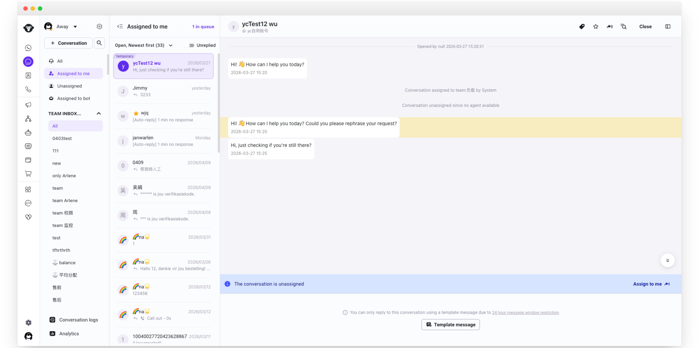
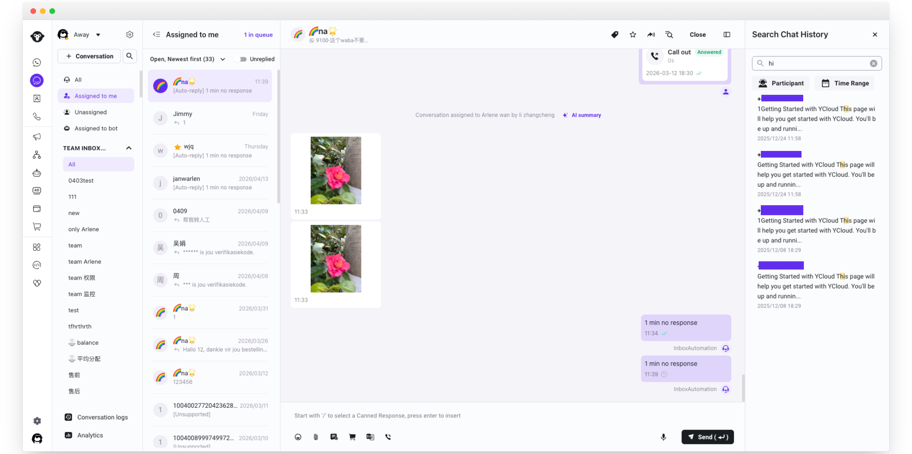
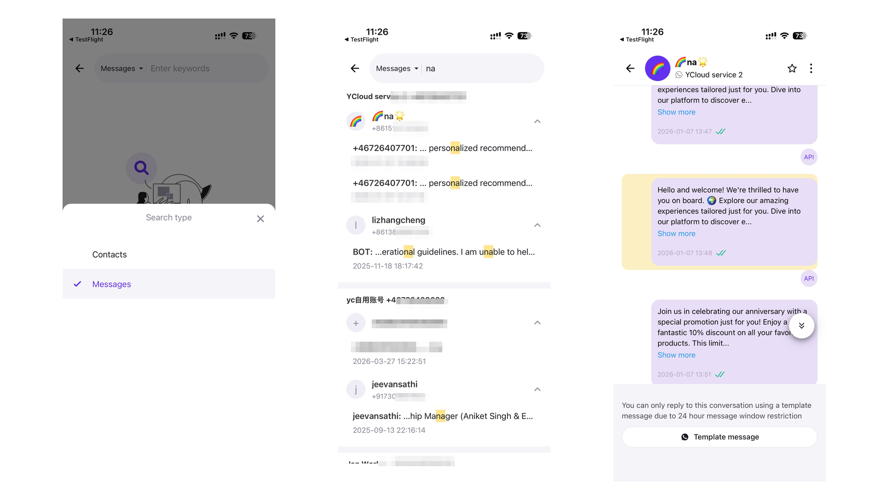

# 搜索联系人和聊天记录

### 功能简介

Inbox 新增搜索功能，帮助客服人员快速定位历史对话和联系人信息。支持两种搜索模式：

* **全局搜索**：在所有会话和联系人中搜索
* **会话内搜索**：在当前打开的单个会话中搜索历史消息

### 一、全局搜索（Web 端）

#### 入口

点击左侧联系人列表顶部的搜索图标，展开搜索框。

<figure><figcaption></figcaption></figure>

#### 联系人搜索

默认进入「联系人」标签页。

**支持搜索：**

* 联系人姓名（模糊搜索，不区分大小写）
* 联系人电话号码（精确匹配）

**结果卡片包含：**&#x5934;像首字母、姓名、电话号码、最后一条消息预览、消息时间、所属 Agent**点击结果：** 直接跳转到对应会话。**新建会话：** 无论搜索结果是否为空，页面始终显示「+ Create a new conversation」按钮，点击后打开新建会话弹窗，并自动带入已输入的号码。

<figure><figcaption></figcaption></figure>

#### 消息搜索

点击「消息」标签页切换到消息搜索。**注意：切换标签页后输入框内容会自动清空。支持搜索：**

* 文本消息内容
* 图文消息中的文字部分

**搜索时间范围：** 默认支持最近 1 年内的消息记录。**筛选条件：**

* **Agent**：支持模糊搜索，可多选
* **时间**：选择开始时间和截止时间

**结果卡片包含：** 发送者头像首字母、发送者姓名、联系方式、消息内容片段（关键词高亮）、消息时间、

<figure><figcaption></figcaption></figure>

**点击结果：**

* 点击会话标题行：展开或收起该会话下的消息列表
* 点击「跳转」按钮：跳转到对应会话
* 点击具体消息行右侧：弹出预览面板，显示该条消息前后 24 小时内的上下文
* 点击具体消息「跳转」按钮：跳转到对应会话中该条消息的位置，消息高亮显示 2 秒后消失

#### 关闭搜索

点击清空按钮关闭搜索框，恢复联系人列表原始状态。

<figure><figcaption></figcaption></figure>

<figure><figcaption></figcaption></figure>

### 二、会话内搜索（Web 端）

#### 入口

打开任意会话后，点击右侧会话详情区域顶部右侧的搜索图标（位于关闭按钮左边）。

#### 使用方式

1. 点击搜索图标，展开搜索框
2. 输入关键词，系统实时在当前会话的历史消息中搜索
3. 搜索结果列表中，鼠标悬停某条消息时显示底色
4. 点击某条消息，自动跳转并滚动到该消息位置

**搜索范围：** 当前会话内所有历史消息（包括客服和客户双方发送的消息）

<figure><figcaption></figcaption></figure>

**筛选条件：**

* **Agent / 联系人**：下拉多选，可以通过发送人来筛选消息记录
* **时间**：选择开始时间和截止时间

**高亮规则：**

* 结果列表中当前选中项：灰色背景
* 列表中匹配关键词：加粗或特殊颜色标记
* 对话框内匹配项：浅黄色高亮

**无结果时：** 显示无结果提示，搜索框保持打开，可继续修改关键词。

### 三、移动端搜索

#### 全局搜索

1. 点击搜索按钮，默认进入「联系人」搜索
2. 点击切换按钮可在「联系人」和「消息」之间切换
3. 消息搜索仅支持模糊搜索聊天内容，**不支持**按 Agent 或时间筛选
4. 搜索时间范围与 Web 端一致（最近 1 年）

<figure><figcaption></figcaption></figure>

#### 会话内搜索

1. 进入会话详情页（Details）
2. 点击「Search chat history」按钮，进入搜索页面
3. 输入关键词搜索当前会话内容
4. 点击「取消」返回详情页

<figure><figcaption></figcaption></figure>

### 常见问题

**Q：最少需要输入几个字符才能触发搜索？**&#x20;

A：输入 1 个字符即可触发实时搜索。

**Q：消息搜索最远能搜多久以前的记录？**&#x20;

A：全局搜索功能支持最近 1 年内的消息记录，页面会有相应提示。会话内消息搜索不限制时间。

**Q：联系人搜索支持哪些字段？**&#x20;

A：支持联系人姓名（模糊搜索）和电话号码（精确匹配）。

**Q：消息搜索支持哪些内容类型？**&#x20;

A：支持纯文本消息，以及图文消息中的文字部分。图片内容暂不支持搜索。

**Q：切换联系人/消息标签页后，之前输入的内容还在吗？**&#x20;

A：不在。切换标签页后输入框内容会自动清空，需重新输入关键词。
