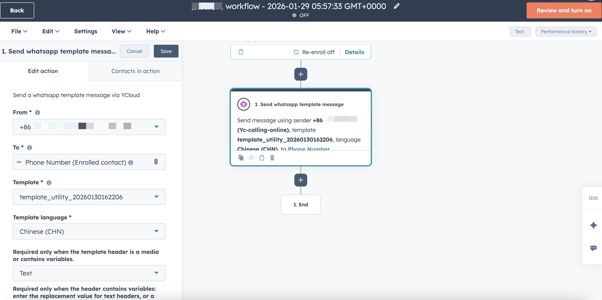

# Hubspot

将 YCloud 与 HubSpot 深度集成，可以把分散在 WhatsApp 中的客户对话，无缝转化为可管理、可跟进、可转化的 CRM 资产，帮助团队提升获客效率、跟进效率和转化率。

## 绑定Hubspot账号有什么作用？

1. **把 WhatsApp 的咨询线索，变成 HubSpot 里的客户资产**
   1. 通过绑定Hubspot账号，YCloud 可以在客户通过 WhatsApp 联系你时：
      * 自动在 HubSpot 创建或更新 Contact
      * 将 WhatsApp 手机号、来源、标签等同步为 HubSpot 属性
2. **WhatsApp 会话的归属与 HubSpot Owner 自动对齐**
   1. 集成后，你可以仍然在Hubspot中分配新的线索，分配后YCloud的会话会自动分配给对应的owner
3. **在 YCloud Inbox 里直接查看 HubSpot 客户信息**
   1. 集成后，你可以在 YCloud Inbox 中：
      * 实时查看 HubSpot 中的客户属性（如生命周期阶段、客户状态、来源等）
      * 自定义展示哪些 HubSpot 属性
4. 在Hubspot的Automation中触发WhatsApp模板信息
   1. 集成后，您可以在Hubspot —— Automation中使用YCloud 发送WhatsApp消息的组件
      1. 在客户的各个旅程中自动触达客户

## 绑定教程

### 前提

1. 您已有Hubspot账号
2. 您的YCloud账号的软件版本是Pro或者Enterprise

### 第一步：绑定Hubspot账号

1. 进入[Integration](https://www.ycloud.com/console/#/app/integrations/all) 页面，点击Hubspot 的 Install&#x20;

<figure><figcaption></figcaption></figure>

2. &#x20;授权Hubspot账号完成授权

<figure><figcaption></figcaption></figure>

当看到以下页面时表示绑定成功，请等待5s后自动跳转到YCloud配置页面

<figure><figcaption></figcaption></figure>

### 第二步：配置同步的Contact 属性

配置当YCloud有新的contact时，往Hubspot新增contact时要传的属性。

1. 选择YCloud的属性。&#x20;
   1. 当有新客户创建后，YCloud会将这些新的客户属性传至Hubspot
2. 匹配YCloud属性和Hubspot属性。
   1. 将选择的YCloud属性和Hubspot的属性进行一一匹配。例如，YCloud的 "Phone number"，您可以匹配为Hubspot的"Phone Number"，或者Hubspot 的 "WhatsApp Phone Number"。您可以根据您的业务决定匹配的属性。

<figure><figcaption></figcaption></figure>

### 第三步：匹配Users的邮箱（Optional）

当您在Hubspot中变更某个Contact的Owner时，YCloud会同步该Owner，为了防止owner的邮箱再hubspot和YCloud中不一致，您可以在这边进行手动匹配。

例如：销售 Bob，他在登录Hubspot的邮箱是bob@ycloud.com， 他在登录YCloud时候的邮箱是 bob.zhang@ycloud.com。 那你就需要在该步骤中匹配一下这两个邮箱。

<figure><figcaption></figcaption></figure>

### 第四步：配置在Inbox看到的Hubspot的客户属性

绑定Hubspot后，您可以在Inbox的右侧的客户详情页面看到这个客户在Hubspot的信息。

在此步骤，您可以配置要显示出来的Hubspot的属性和展示的顺序

<figure><figcaption></figcaption></figure>

配置完成后在Inbox的效果如下：

&#x20;_该Hubspot组件支持拖动变更顺序，里面的属性值也支持修改（部分属性除外）。_

<figure><figcaption></figcaption></figure>

### Hubspot Automation 使用

进入Hubspot > Automation。从左侧列表中找到Send WhatsApp template message 组件加入到画布中。

设置：

* From：使用哪个商业号码给客户发送消息
* To：客户的号码，可选择Hubspot中客户的号码属性
* Template: 需要触发的WhatsApp消息模板（请在YCloud后台完成创建，并等待通过审核）
* 模板中的变量设置：
  * header
    * 若模板的header 是图片，视频，GIF类型的，请选择对应的header类型，并在变量设置中填写要发送的媒体的下载链接
    * 若模板的header是纯文字，且带变量。请选择Text的header类型，并在变量设置中配置变量替换值
    * 若模板没有header或者header为不含变量。则不需要设置
  * body中的变量
    * 按变量的位置顺序依次设置，逗号隔开。可选择hubspot中的属性作为变量的替换值，也可以设置一个固定值

<figure><figcaption></figcaption></figure>
