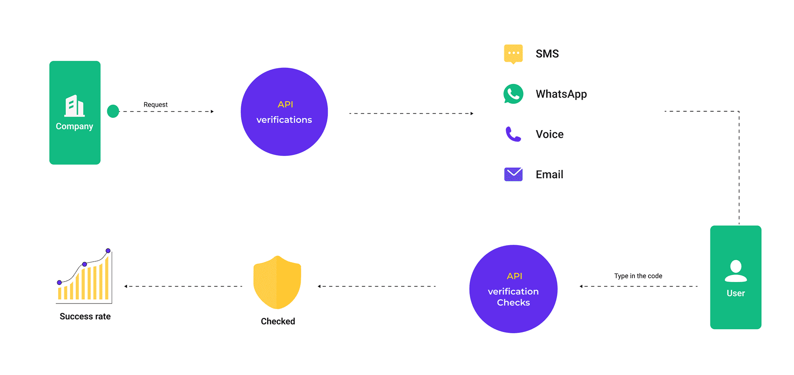

# 入门

## 使用YCloud Verify构建用户验证

集成现成的解决方案，通过短信、WhatsApp、电子邮件和语音等渠道快速发送一次性密码 (OTP)，以验证全球用户身份。

## 您可以从 YCloud 验证中受益

* 简化验证：YCloudVerify集成了消息通道连接、OTP生成、验证消息传递、OTP验证、数据监控等功能。通过使用简单的API将Verify与您的应用系统集成，您可以实现全球用户验证。
* 多渠道整合：整合短信、WhatsApp、Email、Voice等多种主流消息渠道，确保消息全球传递验证。
* 消息模板：预设消息模板，可适应各种验证场景，根据号码位置自动翻译，符合全球当地法律法规。
* 防诈骗：在发送前识别潜在的诈骗号码，异常情况及时触发警报，保护您的企业免受诈骗，避免昂贵的通讯费用。

## YCloud验证如何运作

YCloud Verify 只需两个 API，即可处理 OTP 生成、验证消息传递、OTP 验证、欺诈监控和验证数据统计，从而简化了开发工作。

<figure><figcaption>
Verify working principle
</figcaption></figure>

如果您已经具备生成、存储和验证 OTP 的能力，您还可以使用 YCloud 验证。有关详细信息，请参阅[自定义 OTP 。](yan-zheng-gong-neng/zi-ding-yi-otp.md)

## 开始之前

要使用任何 YCloud 产品，您需要[注册](https://www.ycloud.com/console/#/entry/register)一个免费帐户。

联系客服开通Verify功能

## 建立用户验证

只需几行代码，您就可以使用验证 API 将第一个验证令牌发送到用户的设备。我们有详细的 API 参考：

1. 发送验证码API：通过指定渠道向最终用户发送带有验证码的消息。支持的渠道包括短信、WhatsApp、语音和电子邮件。[跳转至API文档](https://docs.ycloud.com/reference/verification-send)
2. 验证验证码API：检查用户提交的验证码是否正确。[跳转至API文档](https://docs.ycloud.com/reference/verification-check)

## 下一步骤

* [消息模板配置](yan-zheng-gong-neng/yan-zheng-xiao-xi-mu-ban.md)：模板是预定义且经过批准的文本，用于发送验证消息，支持的渠道包括短信、语音、Whatsapp 和电子邮件。
* [安全设置](yan-zheng-gong-neng/an-quan-she-zhi.md)：YCloud预设的安全设置，包括启动验证前检查电话号码、限制国家/地区、列入黑名单限制等。
* [验证分析](yan-zheng-gong-neng/yan-zheng-fen-xi.md)：YCloud验证提供验证请求-发送-成功的完整数据循环，每天自动向企业发送验证报告，每次验证都有清晰的验证日志。
* 验证渠道选择：每种验证渠道都有其自身的优点和缺点。根据您业务所在的国家/地区选择合适的验证渠道，有助于提高验证流程的通过率，保障账户安全。

