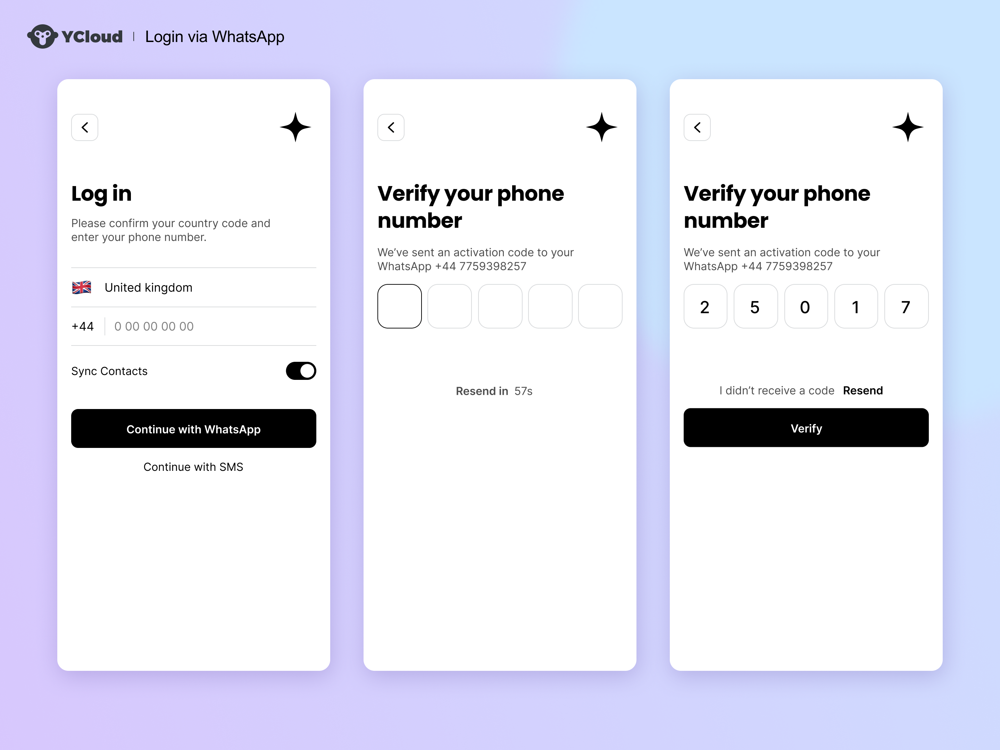

# 通过WhatsApp验证

使用 WhatsApp 消息传递一次性密码 (OTP) 以帮助进行用户身份验证。

通过 WhatsApp 将 OTP 消息发送到他们的设备。这种体验类似于接收短信 OTP，甚至在 Android 手机上，也可以直接从英文 WhatsApp 消息中检索 OTP 代码，让用户无需离开应用程序即可接收代码。

&#x20;

## WhatsApp 验证的好处

作为验证通道，它具有与短信相同的优点，并且不受当地运营商基础设施的影响。这意味着可以在有 Wi-Fi 但蜂窝信号较弱或不存在的区域（例如偏远地区或飞机上）接收 WhatsApp 消息。WhatsApp 通常比 SMS 更快，并且经过端到端加密，提供了额外的安全性。

WhatsApp 还提供更多安全优势：每个 WhatsApp 用户都可以通过创建帐户时提供的唯一电话号码来识别。WhatsApp 使用自己的一套强大的反欺诈工具来验证这些电话号码。这意味着您将部分身份验证工作外包给 WhatsApp。

在许多国家/地区，WhatsApp 比 SMS 便宜，并且可以帮助您省钱，而且无需对未发送的消息收取费用。在印度、印度尼西亚和南美洲，我们建议使用 WhatsApp 作为首选验证渠道，因为它可以提高您的整体验证转化率并且更便宜。

现在使用 YCloud 验证，而不是从头开始构建它，立即开始发送 OTP，没有消息数量限制或行业限制，通过预先批准的 WhatsApp 共享电话号码发送。

&#x20;

## 建立 WhatsApp 验证

1. 使用发送验证码 API，通道指定为 WhatsApp。
2. 像任何其他渠道一样验证验证。[参考API](https://docs.ycloud.com/reference/verification-send)

&#x20;

## WhatsApp 验证定价

发送消息的费用根据发送验证消息的国家/地区而异，并且没有额外费用。WhatsApp 仅对成功的消息收费，您无需为失败或未送达的消息付费。

[💰️ 请参阅 WhatsApp 定价了解更多详情。](https://www.ycloud.com/price)

&#x20;

## 实施 WhatsApp OTP 的最佳实践

### 用户界面设计

使用 WhatsApp 发送 OTP 是一种新方式，我们提供一些 UI 设计建议：

| 设计方案                                                                                     | 适用场景                                               |
| ---------------------------------------------------------------------------------------- | -------------------------------------------------- |
| <p>默认通过 WhatsApp 发送 OTP<br>在 WhatsApp 发送失败后立即通过短信发送（很可能是因为目标电话号码尚未注册个人 WhatsApp 帐户）。</p> | 您的受众主要集中在 WhatsApp 覆盖率较高的国家/地区，例如印度尼西亚、印度、巴西和哥伦比亚。 |
| 提供接收 OTP 消息通道的按钮选项，允许用户选择自己的 OTP 接收通道。                                                   | 您的受众位于 WhatsApp 覆盖率不够高的国家/地区，或者您的应用程序覆盖了许多国家/地区。   |

<figure><figcaption></figcaption></figure>

OTP 默认通过 WhatsApp 发送。如果发送失败，会立即通过短信重发。

<figure><figcaption><p>提供用于接收 OTP 消息通道的按钮选项</p></figcaption></figure>

## 检查用户是否安装了 WhatsApp

为了改善用户体验并默认使用 WhatsApp，您可以确定用户是否在运行您的应用程序的同一设备上安装了 WhatsApp 应用程序。\
以下是 Android 版 WhatsApp 检测的实现示例：

```javascript
fun PackageManager.isPackageInstalled(packageName: String): Boolean {
  return try {
    getPackageInfo(packageName, PackageManager.GET_ACTIVITIES)
    true
  } catch (e: NameNotFoundException) {
    false
  }
}

fun isWhatsAppInstalled : Boolean() {
    val whatsAppPackageName = "com.whatsapp"
    val whatsAppBusinessPackageName = "com.whatsapp.w4b"
    return getPackageManager().isPackageInstalled(whatsAppPackageName) || getPackageManager().isPackageInstalled(whatsAppBusinessPackageName)
}
```

&#x20;

## 问答


<details>

<summary><strong>为什么 WhatsApp 是 OTP 传送的良好渠道？</strong></summary>

在过去的几年里，我们见证了一种新的消息传递渠道的崛起：WhatsApp。它在180个国家拥有超过20亿用户，并正在迅速向各个国家/地区传播。每个 WhatsApp 用户都是通过创建 WhatsApp 帐户时提供的唯一电话号码来识别的，因此这意味着 WhatsApp 可以直接取代短信用于所有验证用例，包括注册、登录和交易。

</details>

<details>

<summary><strong>WhatsApp 验证如何运作？</strong></summary>

如果您熟悉用于发送 SMS OTP 的验证 API，则只需使用 API 请求将所需的通道参数从 SMS 更改为 WhatsApp 即可。与短信一样，预先批准的 OTP 模板消息是通过 YCloud 维护的共享电话号码发送的。

</details>

<details>

<summary>我可以使用自己的品牌和电话号码来发送 WhatsApp OTP 消息，而不是使用 YCloud 的“通用发件人”吗？</summary>

目前，无法将您的品牌和电话号码设置为发件人。但是，您的品牌名称将包含在 WhatsApp 消息正文中。\
使用 YCloud 的 WhatsApp 通用发件人进行验证的主要好处之一是能够使用 YCloud 的 WhatsApp 共享号码。它具有以下优点：

* 从一开始就以最高消息量限制开始
* 避免 WhatsApp 商业政策中可能存在的障碍，例如约会应用程序和加密货币产品。但是，您仍然需要遵守 YCloud 的可接受使用政策。

</details>

<details>

<summary>我应该使用哪种 YCloud 产品：验证 WhatsApp API 还是 WhatsApp 的可编程消息 API？</summary>

如果您的用例是 OTP 交付，那么我们强烈建议使用 YCloud 验证 WhatsApp API，因为它是专门为其构建的解决方案。如果您想使用 WhatsApp 开发更加个性化的消息传递用例，您可以选择[WhatsApp 的可编程消息传递 API](https://docs.ycloud.com/reference/whatsapp_message-send)。

</details>


