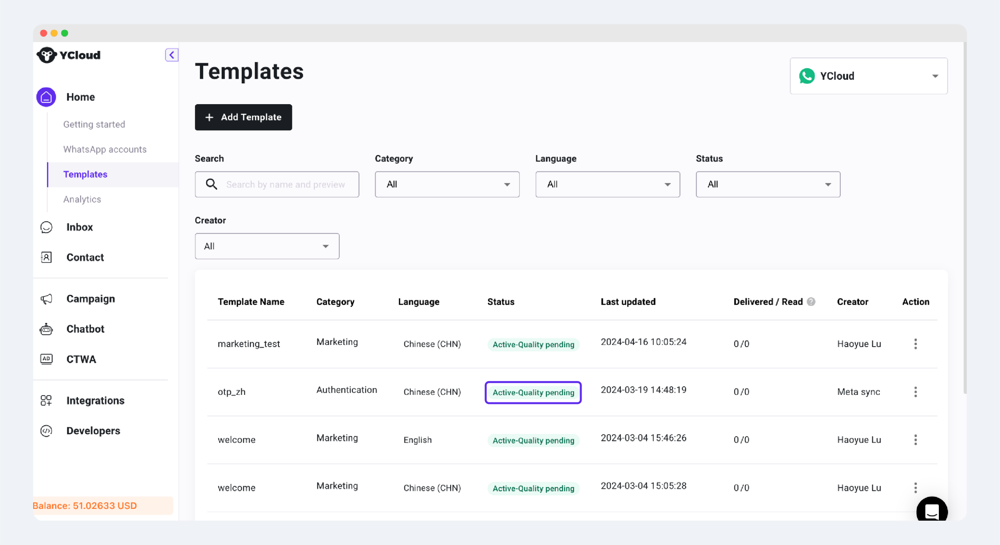
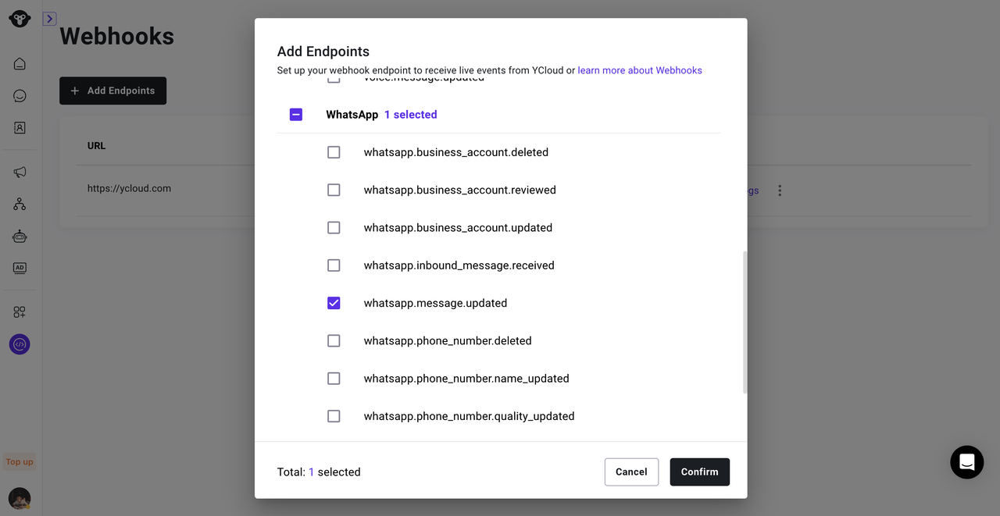
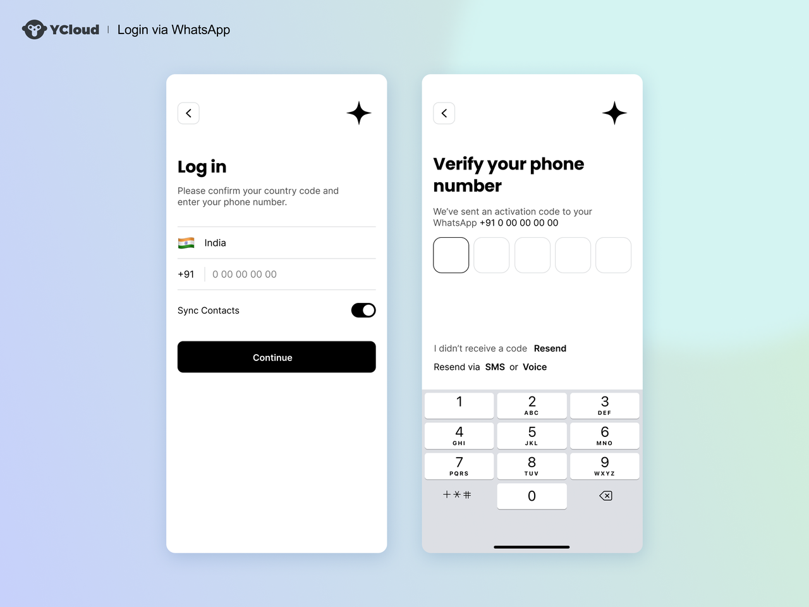
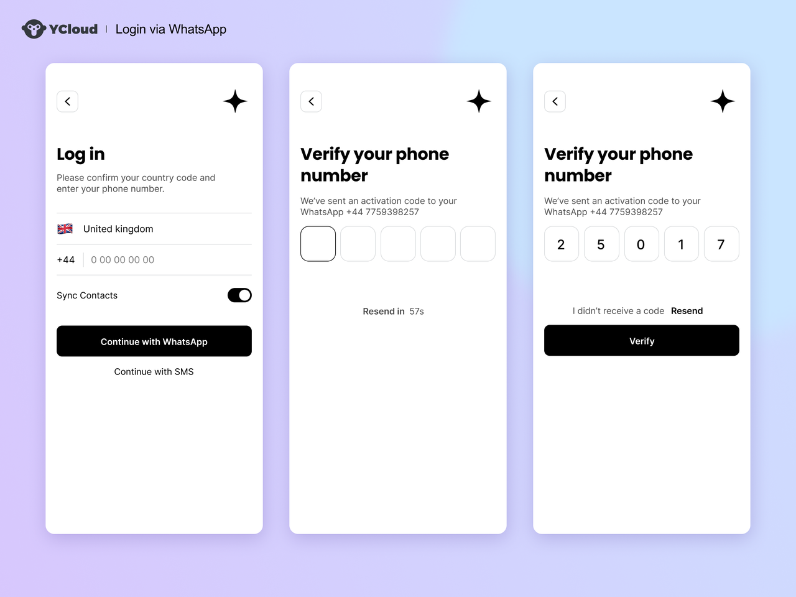

# 通过WhatsApp发送验证码

## 使用WhatsApp发送验证码的优势


作为验证渠道，它具有与 SMS 相同的优势，并且不受当地运营商基础设施的影响。这意味着可以在 Wi-Fi 可用但蜂窝信号较弱或不存在的区域接收 WhatsApp 消息。此外，WhatsApp 还通常比 SMS 更快，并且经过端到端加密，提供额外的安全性。

**1.降低成本**

在许多国家/地区，**WhatsApp 比 SMS 更便宜**，并且无需为未送达的消息收费。因此，在印度、印度尼西亚和南美等高覆盖的国家和地区，我们建议使用 WhatsApp 作为**首选验证渠道**，它可以提高您的整体验证转化率并且更便宜。

**2.安全可靠**

WhatsApp **还可以提供更多安全优势**：每个 WhatsApp 用户都可以通过创建帐户时提供的唯一电话号码来识别。同时，WhatsApp 使用自己的一套强大的反欺诈工具来验证这些电话号码。这些都意味着您将部分身份验证外包给 WhatsApp，直接获得了强大的安全系统。



## 使用WhatsApp发送验证码（OTP）

### 步骤1：注册YCloud

* 登录YCloud后台，[点击访问](https://www.ycloud.com/console/#/entry/login?lastPath=https%3A%2F%2Fwww.ycloud.com%2Fconsole%2F%23%2Fapp%2Fdashboard%2FgetStarted)

### 步骤2：创建WABA账户

请参考详细流程：



### 步骤3：创建验证类消息模板


WhatsApp 专为验证码类型的消息提供了特定的模板：

* 身份验证消息模板的预设固定文本：
  * \<VERIFICATION\_CODE> 是您的验证码。
  * 安全免责声明（可选）：为安全起见，请勿共享该验证码。
  * 过期警告（可选）：这组验证码将在 \<NUM\_MINUTES> 分钟后过期。
* 有效期：自定义这组验证码的实际有效期，超出有效期仍未送达，该消息将被撤回，您将不会被收费，您的客户也不会看到该消息。
* 按钮：复制验证码按钮或一键自动填写按钮。

文本不支持网址、媒体和表情符号。包含一次性密码按钮的身份验证模板仅由预设文本和按钮组成，所以此类模板被暂停的风险大大降低。


#### 1.创建消息模板，

* 点击Home > Templates >  + Add Template，前往[消息模板创建](https://www.ycloud.com/console/#/app/dashboard/templateSetting/add)。

<figure><figcaption></figcaption></figure>

<figure><figcaption></figcaption></figure>

#### 2.设置模板

*   在Category选择Authentication，并命名模版名称和选择模版语言

    * 请注意：**模版名称必须要唯一的**。名称仅支持小写字母a-z、0-9、 下划线（\_)。模版一旦提交，无法进行更改。

    <figure><figcaption></figcaption></figure>
* 选择发送方式：
  * Copy code（复制验证码）
  * Autofill-One tap（一键填充验证码）
  * Autofill-Zero tap（零点击验证码）

在这里选择不同的发送方式，用户收到的界面按钮和使用方法也将有所不同。总的来说，**零点击验证码可提供最佳用户体验，所以是首选的解决方案。**  但是，目前仅 Android 且非印度地区支持该按钮按钮，而且此类按钮需要更改您应用的代码，才能执行“握手”，另外还需要更改应用的签名密钥哈希。  具体对比如下：

<table data-header-hidden data-full-width="true"><thead><tr><th width="115">发送方式</th><th width="213"></th><th width="221"></th><th width="194"></th></tr></thead><tbody><tr><td><strong>发送方式</strong></td><td><strong>Copy code（复制验证码）</strong></td><td><strong>One tap（一键填充验证码）</strong></td><td><strong>Zero tap（零点击验证码）</strong></td></tr><tr><td><strong>界面展示</strong><br></td><td></td><td></td><td></td></tr><tr><td><strong>使用操作</strong></td><td>用户在WhatsApp点击该按钮进行复制，然后手动切换到您的应用页面，粘贴验证码至应用页面</td><td>用户在WhatsApp点击该按钮，会自动加载您的应用，并向该应用传递验证码，仅需点击一次</td><td>用户收到验证码后，您的应用界面会自动完成验证码的填写，无需任何点击或切换</td></tr><tr><td><strong>使用限制</strong></td><td>无设备或地区限制<br></td><td>目前仅支持安卓手机且非印度地区使用, 还需要更改应用程序的代码才能执行"握手", 以及应用程序的签名密钥哈希</td><td>目前仅支持安卓手机且非印度地区使用, 还需要更改应用程序的代码才能执行"握手", 以及应用程序的签名密钥哈希</td></tr></tbody></table>

* 添加安全提示和验证码过期时间提示（可选）

<figure><figcaption></figcaption></figure>

* 设置消息有效期（可选）

建议设置自定义有效期，你可以选择1-10分钟作为消息有效期。设置完成后，在该有效期内您的身份验证消息必须发送完成。**如果消息未在此时间范围内送达用户终端，该消息将被撤回，您将不会被收费，您的客户也不会看到该消息。**&#x5982;果您不设置自定义有效期，则会应用标准的WhatsApp消息有效期（24小时）。这意味着您可能会为超时发送的无效消息支付额外的费用。

<figure><figcaption></figcaption></figure>

*   点击提交模版（Submit）

    * 通常来说，验证码模版在提交后会在几分钟之内就显示通过。当status中出现“active”的状态，代表模版状态已激活，可以进行发送了。

    <figure><figcaption></figcaption></figure>
* 当模版状态为“Active-Quality pending”，即为创建成功

### 步骤4：发送OTP

接下来，您可以使用API发送OTP消息。

> 点击查看[API发送消息接口地址](https://docs.ycloud.com/reference/whatsapp_message-send-directly#/)

\
API请求的参考：



### 步骤5：监听Webhook推送

**1.配置回调地址**

* 点击Developers > Webhooks ，前往[Webhooks配置](https://www.ycloud.com/console/#/app/developers/webhook)。

创建 Webhook 端点，填写回调URL，有关该消息状态的通知都将发送到您的 Webhook 回调。

<figure><figcaption></figcaption></figure>

**2.监听OTP消息状态**

对于您发送的每条消息，有关该消息状态的通知都将发送到您的 Webhook 回调。您可以根据反馈的内容判断您的验证码是否发送成功。

<table><thead><tr><th width="129">状态</th><th>描述</th></tr></thead><tbody><tr><td>failed</td><td>您发送的消息发送失败。失败原因将包含在回调中。请查看错误消息文档以获取有关调试的帮助：<a href="https://developers.facebook.com/docs/whatsapp/cloud-api/support/error-codes">错误代码</a>及<a href="https://developers.facebook.com/docs/whatsapp/cloud-api/support/troubleshooting">故障排除</a></td></tr><tr><td>sent</td><td>您发送的消息正在 WhatsApp 的系统内传输。</td></tr><tr><td>delivered</td><td>您发送的消息已送达客户的设备。</td></tr><tr><td>read</td><td>您发送的消息已被客户阅读。read通知仅对启用了已读回执的客户可用。对于未启用该功能的客户，您只会收到通知delivered。</td></tr></tbody></table>

参考示例：[https://docs.ycloud.com/reference/whatsapp-message-updated-webhook-examples](https://docs.ycloud.com/reference/whatsapp-message-updated-webhook-examples)


## 使用WhatsApp OTP的最佳实践

#### **1.前端界面设计**

使用 WhatsApp 发送 OTP 是一种新的方式，为了使您的用户在收取验证码的过程中获得更佳体验，我们提供一些 UI 设计建议：

<table data-header-hidden><thead><tr><th width="83"></th><th width="213"></th><th width="201"></th><th width="452"></th></tr></thead><tbody><tr><td><strong>方案</strong></td><td><strong>设计方案</strong></td><td><strong>适用场景</strong></td><td><strong>图例</strong></td></tr><tr><td>1</td><td>默认通过 WhatsApp 发送 OTP 在 WhatsApp 发送失败后立即通过短信发送（很可能是因为目标电话号码没有注册个人 WhatsApp 帐户）。</td><td>您的受众主要集中在 WhatsApp 覆盖率高的国家/地区，例如印度尼西亚、印度、巴西和哥伦比亚。<br></td><td></td></tr><tr><td>2</td><td>提供用于接收OTP消息通道的按钮选项，允许用户选择自己的通道来接收OTP。<br></td><td>您的受众位于 WhatsApp 覆盖率不够高的国家/地区，或者您的应用覆盖了多个国家/地区。<br></td><td></td></tr></tbody></table>


**2.检查用户是否安装了 WhatsApp**

为了改善用户体验并默认使用 WhatsApp，您可以进行一个检查步骤，确定用户是否在运行您的应用程序的同一设备上安装了 WhatsApp 应用程序。如果监测到已安装，则您可以正常提交WhatsApp验证码。如果监测到未安装，则改用SMS发送。

检测 APP 是否安装，可以参考：

* iOS参考 [https://developer.apple.com/documentation/uikit/uiapplication/1622952-canopenurl](https://developer.apple.com/documentation/uikit/uiapplication/1622952-canopenurl)
* Android参考[https://code.luasoftware.com/tutorials/android/android-check-if-app-installed](https://code.luasoftware.com/tutorials/android/android-check-if-app-installed)

以下是 WhatsApp 检测 Android 的实现示例：

```JSON
fun PackageManager.isPackageInstalled(packageName: String): Boolean {
  return try {
    getPackageInfo(packageName, PackageManager.GET_ACTIVITIES)
    true
  } catch (e: NameNotFoundException) {
    false
  }
}

fun isWhatsAppInstalled : Boolean() {
    val whatsAppPackageName = "com.whatsapp"
    val whatsAppBusinessPackageName = "com.whatsapp.w4b"
    return getPackageManager().isPackageInstalled(whatsAppPackageName) || getPackageManager().isPackageInstalled(whatsAppBusinessPackageName)
}
```


**3.设置自动补发策略**

一般来说，自动补发分为两种情况：

1. 发送失败（failed）立即补发SMS（非常建议）

Failed：代表WhatsApp消息提交失败。如果回执是失败（failed）的情况，则立即改用SMS进行补发，保证客户体验。

2. 长时间没有收到的Deliverd状态报告补发SMS（可选）

我们建议您设计超时未送达的补发策略，即：制定超时时间，当WhatsApp OTP消息提交成功（sent）后，迟迟未收到消息Deliverd状态更新，自动通过SMS补发同样的OTP消息。我们建议该超时时间为15s\~60s的任意时间，这取决于您如何平衡成本与客户体验。<br>

### **特殊的验证方式：上行验证**

除了最常用的由企业主动下发验证码外，还有一种特殊的上行验证码的方式同样可以完成用户验证，即通过**用户主动发送上行消息**完成用户验证，它是类似微信第三方登录的体验。这种方式的好处在于：

* **成本更低**，以印尼为例，由用户发起的会话价格收费，比商家发起的价格优惠了至少1/3。
* 因为是由用户发起的会话，带来了**24小时免费互动窗口**，企业在这个窗口期内可以通过自定义消息发送营销、或者通知消息触达客户，而不产生额外的费用。

\
下方是Shopee App在东南亚的案例：👇




