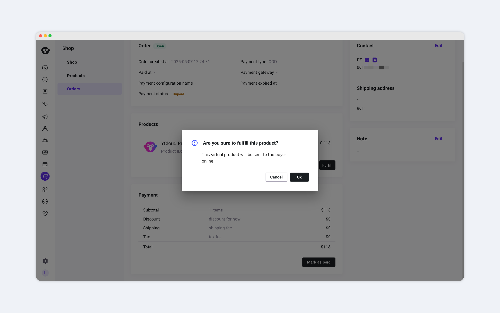
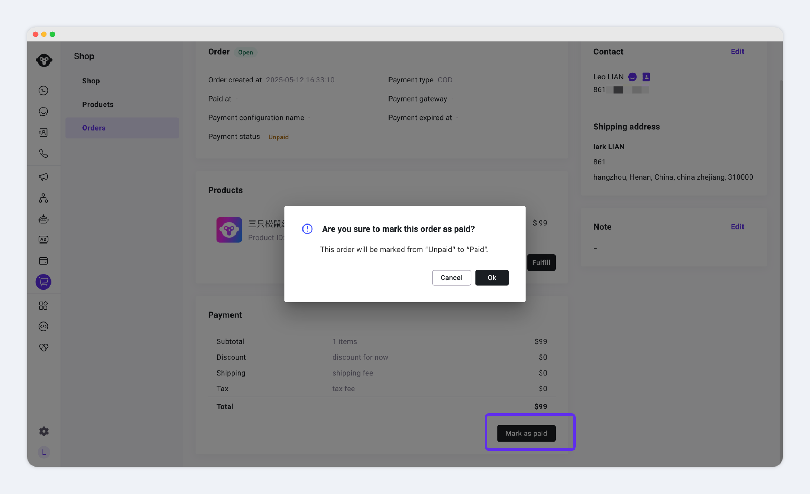
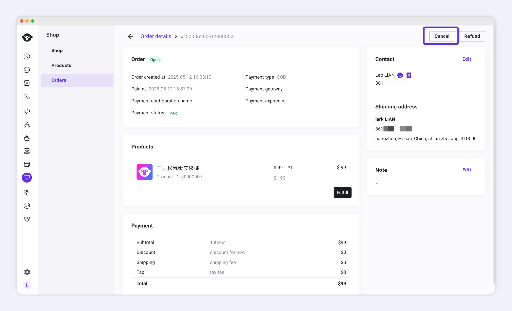
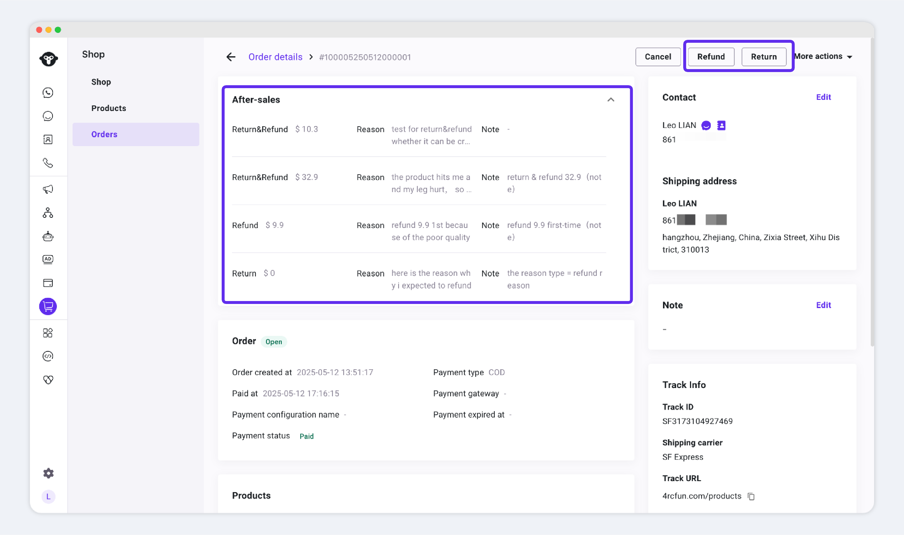

# 订单管理


正式售卖前，需要确保，店铺已完成这些配置：

* [创建店铺](../creatstore.md)
* [添加商品](../products.md)
* [运费设置](../shipping.md)
* [支付设置](../payments.md)


## 订单产生

当您在inbox与客户沟通时，如果您的客户，对商品感兴趣时，您可以直接发送商品链接

* inbox-打开与客户的聊天框-菜单，选择 send a  product，选择商品并发送
* 
* 您的客户：点击商品链接，选择sku- buy now，填写地址并下单。


目前Shop支持的支付方式：

* COD（Cash on delivery/货到付款）
* PayPal 钱包
* [更多信息，点此了解](../payments.md)


## 订单管理

在收到订单后，您需要关注的重要事项：

* 订单发货；
* 订单标记为已付款；
* 订单取消；
* 订单退货、退款；

### 订单发货


商品分为2种类型：虚拟商品、实物商品。

不同类型商品，发货流程会有一些差异。


#### 实物商品

当您需要对订单进行发货时，找到该笔订单，点击-发货，填写物流信息

<figure><figcaption>
实物商品-发货操作入口
</figcaption></figure>

#### 虚拟商品


注意，虚拟商品的发货操作不可撤回。请务必谨慎操作。


当客户购买的是虚拟商品，此时，发货操作如下

<figure><figcaption>
虚拟商品-发货确认通知
</figcaption></figure>

弹窗点击OK，则系统会认为 发货成功；

## 订单标记为已支付

COD订单，订单款项将在线下收取。

当您确认已收到款项时，需要您将该笔订单，标记为已支付；

<figure><figcaption></figcaption></figure>

点击OK后，订单支付状态将从待支付 改为 已支付。

## 订单取消

因为某些原因，当您的订单不需要再发货时，可以将订单取消；

<figure><figcaption>
Shop-订单-取消订单
</figcaption></figure>

## 订单退款/退货

需要对订单进行退款、退货时，请：

1. 点击：退款、退货按钮。
2. 填写：退款金额、原因、备注等字段


注意，

* 您填写的退款金额、退货理由等信息，都可以被您的客户看到。
* note字段信息，并不会被您的客户看到。


保存后的退款、退货信息，将在订单详情展示，如下图：

<figure><figcaption></figcaption></figure>

