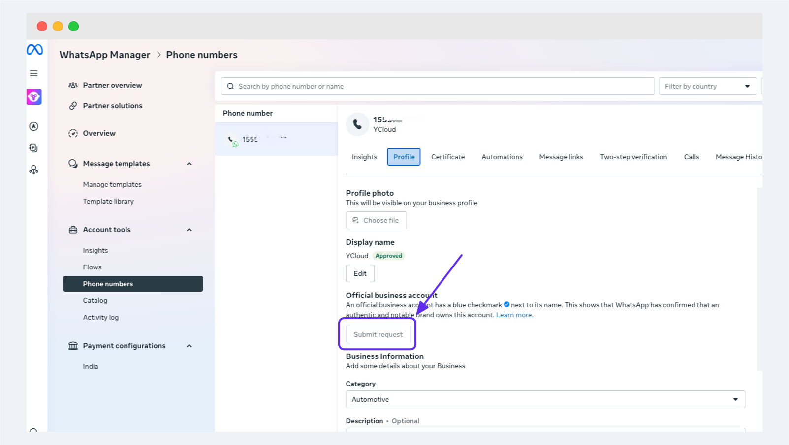
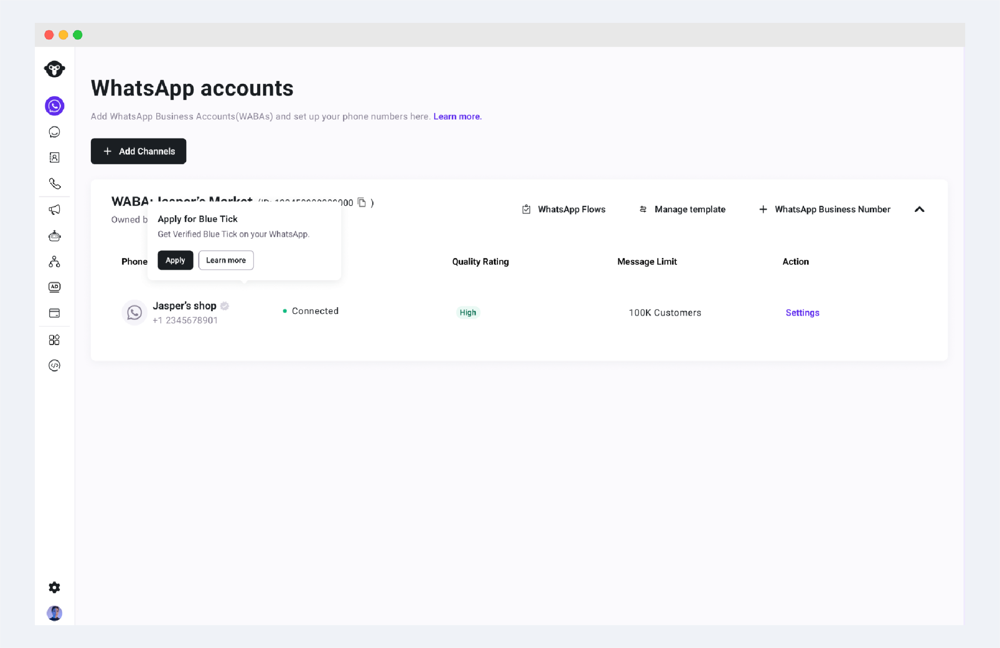
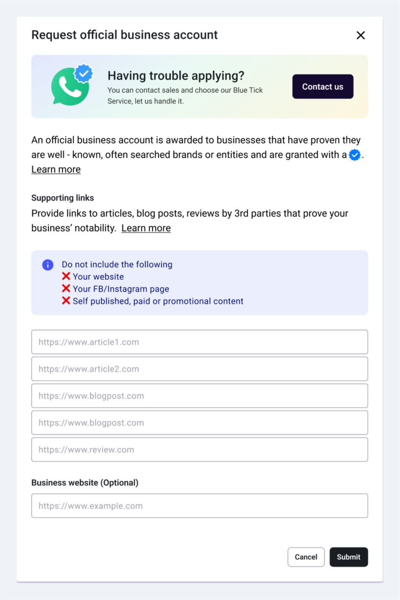
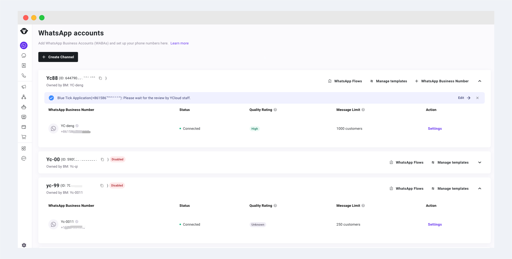

# 官方账号验证


自 2025 年 8 月起，由于 Meta蓝标政策调整，蓝标申请业务暂时暂停。


OBA 认证也称为蓝标认证。

如果 WhatsApp 帐号为官方商业帐号，则联系人视图中的显示名旁将显示一个勾号标记。

同时，官方账号认证成功将有效增强账号的稳定性。

<figure><figcaption></figcaption></figure>

## 前置条件

WhatsApp 官方商业帐号 (OBA) 标准根据众多因素制定，并且不同于其他平台的政策。除了遵守以下 WhatsApp[商业](https://l.facebook.com/l.php?u=https%3A%2F%2Fwww.whatsapp.com%2Flegal%2Fcommerce-policy%2F\&h=AT08HSm0jn8ixUVDVnEYHuVADYRg9gA3DCFUHDeLaKh222GpcAk5cPhD1JL9NsHdczjGNMHrUtcjVEcOIABNN58f5_B-5tnOypQwkxrUKjFzHIUH3-ofzldx9CklDtWr9hKqSS5zm4U)交易政策和 [Business](https://www.whatsapp.com/legal/business-policy) 政策，商家还必须：

* 是知名商家：代表知名公司、搜索频率高的品牌或实体
* 已认证：已通过[公司验证](qi-ye-ren-zheng.md)
* 设置双重验证 (2FA)：已设置两步验证。

<figure><figcaption></figcaption></figure>

* 消息限制已达到1,000及以上

## 申请官方蓝标账号（OBA）


自 2025 年 8 月起，由于 Meta蓝标政策调整，通过 BSP申请蓝标的业务暂时暂停。您可以通过访问Meta Business Suite后台 WhatsApp accounts 管理页面，从您的号码档案中申请 OBA。(如果无法点击该按钮，那么您暂时无法申请蓝标)



目前OBA 认证仅允许通过 BSP 进行申请，请按照以下说明向我们提交申请工单，在工作人员审核通过后将向 Meta 提交您的申请：

**在确保您的号码符合上述【前置条件】后，在需要申请 OBA 认证的号码右侧的对勾符号上鼠标悬浮，可见 Apply 按钮，点击该按钮。**

<figure><figcaption></figcaption></figure>

在弹窗内填写OBA 申请所需信息

* 您最多可以提交 5 个支持链接，尤其是来自知名出版物（例如《今日印度》、《经济时报》、《华尔街日报》、《路透社》、《维基百科》、《商业内幕》）的支持链接，以表明该企业是知名的，这有助于我们确定知名性。
* 如果您的公司有官方网站，请在最下方填写您的网站链接，这有助于我们确认您企业的真实性与知名度，加快审核进度。

<figure><figcaption></figcaption></figure>

完成后点击提交按钮提交您的申请，您的申请将在我们后台由相关工作人员完成审核。您可以在后台看到审核的实时进度。如果需要重传材料，您将看到重传入口。

<figure><figcaption></figcaption></figure>

WhatsApp审核完您的请求后，如果您的 OBA 已通过，号码右侧将自动出现蓝标标识。

如果您的 OBA 请求被拒绝，账号上方也会有对应提示。

WhatsApp不向企业员工、测试账户和WhatsApp Business App账户授予OBA，目前仅供 WhatsApp 商业平台用户使用。

## 了解知名度

知名度要求企业拥有知名且经常被搜索的品牌或实体。

另一方面，知名度则反映出在网络新闻文章中的大量存在。知名度的评估基于帐户在具有大量受众的出版物的新闻文章中的存在。不将付费或促销内容（包括商家或应用列表）视为审核来源。

OBA是在电话号码和显示名称级别颁发的。会评估申请 OBA 状态的商业帐户的显示名称的知名度 — 如果在获得 OBA 状态后更改了显示名称，将需要重新评估新显示名称的知名度和[显示名称合规性](https://developers.facebook.com/docs/whatsapp/guides/display-name/#display-name-guidelines)。

此外，Whatsapp 企业帐户中先前的 OBA 批准并不保证与该帐户关联的其他号码（具有不同的显示名称）也会获得批准。如果您的 WABA 包含一个主要父品牌，并且与该品牌关联的电话号码符合知名度要求，我们建议按如下方式更新子品牌的显示名称：“\{{sub-brand name\}} by \{{notable name\}}”。

## OBA申请被拒绝 

如果您的 OBA 请求被拒绝，则意味着您的帐户或您提交的认证材料不符合 OBA 认证的要求。如果您对审核结果有任何疑问，请点击【联系我们】按钮与我们进一步沟通。

## 观看详细介绍视频👇


