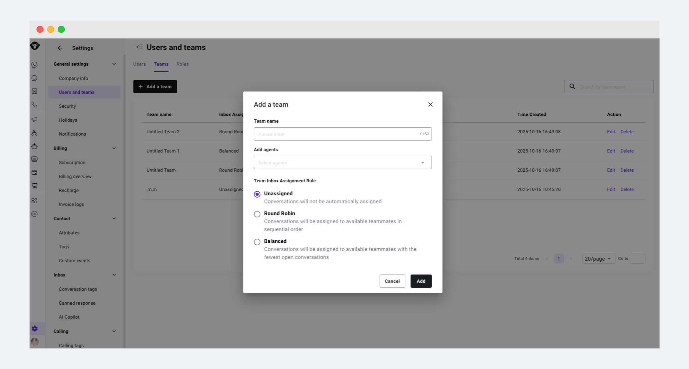

# 用户和团队

进行用户管理。邀请团队成员、分配角色并控制用户权限。&#x20;

入口：左侧导航的Settings >[ User\&Teams](https://www.ycloud.com/console/#/app/globalSettings/general/usersAndTeams)

## 角色

### 系统默认角色

系统提供了6个默认角色分别为：管理员、运营、开发者、Inbox管理员、客服、销售。

默认角色的权限范围可在邀请用户时点击Check permissions进行查看，系统角色权限不支持编辑，如果您有自定义权限的需求，请创建自定义角色

<figure><figcaption></figcaption></figure>

### 自定义用户角色


Pro 及以上版本支持自定义用户角色


您可以创建自己的用户角色并给该角色配置不同的功能权限。创建教程：

1. 进入[ User\&Teams](https://www.ycloud.com/console/#/app/globalSettings/general/usersAndTeams) 页面，点击Roles

<figure><figcaption></figcaption></figure>

2. 点击Add roles, 并配置角色信息包括：角色名称，角色描述，角色权限。

您可以选择一个系统角色进行快速配置，在该系统角色的权限基础上进行权限变更。设置完成后进行保存。

<figure><figcaption></figcaption></figure>

### 邀请用户

要为您的账号添加用户，请按照以下步骤操作：

1. 左侧导航的Settings >[ User\&Teams](https://www.ycloud.com/console/#/app/globalSettings/general/usersAndTeams)。点击页面中的 “Invite user”按钮。

<figure><figcaption></figcaption></figure>

2. 填写待邀请成员的基本信息，点击按钮 “Add”。系统将向该成员邮箱发送一封激活邮件。

<figure><figcaption></figcaption></figure>

3. 团队成员接受邀请

成员找到对应激活邮件并点击按钮“激活账号”接受邀请，完成账号的激活。

<figure><figcaption></figcaption></figure>

PS: 如成员状态长时间是Pending或者未收到邀请邮件，可点击“重发”按钮

<figure><figcaption></figcaption></figure>

### 删除用户

点击用户行对应的“移除”按钮，可永久移除该用户

<figure><figcaption></figcaption></figure>

### 编辑用户

#### 修改用户身份

点击操作区域的编辑按钮，在弹窗中可修改该用户对应的角色及团队，用户邮箱不可修改，修改完毕点击确认。

<figure><figcaption></figcaption></figure>

#### 设置接待上限

在操作区域中，点击Agent capacity来设置接待上限。当设置了接待上限后，如果当前用户正在接待的会话数已经到达了设置的上限，会话将不会自动分配给该用户，而会进入到unassigned界面中。

<figure><figcaption></figcaption></figure>

### 转移Owner

Admin Owner身份不可删除，但由于工作变动，当需要转移账号Admin Owner身份时，可进行如下操作

1. 需要由Admin Owner本人进行操作，在要转移的对象的操作区点击“Transfer Ownership”按钮
2. 在弹窗中点击确认
3. 您的身份将变为Admin，随后可按照删除用户的操作指示删除用户

<figure><figcaption></figcaption></figure>

### 为所有成员开启2fa

为更好的保障账户安全，如果用户没有开启2fa，账号管理员可以通过设置2fa验证开关，要求所有成员没在登录到本企业账号时进行2fa验证。

<figure><figcaption></figcaption></figure>

## 创建、管理团队

要为您的账号添加团队，请按照以下步骤操作：

1. 左侧导航的Settings >[ User\&Teams](https://www.ycloud.com/console/#/app/globalSettings/general/usersAndTeams) 点击页面中的 “Add a team”按钮
2. 在弹窗中填写团队名称并添加相关用户
3. 如有需要，可为该团队选择Team supervisor（团队主管）(只能从团队成员中选择)，支持多选。团队主管可查看团队内所有成员在Inbox和Calling功能模块中的对话消息或语音消息内容
4. 通过操作列的按钮 编辑团队名称、成员、主管 或 删除 团队
5. 创建 Team 的同时会创建对应的Team Inboxes，您可以设置 team 内的分配规则，可以选择不分配（会话将自动停留在 team 的未分配中），在线自动均分和在线负载均衡分配三种模式

<figure><figcaption></figcaption></figure>

<figure><figcaption></figcaption></figure>
